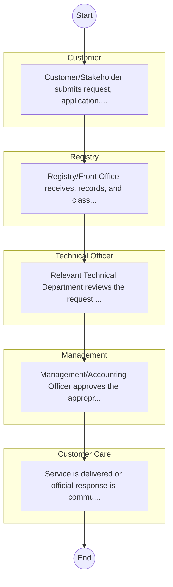

# STANDARD BPM TEMPLATE – Crop Development

## Cover Page
- **Ministry/Department/Agency (MDA):** Crop Development
- **Process Name:** To develop, regulate, and promote agricultural crops across various sub-sectors; to conduct research and development in crops, agricultural seeds, and crop genetics to enhance productivity and resilience; to ensure phytosanitary services and compliance with international standards for crop health and trade; to formulate policies on agricultural training, agricultural land resources inventory and management, agricultural mechanization, land consolidation for agricultural benefit, and agricultural insurance; to establish agricultural extension policies and service standards to disseminate knowledge to farmers; to build capacity for agricultural staff and farmers; to support the administration of irrigation schemes for enhanced crop production; to manage biosafety aspects related to genetically modified crops; and to drive crop value chains, research, and extension services to foster economic growth and food security.
- **Document Version:** 1.0
- **Date:** 2026-02-14
- **Classification:** Official

---

## Executive Summary
Crop Development in Kenya is a core function primarily handled by the Department of Crop Development within the State Department for Agriculture, under the Ministry of Agriculture and Livestock Development (MoALD). Its mandate focuses on the development, regulation, and promotion of agricultural crops, conducting research, ensuring phytosanitary services, and formulating policies to enhance national food and nutrition security, drive economic development, and improve farmer livelihoods through sustainable and productive crop production systems across the country.

---

## Process Flowchart (BPMN 2.0 - Mermaid)
*Guidance: This diagram visualizes the process flow across different actors (Swimlanes).*

---

## Process Overview
### Process Name
To develop, regulate, and promote agricultural crops across various sub-sectors; to conduct research and development in crops, agricultural seeds, and crop genetics to enhance productivity and resilience; to ensure phytosanitary services and compliance with international standards for crop health and trade; to formulate policies on agricultural training, agricultural land resources inventory and management, agricultural mechanization, land consolidation for agricultural benefit, and agricultural insurance; to establish agricultural extension policies and service standards to disseminate knowledge to farmers; to build capacity for agricultural staff and farmers; to support the administration of irrigation schemes for enhanced crop production; to manage biosafety aspects related to genetically modified crops; and to drive crop value chains, research, and extension services to foster economic growth and food security.

### Service Category
- G2C/G2B

### Process Objective
- To develop, regulate, and promote agricultural crops across various sub-sectors; to conduct research and development in crops, agricultural seeds, and crop genetics to enhance productivity and resilience; to ensure phytosanitary services and compliance with international standards for crop health and trade; to formulate policies on agricultural training, agricultural land resources inventory and management, agricultural mechanization, land consolidation for agricultural benefit, and agricultural insurance; to establish agricultural extension policies and service standards to disseminate knowledge to farmers; to build capacity for agricultural staff and farmers; to support the administration of irrigation schemes for enhanced crop production; to manage biosafety aspects related to genetically modified crops; and to drive crop value chains, research, and extension services to foster economic growth and food security.

### Scope
- **In Scope:** End-to-end processing within Crop Development.
- **Out of Scope:** External agency approvals.

### Triggers
- Submission of application/request by Customer.

### End States
- **Successful:** License / Permit / Certificate, Compliance Inspection Report, Official Receipt, Gazette Notice
- **Unsuccessful:** Application rejected due to non-compliance.

### Policy Context
- The Crop Development Act; The Constitution of Kenya 2010; Data Protection Act 2019.

---

## Stakeholders
| Stakeholder | Role | Responsibilities |
|---|---|---|
| Registry | Process Actor | Performs actions as defined in steps. |
| Customer Care | Process Actor | Performs actions as defined in steps. |
| Management | Process Actor | Performs actions as defined in steps. |
| Customer | Process Actor | Performs actions as defined in steps. |
| Technical Officer | Process Actor | Performs actions as defined in steps. |

---

## Inputs & Outputs
- **Inputs:** Application Form (License/Permit), Compliance Documents (Tax Compliance, CR12), Technical Reports / Site Plans, Proof of Payment
- **Outputs:** License / Permit / Certificate, Compliance Inspection Report, Official Receipt, Gazette Notice

---

## Detailed Process (AS-IS)
| Step | Role | Action | Tool | Notes |
|---|---|---|---|---|
| 1 | Customer | Customer/Stakeholder submits request, application, or inquiry via official channels (Email, Letter, or Portal). | Digital | |
| 2 | Registry | Registry/Front Office receives, records, and classifies the request. | Manual | |
| 3 | Technical Officer | Relevant Technical Department reviews the request against internal policies and regulations. | Manual | |
| 4 | Management | Management/Accounting Officer approves the appropriate action or service delivery. | Manual | |
| 5 | Customer Care | Service is delivered or official response is communicated to the customer. | Manual | |

---

## Pain Points & Opportunities
### Pain Points
- Manual document verification takes time.
- High cost and time for physical inspections.
- Risk of counterfeit licenses/certificates.
- Lack of real-time monitoring of licensees.

### Opportunities
- Online Licensing Management System (LMS).
- Integration with IPRS and BRS for auto-verification.
- Mobile field inspection apps with GIS.
- QR-coded verifiable certificates.

---

## KPIs
| KPI | Baseline | Target |
|---|---|---|
| Turnaround Time | 30 Days | 5 Days |
| CSAT | 50% | 90% |
