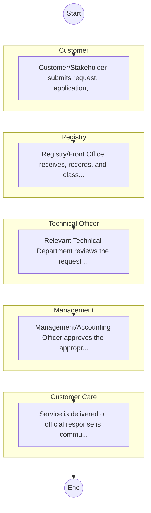

# STANDARD BPM TEMPLATE – Defence

## Cover Page
- **Ministry/Department/Agency (MDA):** Defence
- **Process Name:** To defend and protect the sovereignty and territorial integrity of the Republic of Kenya from external aggression; to facilitate and support the Kenya Defence Forces (KDF) in fulfilling their constitutional mandate under Article 241 (3) (a), (b) & (c), which includes defending Kenya from external aggression, assisting civilian authority in emergencies or disasters, and restoring peace in areas of Kenya affected by unrest or instability when assigned; to provide essential civilian services such as policy development, administration, financial management, public communications, human resource management, medical, and technical support to the Defence Forces; and to contribute to regional and international peace and security through participation in peacekeeping missions and collaborative defence initiatives.
- **Document Version:** 1.0
- **Date:** 2026-02-14
- **Classification:** Official

---

## Executive Summary
The Ministry of Defence (MoD) of Kenya is a cabinet-level office responsible for defence-related matters and the oversight of the Kenya Defence Forces (KDF). Its primary mandate, guided by the Constitution of the Republic of Kenya, is to defend and protect the sovereignty and territorial integrity of the Republic of Kenya, ensure national security, and provide support during emergencies or disasters. The MoD aims to maintain a premier, credible, and mission-capable force deeply rooted in professionalism, contributing to regional peace and stability and supporting national development.

---

## Process Flowchart (BPMN 2.0 - Mermaid)
*Guidance: This diagram visualizes the process flow across different actors (Swimlanes).*

---

## Process Overview
### Process Name
To defend and protect the sovereignty and territorial integrity of the Republic of Kenya from external aggression; to facilitate and support the Kenya Defence Forces (KDF) in fulfilling their constitutional mandate under Article 241 (3) (a), (b) & (c), which includes defending Kenya from external aggression, assisting civilian authority in emergencies or disasters, and restoring peace in areas of Kenya affected by unrest or instability when assigned; to provide essential civilian services such as policy development, administration, financial management, public communications, human resource management, medical, and technical support to the Defence Forces; and to contribute to regional and international peace and security through participation in peacekeeping missions and collaborative defence initiatives.

### Service Category
- G2C/G2B

### Process Objective
- To defend and protect the sovereignty and territorial integrity of the Republic of Kenya from external aggression; to facilitate and support the Kenya Defence Forces (KDF) in fulfilling their constitutional mandate under Article 241 (3) (a), (b) & (c), which includes defending Kenya from external aggression, assisting civilian authority in emergencies or disasters, and restoring peace in areas of Kenya affected by unrest or instability when assigned; to provide essential civilian services such as policy development, administration, financial management, public communications, human resource management, medical, and technical support to the Defence Forces; and to contribute to regional and international peace and security through participation in peacekeeping missions and collaborative defence initiatives.

### Scope
- **In Scope:** End-to-end processing within Defence.
- **Out of Scope:** External agency approvals.

### Triggers
- Submission of application/request by Customer.

### End States
- **Successful:** License / Permit / Certificate, Compliance Inspection Report, Official Receipt, Gazette Notice
- **Unsuccessful:** Application rejected due to non-compliance.

### Policy Context
- The Defence Act; The Constitution of Kenya 2010; Data Protection Act 2019.

---

## Stakeholders
| Stakeholder | Role | Responsibilities |
|---|---|---|
| Registry | Process Actor | Performs actions as defined in steps. |
| Customer Care | Process Actor | Performs actions as defined in steps. |
| Management | Process Actor | Performs actions as defined in steps. |
| Customer | Process Actor | Performs actions as defined in steps. |
| Technical Officer | Process Actor | Performs actions as defined in steps. |

---

## Inputs & Outputs
- **Inputs:** Application Form (License/Permit), Compliance Documents (Tax Compliance, CR12), Technical Reports / Site Plans, Proof of Payment
- **Outputs:** License / Permit / Certificate, Compliance Inspection Report, Official Receipt, Gazette Notice

---

## Detailed Process (AS-IS)
| Step | Role | Action | Tool | Notes |
|---|---|---|---|---|
| 1 | Customer | Customer/Stakeholder submits request, application, or inquiry via official channels (Email, Letter, or Portal). | Digital | |
| 2 | Registry | Registry/Front Office receives, records, and classifies the request. | Manual | |
| 3 | Technical Officer | Relevant Technical Department reviews the request against internal policies and regulations. | Manual | |
| 4 | Management | Management/Accounting Officer approves the appropriate action or service delivery. | Manual | |
| 5 | Customer Care | Service is delivered or official response is communicated to the customer. | Manual | |

---

## Pain Points & Opportunities
### Pain Points
- Manual document verification takes time.
- High cost and time for physical inspections.
- Risk of counterfeit licenses/certificates.
- Lack of real-time monitoring of licensees.

### Opportunities
- Online Licensing Management System (LMS).
- Integration with IPRS and BRS for auto-verification.
- Mobile field inspection apps with GIS.
- QR-coded verifiable certificates.

---

## KPIs
| KPI | Baseline | Target |
|---|---|---|
| Turnaround Time | 30 Days | 5 Days |
| CSAT | 50% | 90% |
