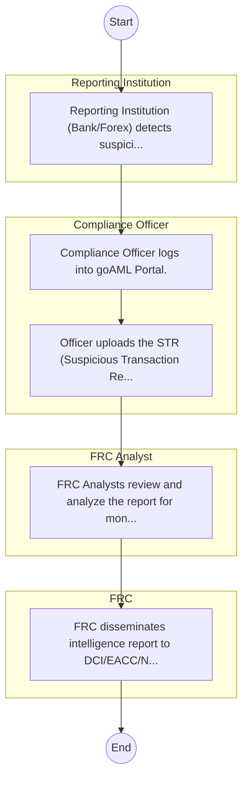

# STANDARD BPM TEMPLATE – Financial Reporting Centre

## Cover Page
- **Ministry/Department/Agency (MDA):** Financial Reporting Centre
- **Process Name:** Represents 'Public Administration and International Relations' cluster for balanced coverage; entity type: Agency. Included as Tier 3 for light‑touch desk review/survey.
- **Document Version:** 1.0
- **Date:** 2026-02-14
- **Classification:** Official

---

## Executive Summary
Represents 'Public Administration and International Relations' cluster for balanced coverage; entity type: Agency. Included as Tier 3 for light‑touch desk review/survey.

---

## Process Flowchart (BPMN 2.0 - Mermaid)
*Guidance: This diagram visualizes the process flow across different actors (Swimlanes).*

---

## Process Overview
### Process Name
Represents 'Public Administration and International Relations' cluster for balanced coverage; entity type: Agency. Included as Tier 3 for light‑touch desk review/survey.

### Service Category
- G2C/G2B

### Process Objective
- Represents 'Public Administration and International Relations' cluster for balanced coverage; entity type: Agency. Included as Tier 3 for light‑touch desk review/survey.

### Scope
- **In Scope:** End-to-end processing within Financial Reporting Centre.
- **Out of Scope:** External agency approvals.

### Triggers
- Submission of application/request by Reporting Institution.

### End States
- **Successful:** License / Permit / Certificate, Compliance Inspection Report, Official Receipt, Gazette Notice
- **Unsuccessful:** Application rejected due to non-compliance.

### Policy Context
- The Financial Reporting Centre Act; The Constitution of Kenya 2010; Data Protection Act 2019.

---

## Stakeholders
| Stakeholder | Role | Responsibilities |
|---|---|---|
| Reporting Institution | Process Actor | Performs actions as defined in steps. |
| FRC | Process Actor | Performs actions as defined in steps. |
| Compliance Officer | Process Actor | Performs actions as defined in steps. |
| FRC Analyst | Process Actor | Performs actions as defined in steps. |

---

## Inputs & Outputs
- **Inputs:** Application Form (License/Permit), Compliance Documents (Tax Compliance, CR12), Technical Reports / Site Plans, Proof of Payment
- **Outputs:** License / Permit / Certificate, Compliance Inspection Report, Official Receipt, Gazette Notice

---

## Detailed Process (AS-IS)
| Step | Role | Action | Tool | Notes |
|---|---|---|---|---|
| 1 | Reporting Institution | Reporting Institution (Bank/Forex) detects suspicious activity. | Manual | |
| 2 | Compliance Officer | Compliance Officer logs into goAML Portal. | Digital | |
| 3 | Compliance Officer | Officer uploads the STR (Suspicious Transaction Report) and supporting documents. | Manual | |
| 4 | FRC Analyst | FRC Analysts review and analyze the report for money laundering links. | Manual | |
| 5 | FRC | FRC disseminates intelligence report to DCI/EACC/NIS for investigation. | Manual | |

---

## Pain Points & Opportunities
### Pain Points
- Manual document verification takes time.
- High cost and time for physical inspections.
- Risk of counterfeit licenses/certificates.
- Lack of real-time monitoring of licensees.

### Opportunities
- Online Licensing Management System (LMS).
- Integration with IPRS and BRS for auto-verification.
- Mobile field inspection apps with GIS.
- QR-coded verifiable certificates.

---

## KPIs
| KPI | Baseline | Target |
|---|---|---|
| Turnaround Time | 30 Days | 5 Days |
| CSAT | 50% | 90% |
