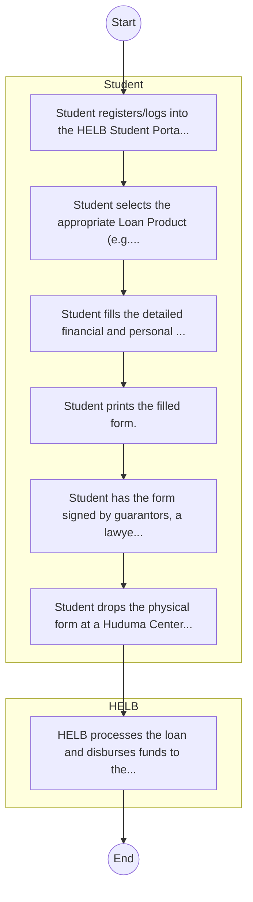

# STANDARD BPM TEMPLATE – Higher Education Loans Board

## Cover Page
- **Ministry/Department/Agency (MDA):** Higher Education Loans Board
- **Process Name:** To provide affordable and sustainable financing for tertiary education by mobilizing and managing funds; establishing, managing, and awarding loans, bursaries, and scholarships to needy Kenyan students; and efficiently recovering previously disbursed funds to ensure the revolving nature of the scheme and its long-term sustainability.
- **Document Version:** 1.0
- **Date:** 2026-02-14
- **Classification:** Official

---

## Executive Summary
The Higher Education Loans Board (HELB) is a statutory body in Kenya, established in July 1995 by an Act of Parliament (Cap 213A) as a state corporation under the Ministry of Education. Its core mandate is to provide affordable loans, bursaries, and scholarships to Kenyan students pursuing higher education in recognized institutions, both within and outside Kenya, to ensure access to tertiary education.

---

## Process Flowchart (BPMN 2.0 - Mermaid)
*Guidance: This diagram visualizes the process flow across different actors (Swimlanes).*

---

## Process Overview
### Process Name
To provide affordable and sustainable financing for tertiary education by mobilizing and managing funds; establishing, managing, and awarding loans, bursaries, and scholarships to needy Kenyan students; and efficiently recovering previously disbursed funds to ensure the revolving nature of the scheme and its long-term sustainability.

### Service Category
- G2B (Government to Business)

### Process Objective
- To provide affordable and sustainable financing for tertiary education by mobilizing and managing funds; establishing, managing, and awarding loans, bursaries, and scholarships to needy Kenyan students; and efficiently recovering previously disbursed funds to ensure the revolving nature of the scheme and its long-term sustainability.

### Scope
- **In Scope:** End-to-end processing within Higher Education Loans Board.
- **Out of Scope:** External agency approvals.

### Triggers
- Submission of application/request by Student.

### End States
- **Successful:** License / Permit / Certificate, Compliance Inspection Report, Official Receipt, Gazette Notice
- **Unsuccessful:** Application rejected due to non-compliance.

### Policy Context
- The Higher Education Loans Board Act; The Constitution of Kenya 2010; Data Protection Act 2019.

---

## Stakeholders
| Stakeholder | Role | Responsibilities |
|---|---|---|
| Student | Process Actor | Performs actions as defined in steps. |
| HELB | Process Actor | Performs actions as defined in steps. |

---

## Inputs & Outputs
- **Inputs:** Application Form (License/Permit), Compliance Documents (Tax Compliance, CR12), Technical Reports / Site Plans, Proof of Payment
- **Outputs:** License / Permit / Certificate, Compliance Inspection Report, Official Receipt, Gazette Notice

---

## Detailed Process (AS-IS)
| Step | Role | Action | Tool | Notes |
|---|---|---|---|---|
| 1 | Student | Student registers/logs into the HELB Student Portal. | Digital | |
| 2 | Student | Student selects the appropriate Loan Product (e.g., Undergraduate First Time). | Manual | |
| 3 | Student | Student fills the detailed financial and personal background form online. | Manual | |
| 4 | Student | Student prints the filled form. | Manual | |
| 5 | Student | Student has the form signed by guarantors, a lawyer/magistrate, and the local Chief. | Manual | |
| 6 | Student | Student drops the physical form at a Huduma Center or Bank. | Manual | |
| 7 | HELB | HELB processes the loan and disburses funds to the university/student. | Manual | |

---

## Pain Points & Opportunities
### Pain Points
- Manual document verification takes time.
- High cost and time for physical inspections.
- Risk of counterfeit licenses/certificates.
- Lack of real-time monitoring of licensees.

### Opportunities
- Online Licensing Management System (LMS).
- Integration with IPRS and BRS for auto-verification.
- Mobile field inspection apps with GIS.
- QR-coded verifiable certificates.

---

## KPIs
| KPI | Baseline | Target |
|---|---|---|
| Turnaround Time | 30 Days | 5 Days |
| CSAT | 50% | 90% |
