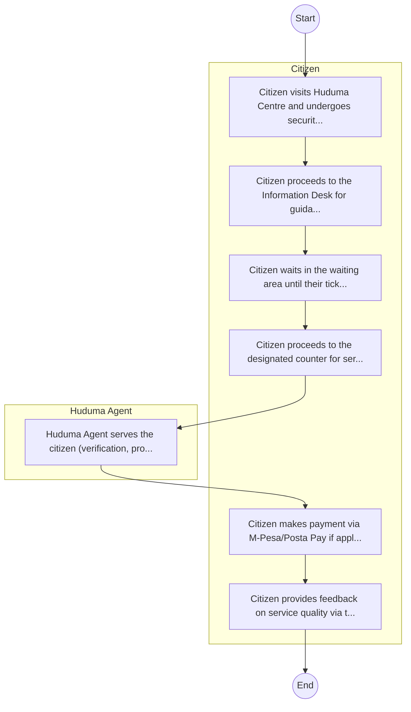

# STANDARD BPM TEMPLATE – HUDUMA SECRETARIAT

## Cover Page
- **Ministry/Department/Agency (MDA):** HUDUMA SECRETARIAT
- **Process Name:** To develop, operationalize, support, and maintain integrated government service platforms (Huduma Centres, Huduma E-Services, Contact Centre) to provide quality, accessible, dignified, and convenient public services to Kenyan citizens from various government entities.
- **Document Version:** 1.0
- **Date:** 2026-02-14
- **Classification:** Official

---

## Executive Summary
The Huduma Secretariat Kenya is mandated to transform public service delivery, providing efficient, effective, accessible, and citizen-centric services through integrated 'one-stop-shop' platforms like Huduma Centres and Huduma E-Services. It's a flagship project under Kenya Vision 2030.

---

## Process Flowchart (BPMN 2.0 - Mermaid)
*Guidance: This diagram visualizes the process flow across different actors (Swimlanes).*

---

## Process Overview
### Process Name
To develop, operationalize, support, and maintain integrated government service platforms (Huduma Centres, Huduma E-Services, Contact Centre) to provide quality, accessible, dignified, and convenient public services to Kenyan citizens from various government entities.

### Service Category
- G2C/G2B

### Process Objective
- To develop, operationalize, support, and maintain integrated government service platforms (Huduma Centres, Huduma E-Services, Contact Centre) to provide quality, accessible, dignified, and convenient public services to Kenyan citizens from various government entities.

### Scope
- **In Scope:** End-to-end processing within HUDUMA SECRETARIAT.
- **Out of Scope:** External agency approvals.

### Triggers
- Submission of application/request by Citizen.

### End States
- **Successful:** License / Permit / Certificate, Compliance Inspection Report, Official Receipt, Gazette Notice
- **Unsuccessful:** Application rejected due to non-compliance.

### Policy Context
- The HUDUMA SECRETARIAT Act; The Constitution of Kenya 2010; Data Protection Act 2019.

---

## Stakeholders
| Stakeholder | Role | Responsibilities |
|---|---|---|
| Citizen | Process Actor | Performs actions as defined in steps. |
| Huduma Agent | Process Actor | Performs actions as defined in steps. |

---

## Inputs & Outputs
- **Inputs:** Application Form (License/Permit), Compliance Documents (Tax Compliance, CR12), Technical Reports / Site Plans, Proof of Payment
- **Outputs:** License / Permit / Certificate, Compliance Inspection Report, Official Receipt, Gazette Notice

---

## Detailed Process (AS-IS)
| Step | Role | Action | Tool | Notes |
|---|---|---|---|---|
| 1 | Citizen | Citizen visits Huduma Centre and undergoes security check. | Manual | |
| 2 | Citizen | Citizen proceeds to the Information Desk for guidance and ticket issuance. | Manual | |
| 3 | Citizen | Citizen waits in the waiting area until their ticket number is called/displayed. | Manual | |
| 4 | Citizen | Citizen proceeds to the designated counter for service (e.g., ID replacement, NHIF). | Manual | |
| 5 | Huduma Agent | Huduma Agent serves the citizen (verification, processing, or referral). | Manual | |
| 6 | Citizen | Citizen makes payment via M-Pesa/Posta Pay if applicable. | Manual | |
| 7 | Citizen | Citizen provides feedback on service quality via the terminal. | Manual | |

---

## Pain Points & Opportunities
### Pain Points
- Manual document verification takes time.
- High cost and time for physical inspections.
- Risk of counterfeit licenses/certificates.
- Lack of real-time monitoring of licensees.

### Opportunities
- Online Licensing Management System (LMS).
- Integration with IPRS and BRS for auto-verification.
- Mobile field inspection apps with GIS.
- QR-coded verifiable certificates.

---

## KPIs
| KPI | Baseline | Target |
|---|---|---|
| Turnaround Time | 30 Days | 5 Days |
| CSAT | 50% | 90% |
