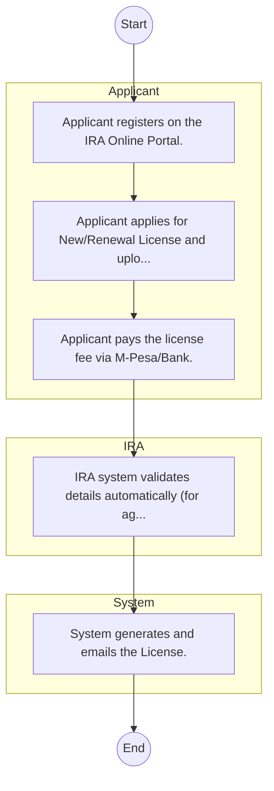

# STANDARD BPM TEMPLATE – Insurance Regulatory Authority

## Cover Page
- **Ministry/Department/Agency (MDA):** Insurance Regulatory Authority
- **Process Name:** Represents 'Public Administration and International Relations' cluster for balanced coverage; entity type: Agency. Included as Tier 3 for light‑touch desk review/survey.
- **Document Version:** 1.0
- **Date:** 2026-02-14
- **Classification:** Official

---

## Executive Summary
Represents 'Public Administration and International Relations' cluster for balanced coverage; entity type: Agency. Included as Tier 3 for light‑touch desk review/survey.

---

## Process Flowchart (BPMN 2.0 - Mermaid)
*Guidance: This diagram visualizes the process flow across different actors (Swimlanes).*

---

## Process Overview
### Process Name
Represents 'Public Administration and International Relations' cluster for balanced coverage; entity type: Agency. Included as Tier 3 for light‑touch desk review/survey.

### Service Category
- G2B (Government to Business)

### Process Objective
- Represents 'Public Administration and International Relations' cluster for balanced coverage; entity type: Agency. Included as Tier 3 for light‑touch desk review/survey.

### Scope
- **In Scope:** End-to-end processing within Insurance Regulatory Authority.
- **Out of Scope:** External agency approvals.

### Triggers
- Submission of application/request by Applicant.

### End States
- **Successful:** Loan Disbursement / Service Delivery, Statement of Account, Contract / Agreement, Receipt / Invoice
- **Unsuccessful:** Application rejected due to non-compliance.

### Policy Context
- The Insurance Regulatory Authority Act; The Constitution of Kenya 2010; Data Protection Act 2019.

---

## Stakeholders
| Stakeholder | Role | Responsibilities |
|---|---|---|
| Applicant | Process Actor | Performs actions as defined in steps. |
| System | Process Actor | Performs actions as defined in steps. |
| IRA | Process Actor | Performs actions as defined in steps. |

---

## Inputs & Outputs
- **Inputs:** Loan/Service Application Form, Business Proposal / Plan, Financial Statements / Bank Records, Collateral / Security Documents
- **Outputs:** Loan Disbursement / Service Delivery, Statement of Account, Contract / Agreement, Receipt / Invoice

---

## Detailed Process (AS-IS)
| Step | Role | Action | Tool | Notes |
|---|---|---|---|---|
| 1 | Applicant | Applicant registers on the IRA Online Portal. | Digital | |
| 2 | Applicant | Applicant applies for New/Renewal License and uploads COP (Certificate of Proficiency). | Manual | |
| 3 | Applicant | Applicant pays the license fee via M-Pesa/Bank. | Manual | |
| 4 | IRA | IRA system validates details automatically (for agents) or via officer review (for brokers). | Manual | |
| 5 | System | System generates and emails the License. | Manual | |

---

## Pain Points & Opportunities
### Pain Points
- Lengthy credit appraisal processes.
- Manual debt collection and reconciliation.
- High paperwork for loan processing.
- Lack of 360-degree customer view.

### Opportunities
- Automated Credit Scoring and Appraisal.
- Mobile-based loan application and repayment.
- Customer Relationship Management (CRM) systems.
- Data analytics for risk management.

---

## KPIs
| KPI | Baseline | Target |
|---|---|---|
| Turnaround Time | 30 Days | 5 Days |
| CSAT | 50% | 90% |
