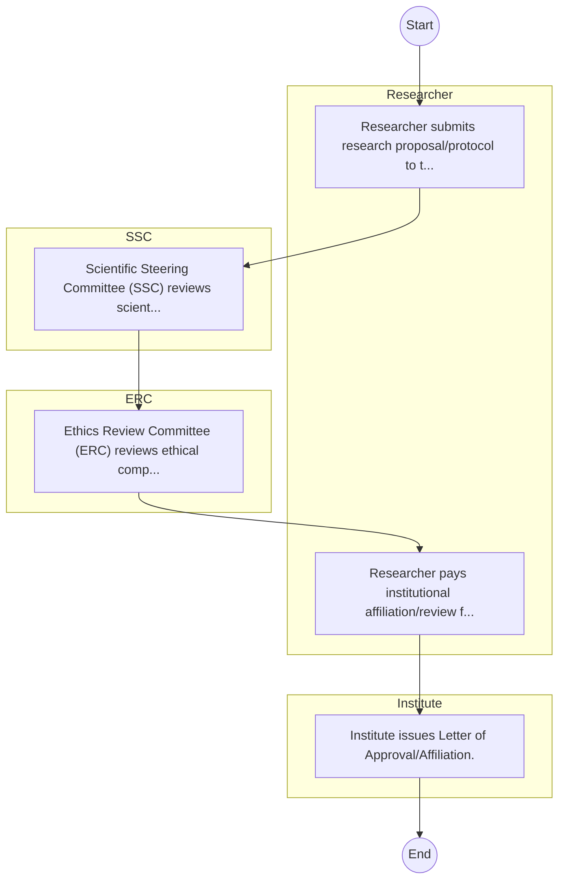

# STANDARD BPM TEMPLATE – Kenya Agricultural and Livestock Research Organization

## Cover Page
- **Ministry/Department/Agency (MDA):** Kenya Agricultural and Livestock Research Organization
- **Process Name:** To generate and promote knowledge and appropriate technologies to enhance agricultural and livestock productivity, value addition, and sustainable resource management; to undertake, streamline, coordinate, and regulate all aspects of research in agriculture and livestock development; and to promote the application of research findings, technologies, and innovations to improve livelihoods and ensure food security in Kenya.
- **Document Version:** 1.0
- **Date:** 2026-02-14
- **Classification:** Official

---

## Executive Summary
The Kenya Agricultural and Livestock Research Organization (KALRO) is mandated to conduct agricultural and livestock research of strategic national importance. It produces and promotes improved technologies, information, knowledge, and approaches to support the agricultural and livestock sector, contributing significantly to food security, poverty reduction, and overall economic development in Kenya.

---

## Process Flowchart (BPMN 2.0 - Mermaid)
*Guidance: This diagram visualizes the process flow across different actors (Swimlanes).*

---

## Process Overview
### Process Name
To generate and promote knowledge and appropriate technologies to enhance agricultural and livestock productivity, value addition, and sustainable resource management; to undertake, streamline, coordinate, and regulate all aspects of research in agriculture and livestock development; and to promote the application of research findings, technologies, and innovations to improve livelihoods and ensure food security in Kenya.

### Service Category
- G2C/G2B

### Process Objective
- To generate and promote knowledge and appropriate technologies to enhance agricultural and livestock productivity, value addition, and sustainable resource management; to undertake, streamline, coordinate, and regulate all aspects of research in agriculture and livestock development; and to promote the application of research findings, technologies, and innovations to improve livelihoods and ensure food security in Kenya.

### Scope
- **In Scope:** End-to-end processing within Kenya Agricultural and Livestock Research Organization.
- **Out of Scope:** External agency approvals.

### Triggers
- Submission of application/request by Researcher.

### End States
- **Successful:** License / Permit / Certificate, Compliance Inspection Report, Official Receipt, Gazette Notice
- **Unsuccessful:** Application rejected due to non-compliance.

### Policy Context
- The Kenya Agricultural and Livestock Research Organization Act; The Constitution of Kenya 2010; Data Protection Act 2019.

---

## Stakeholders
| Stakeholder | Role | Responsibilities |
|---|---|---|
| ERC | Process Actor | Performs actions as defined in steps. |
| Researcher | Process Actor | Performs actions as defined in steps. |
| SSC | Process Actor | Performs actions as defined in steps. |
| Institute | Process Actor | Performs actions as defined in steps. |

---

## Inputs & Outputs
- **Inputs:** Application Form (License/Permit), Compliance Documents (Tax Compliance, CR12), Technical Reports / Site Plans, Proof of Payment
- **Outputs:** License / Permit / Certificate, Compliance Inspection Report, Official Receipt, Gazette Notice

---

## Detailed Process (AS-IS)
| Step | Role | Action | Tool | Notes |
|---|---|---|---|---|
| 1 | Researcher | Researcher submits research proposal/protocol to the Institute. | Manual | |
| 2 | SSC | Scientific Steering Committee (SSC) reviews scientific merit. | Manual | |
| 3 | ERC | Ethics Review Committee (ERC) reviews ethical compliance. | Manual | |
| 4 | Researcher | Researcher pays institutional affiliation/review fees. | Manual | |
| 5 | Institute | Institute issues Letter of Approval/Affiliation. | Manual | |

---

## Pain Points & Opportunities
### Pain Points
- Manual document verification takes time.
- High cost and time for physical inspections.
- Risk of counterfeit licenses/certificates.
- Lack of real-time monitoring of licensees.

### Opportunities
- Online Licensing Management System (LMS).
- Integration with IPRS and BRS for auto-verification.
- Mobile field inspection apps with GIS.
- QR-coded verifiable certificates.

---

## KPIs
| KPI | Baseline | Target |
|---|---|---|
| Turnaround Time | 30 Days | 5 Days |
| CSAT | 50% | 90% |
