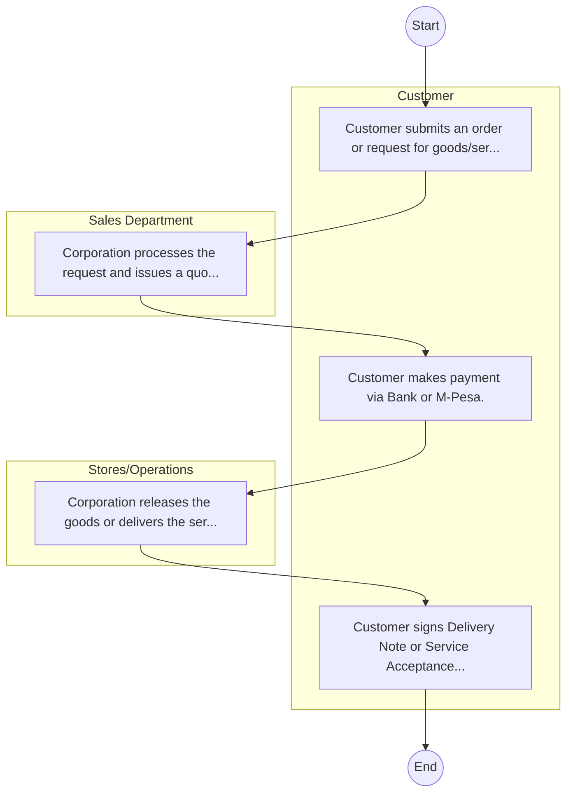

# STANDARD BPM TEMPLATE – Kenya Broadcasting Corporation

## Cover Page
- **Ministry/Department/Agency (MDA):** Kenya Broadcasting Corporation
- **Process Name:** To deliver high-quality, diverse, and objective programming across radio, television, and digital platforms; to increase public understanding of government development policies and strategies; to promote effective communication and national cohesion; and to serve as a vital tool for national development by upholding independence, impartiality, and public service broadcasting principles.
- **Document Version:** 1.0
- **Date:** 2026-02-14
- **Classification:** Official

---

## Executive Summary
The Kenya Broadcasting Corporation (KBC) is Kenya's national public broadcaster, established by an Act of Parliament (CAP 221 of the Laws of Kenya). Its primary mandate is to provide independent, impartial, objective, informative, educative, and entertaining broadcasting services in diverse languages, contributing to national unity, cultural preservation, and the socio-economic well-being of the Kenyan people.

---

## Process Flowchart (BPMN 2.0 - Mermaid)
*Guidance: This diagram visualizes the process flow across different actors (Swimlanes).*

---

## Process Overview
### Process Name
To deliver high-quality, diverse, and objective programming across radio, television, and digital platforms; to increase public understanding of government development policies and strategies; to promote effective communication and national cohesion; and to serve as a vital tool for national development by upholding independence, impartiality, and public service broadcasting principles.

### Service Category
- G2B (Government to Business)

### Process Objective
- To deliver high-quality, diverse, and objective programming across radio, television, and digital platforms; to increase public understanding of government development policies and strategies; to promote effective communication and national cohesion; and to serve as a vital tool for national development by upholding independence, impartiality, and public service broadcasting principles.

### Scope
- **In Scope:** End-to-end processing within Kenya Broadcasting Corporation.
- **Out of Scope:** External agency approvals.

### Triggers
- Submission of application/request by Customer.

### End States
- **Successful:** Loan Disbursement / Service Delivery, Statement of Account, Contract / Agreement, Receipt / Invoice
- **Unsuccessful:** Application rejected due to non-compliance.

### Policy Context
- The Kenya Broadcasting Corporation Act; The Constitution of Kenya 2010; Data Protection Act 2019.

---

## Stakeholders
| Stakeholder | Role | Responsibilities |
|---|---|---|
| Customer | Process Actor | Performs actions as defined in steps. |
| Sales Department | Process Actor | Performs actions as defined in steps. |
| Stores/Operations | Process Actor | Performs actions as defined in steps. |

---

## Inputs & Outputs
- **Inputs:** Loan/Service Application Form, Business Proposal / Plan, Financial Statements / Bank Records, Collateral / Security Documents
- **Outputs:** Loan Disbursement / Service Delivery, Statement of Account, Contract / Agreement, Receipt / Invoice

---

## Detailed Process (AS-IS)
| Step | Role | Action | Tool | Notes |
|---|---|---|---|---|
| 1 | Customer | Customer submits an order or request for goods/services. | Manual | |
| 2 | Sales Department | Corporation processes the request and issues a quotation/proforma invoice. | Manual | |
| 3 | Customer | Customer makes payment via Bank or M-Pesa. | Manual | |
| 4 | Stores/Operations | Corporation releases the goods or delivers the service. | Manual | |
| 5 | Customer | Customer signs Delivery Note or Service Acceptance Form. | Manual | |

---

## Pain Points & Opportunities
### Pain Points
- Lengthy credit appraisal processes.
- Manual debt collection and reconciliation.
- High paperwork for loan processing.
- Lack of 360-degree customer view.

### Opportunities
- Automated Credit Scoring and Appraisal.
- Mobile-based loan application and repayment.
- Customer Relationship Management (CRM) systems.
- Data analytics for risk management.

---

## KPIs
| KPI | Baseline | Target |
|---|---|---|
| Turnaround Time | 30 Days | 5 Days |
| CSAT | 50% | 90% |
