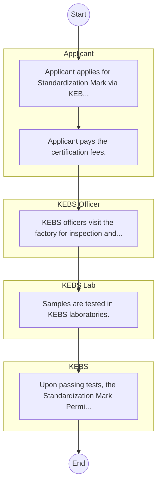

# STANDARD BPM TEMPLATE – Kenya Bureau of Standards

## Cover Page
- **Ministry/Department/Agency (MDA):** Kenya Bureau of Standards
- **Process Name:** To develop and promote national standards; provide quality assurance and inspection services for locally manufactured and imported products; conduct market surveillance to enforce compliance; offer comprehensive testing and metrology (calibration) services; and certify products and management systems to enhance the quality of goods and services, promote consumer safety, and support industrial competitiveness in Kenya.
- **Document Version:** 1.0
- **Date:** 2026-02-14
- **Classification:** Official

---

## Executive Summary
The Kenya Bureau of Standards (KEBS) is a government agency established by an Act of Parliament, responsible for maintaining standards and practices of metrology in Kenya. Its core mandate is to ensure quality through standardization, quality assurance and inspection, market surveillance, testing services, metrology, and certification, thereby protecting consumers and facilitating fair trade and industrial growth.

---

## Process Flowchart (BPMN 2.0 - Mermaid)
*Guidance: This diagram visualizes the process flow across different actors (Swimlanes).*

---

## Process Overview
### Process Name
To develop and promote national standards; provide quality assurance and inspection services for locally manufactured and imported products; conduct market surveillance to enforce compliance; offer comprehensive testing and metrology (calibration) services; and certify products and management systems to enhance the quality of goods and services, promote consumer safety, and support industrial competitiveness in Kenya.

### Service Category
- G2C/G2B

### Process Objective
- To develop and promote national standards; provide quality assurance and inspection services for locally manufactured and imported products; conduct market surveillance to enforce compliance; offer comprehensive testing and metrology (calibration) services; and certify products and management systems to enhance the quality of goods and services, promote consumer safety, and support industrial competitiveness in Kenya.

### Scope
- **In Scope:** End-to-end processing within Kenya Bureau of Standards.
- **Out of Scope:** External agency approvals.

### Triggers
- Submission of application/request by Applicant.

### End States
- **Successful:** License / Permit / Certificate, Compliance Inspection Report, Official Receipt, Gazette Notice
- **Unsuccessful:** Application rejected due to non-compliance.

### Policy Context
- The Kenya Bureau of Standards Act; The Constitution of Kenya 2010; Data Protection Act 2019.

---

## Stakeholders
| Stakeholder | Role | Responsibilities |
|---|---|---|
| Applicant | Process Actor | Performs actions as defined in steps. |
| KEBS | Process Actor | Performs actions as defined in steps. |
| KEBS Officer | Process Actor | Performs actions as defined in steps. |
| KEBS Lab | Process Actor | Performs actions as defined in steps. |

---

## Inputs & Outputs
- **Inputs:** Application Form (License/Permit), Compliance Documents (Tax Compliance, CR12), Technical Reports / Site Plans, Proof of Payment
- **Outputs:** License / Permit / Certificate, Compliance Inspection Report, Official Receipt, Gazette Notice

---

## Detailed Process (AS-IS)
| Step | Role | Action | Tool | Notes |
|---|---|---|---|---|
| 1 | Applicant | Applicant applies for Standardization Mark via KEBS IMS portal. | Digital | |
| 2 | Applicant | Applicant pays the certification fees. | Manual | |
| 3 | KEBS Officer | KEBS officers visit the factory for inspection and sample collection. | Manual | |
| 4 | KEBS Lab | Samples are tested in KEBS laboratories. | Manual | |
| 5 | KEBS | Upon passing tests, the Standardization Mark Permit is issued. | Manual | |

---

## Pain Points & Opportunities
### Pain Points
- Manual document verification takes time.
- High cost and time for physical inspections.
- Risk of counterfeit licenses/certificates.
- Lack of real-time monitoring of licensees.

### Opportunities
- Online Licensing Management System (LMS).
- Integration with IPRS and BRS for auto-verification.
- Mobile field inspection apps with GIS.
- QR-coded verifiable certificates.

---

## KPIs
| KPI | Baseline | Target |
|---|---|---|
| Turnaround Time | 30 Days | 5 Days |
| CSAT | 50% | 90% |
