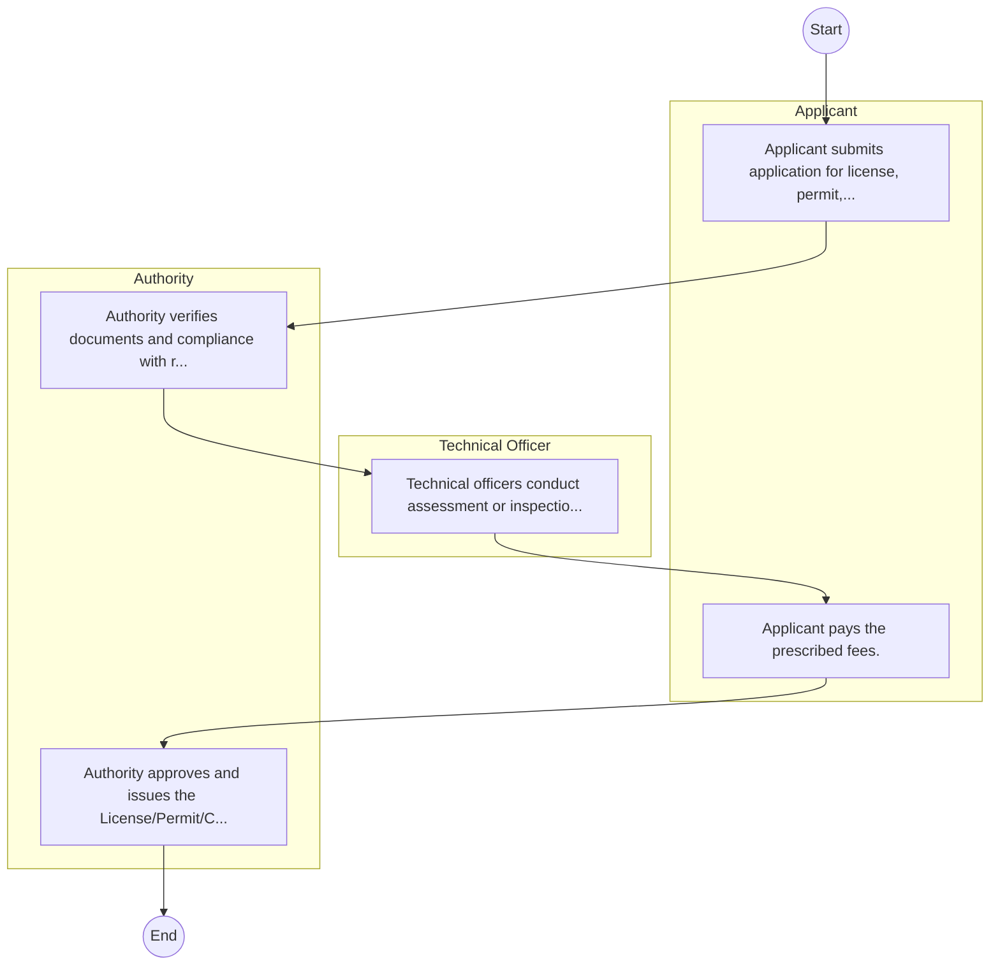

# STANDARD BPM TEMPLATE – Kenya Health Professionals Oversight Authority

## Cover Page
- **Ministry/Department/Agency (MDA):** Kenya Health Professionals Oversight Authority
- **Process Name:** Represents 'Health' cluster for balanced coverage; entity type: Agency. Included as Tier 3 for light‑touch desk review/survey.
- **Document Version:** 1.0
- **Date:** 2026-02-14
- **Classification:** Official

---

## Executive Summary
Represents 'Health' cluster for balanced coverage; entity type: Agency. Included as Tier 3 for light‑touch desk review/survey.

---

## Process Flowchart (BPMN 2.0 - Mermaid)
*Guidance: This diagram visualizes the process flow across different actors (Swimlanes).*

---

## Process Overview
### Process Name
Represents 'Health' cluster for balanced coverage; entity type: Agency. Included as Tier 3 for light‑touch desk review/survey.

### Service Category
- G2B (Government to Business)

### Process Objective
- Represents 'Health' cluster for balanced coverage; entity type: Agency. Included as Tier 3 for light‑touch desk review/survey.

### Scope
- **In Scope:** End-to-end processing within Kenya Health Professionals Oversight Authority.
- **Out of Scope:** External agency approvals.

### Triggers
- Submission of application/request by Applicant.

### End States
- **Successful:** Patient File / EMR Record, Diagnostic Lab Reports, Prescription / Medication, Discharge Summary
- **Unsuccessful:** Application rejected due to non-compliance.

### Policy Context
- The Kenya Health Professionals Oversight Authority Act; The Constitution of Kenya 2010; Data Protection Act 2019.

---

## Stakeholders
| Stakeholder | Role | Responsibilities |
|---|---|---|
| Applicant | Process Actor | Performs actions as defined in steps. |
| Authority | Process Actor | Performs actions as defined in steps. |
| Technical Officer | Process Actor | Performs actions as defined in steps. |

---

## Inputs & Outputs
- **Inputs:** Patient Personal/Bio-data, Insurance Card / NHIF Number, Medical History Records, Triage Vitals (BP, Temp, etc.)
- **Outputs:** Patient File / EMR Record, Diagnostic Lab Reports, Prescription / Medication, Discharge Summary

---

## Detailed Process (AS-IS)
| Step | Role | Action | Tool | Notes |
|---|---|---|---|---|
| 1 | Applicant | Applicant submits application for license, permit, or service. | Manual | |
| 2 | Authority | Authority verifies documents and compliance with regulations. | Manual | |
| 3 | Technical Officer | Technical officers conduct assessment or inspection. | Manual | |
| 4 | Applicant | Applicant pays the prescribed fees. | Manual | |
| 5 | Authority | Authority approves and issues the License/Permit/Certificate. | Manual | |

---

## Pain Points & Opportunities
### Pain Points
- Loss of physical patient files.
- Long patient wait times at triage and pharmacy.
- Lack of interoperability between departments (Lab, Pharmacy, Billing).
- Revenue leakage in cash collections.

### Opportunities
- Comprehensive Electronic Medical Records (EMR).
- Telemedicine for remote consultations.
- AI-assisted diagnostics and radiology.
- Automated inventory management for pharmacy.

---

## KPIs
| KPI | Baseline | Target |
|---|---|---|
| Turnaround Time | 30 Days | 5 Days |
| CSAT | 50% | 90% |
