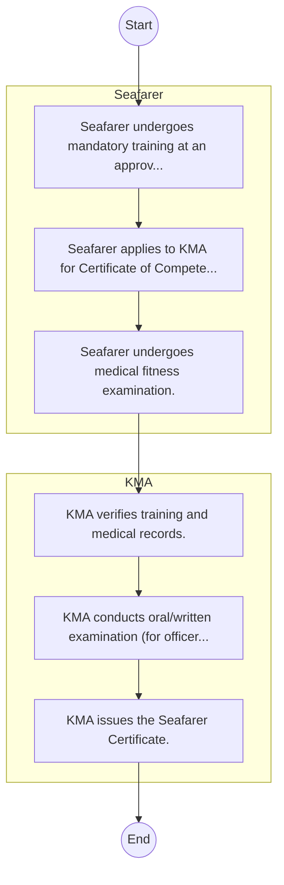

# STANDARD BPM TEMPLATE – Kenya Maritime Authority

## Cover Page
- **Ministry/Department/Agency (MDA):** Kenya Maritime Authority
- **Process Name:** To administer and enforce the Merchant Shipping Act, 2009, and other related regulations and international maritime conventions; to manage maritime search and rescue operations; to ensure shipping safety and security; to oversee the training, recruitment, and welfare of seafarers; to investigate maritime casualties; to develop national oil spill contingency plans; to maintain and administer a national ship register; and to advise the government on all matters pertaining to maritime affairs and legislation.
- **Document Version:** 1.0
- **Date:** 2026-02-14
- **Classification:** Official

---

## Executive Summary
The Kenya Maritime Authority (KMA) is a statutory authority established under the Kenya Maritime Authority Act 2006. Its primary mandate is to regulate, coordinate, and oversee maritime affairs in the Republic of Kenya, ensuring shipping safety, promoting seafarer welfare, protecting the marine environment, and facilitating maritime trade and investment in compliance with national and international standards.

---

## Process Flowchart (BPMN 2.0 - Mermaid)
*Guidance: This diagram visualizes the process flow across different actors (Swimlanes).*

---

## Process Overview
### Process Name
To administer and enforce the Merchant Shipping Act, 2009, and other related regulations and international maritime conventions; to manage maritime search and rescue operations; to ensure shipping safety and security; to oversee the training, recruitment, and welfare of seafarers; to investigate maritime casualties; to develop national oil spill contingency plans; to maintain and administer a national ship register; and to advise the government on all matters pertaining to maritime affairs and legislation.

### Service Category
- G2B (Government to Business)

### Process Objective
- To administer and enforce the Merchant Shipping Act, 2009, and other related regulations and international maritime conventions; to manage maritime search and rescue operations; to ensure shipping safety and security; to oversee the training, recruitment, and welfare of seafarers; to investigate maritime casualties; to develop national oil spill contingency plans; to maintain and administer a national ship register; and to advise the government on all matters pertaining to maritime affairs and legislation.

### Scope
- **In Scope:** End-to-end processing within Kenya Maritime Authority.
- **Out of Scope:** External agency approvals.

### Triggers
- Submission of application/request by Seafarer.

### End States
- **Successful:** License / Permit / Certificate, Compliance Inspection Report, Official Receipt, Gazette Notice
- **Unsuccessful:** Application rejected due to non-compliance.

### Policy Context
- The Kenya Maritime Authority Act; The Constitution of Kenya 2010; Data Protection Act 2019.

---

## Stakeholders
| Stakeholder | Role | Responsibilities |
|---|---|---|
| KMA | Process Actor | Performs actions as defined in steps. |
| Seafarer | Process Actor | Performs actions as defined in steps. |

---

## Inputs & Outputs
- **Inputs:** Application Form (License/Permit), Compliance Documents (Tax Compliance, CR12), Technical Reports / Site Plans, Proof of Payment
- **Outputs:** License / Permit / Certificate, Compliance Inspection Report, Official Receipt, Gazette Notice

---

## Detailed Process (AS-IS)
| Step | Role | Action | Tool | Notes |
|---|---|---|---|---|
| 1 | Seafarer | Seafarer undergoes mandatory training at an approved maritime institution. | Manual | |
| 2 | Seafarer | Seafarer applies to KMA for Certificate of Competency (CoC) or Proficiency. | Manual | |
| 3 | Seafarer | Seafarer undergoes medical fitness examination. | Manual | |
| 4 | KMA | KMA verifies training and medical records. | Manual | |
| 5 | KMA | KMA conducts oral/written examination (for officers). | Manual | |
| 6 | KMA | KMA issues the Seafarer Certificate. | Manual | |

---

## Pain Points & Opportunities
### Pain Points
- Manual document verification takes time.
- High cost and time for physical inspections.
- Risk of counterfeit licenses/certificates.
- Lack of real-time monitoring of licensees.

### Opportunities
- Online Licensing Management System (LMS).
- Integration with IPRS and BRS for auto-verification.
- Mobile field inspection apps with GIS.
- QR-coded verifiable certificates.

---

## KPIs
| KPI | Baseline | Target |
|---|---|---|
| Turnaround Time | 30 Days | 5 Days |
| CSAT | 50% | 90% |
