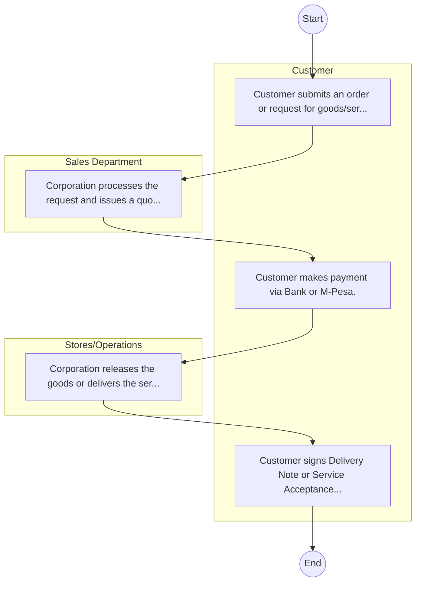

# STANDARD BPM TEMPLATE – Kenya Railways Corporation

## Cover Page
- **Ministry/Department/Agency (MDA):** Kenya Railways Corporation
- **Process Name:** To provide efficient, safe, and reliable railway and inland waterways transport services for both passengers and cargo; to promote, facilitate, and actively participate in national and metropolitan railway network development, including the Standard Gauge Railway (SGR) and revitalization of the Meter Gauge Railway (MGR); to offer skills and technology for the railway sector; to leverage its assets for business growth and optimal resource utilization; and to develop an integrated, safe, reliable, and sustainable rail transport system that meets the evolving needs of the country and region.
- **Document Version:** 1.0
- **Date:** 2026-02-14
- **Classification:** Official

---

## Executive Summary
The Kenya Railways Corporation (KRC) is a state corporation established in 1978 under the Kenya Railways Corporation Act (Cap 397) of the Laws of Kenya. KRC is mandated to provide efficient and effective railway and inland waterways transport services. It plays a pivotal role in national and metropolitan railway network development, facilitating the movement of passengers and cargo, connecting Kenya and the East and Central African region to global markets, and significantly contributing to economic growth and regional integration.

---

## Process Flowchart (BPMN 2.0 - Mermaid)
*Guidance: This diagram visualizes the process flow across different actors (Swimlanes).*

---

## Process Overview
### Process Name
To provide efficient, safe, and reliable railway and inland waterways transport services for both passengers and cargo; to promote, facilitate, and actively participate in national and metropolitan railway network development, including the Standard Gauge Railway (SGR) and revitalization of the Meter Gauge Railway (MGR); to offer skills and technology for the railway sector; to leverage its assets for business growth and optimal resource utilization; and to develop an integrated, safe, reliable, and sustainable rail transport system that meets the evolving needs of the country and region.

### Service Category
- G2B (Government to Business)

### Process Objective
- To provide efficient, safe, and reliable railway and inland waterways transport services for both passengers and cargo; to promote, facilitate, and actively participate in national and metropolitan railway network development, including the Standard Gauge Railway (SGR) and revitalization of the Meter Gauge Railway (MGR); to offer skills and technology for the railway sector; to leverage its assets for business growth and optimal resource utilization; and to develop an integrated, safe, reliable, and sustainable rail transport system that meets the evolving needs of the country and region.

### Scope
- **In Scope:** End-to-end processing within Kenya Railways Corporation.
- **Out of Scope:** External agency approvals.

### Triggers
- Submission of application/request by Customer.

### End States
- **Successful:** Loan Disbursement / Service Delivery, Statement of Account, Contract / Agreement, Receipt / Invoice
- **Unsuccessful:** Application rejected due to non-compliance.

### Policy Context
- The Kenya Railways Corporation Act; The Constitution of Kenya 2010; Data Protection Act 2019.

---

## Stakeholders
| Stakeholder | Role | Responsibilities |
|---|---|---|
| Customer | Process Actor | Performs actions as defined in steps. |
| Sales Department | Process Actor | Performs actions as defined in steps. |
| Stores/Operations | Process Actor | Performs actions as defined in steps. |

---

## Inputs & Outputs
- **Inputs:** Loan/Service Application Form, Business Proposal / Plan, Financial Statements / Bank Records, Collateral / Security Documents
- **Outputs:** Loan Disbursement / Service Delivery, Statement of Account, Contract / Agreement, Receipt / Invoice

---

## Detailed Process (AS-IS)
| Step | Role | Action | Tool | Notes |
|---|---|---|---|---|
| 1 | Customer | Customer submits an order or request for goods/services. | Manual | |
| 2 | Sales Department | Corporation processes the request and issues a quotation/proforma invoice. | Manual | |
| 3 | Customer | Customer makes payment via Bank or M-Pesa. | Manual | |
| 4 | Stores/Operations | Corporation releases the goods or delivers the service. | Manual | |
| 5 | Customer | Customer signs Delivery Note or Service Acceptance Form. | Manual | |

---

## Pain Points & Opportunities
### Pain Points
- Lengthy credit appraisal processes.
- Manual debt collection and reconciliation.
- High paperwork for loan processing.
- Lack of 360-degree customer view.

### Opportunities
- Automated Credit Scoring and Appraisal.
- Mobile-based loan application and repayment.
- Customer Relationship Management (CRM) systems.
- Data analytics for risk management.

---

## KPIs
| KPI | Baseline | Target |
|---|---|---|
| Turnaround Time | 30 Days | 5 Days |
| CSAT | 50% | 90% |
