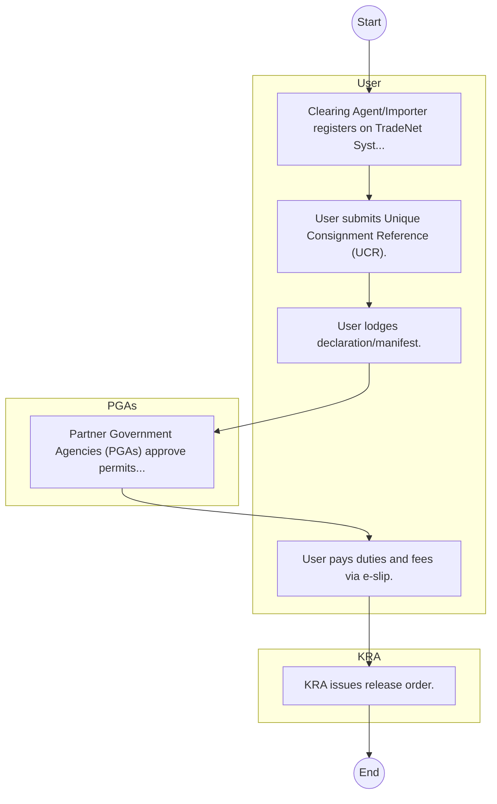

# STANDARD BPM TEMPLATE – Kenya Trade Network Agency

## Cover Page
- **Ministry/Department/Agency (MDA):** Kenya Trade Network Agency
- **Process Name:** To establish, implement, and manage the National Electronic Single Window System (NESWS) to facilitate international trade; to integrate the electronic systems of public and private entities involved in international trade transactions; to develop, manage, and promote the efficient exchange of electronic data to facilitate trade; to conduct and coordinate research in e-commerce to simplify and standardize trade documentation; to maintain an electronic database of all imported and exported goods and services; to provide training programs to ensure adherence to international trade norms; and to offer services such as the Trade Facilitation Platform and the InfoTrade Kenya Portal for procedural guidance and stakeholder education.
- **Document Version:** 1.0
- **Date:** 2026-02-14
- **Classification:** Official

---

## Executive Summary
The Kenya Trade Network Agency (KenTrade) is a state corporation operating under Kenya's National Treasury, established in January 2011. Its core mandate is to establish, implement, and manage the National Electronic Single Window System (NESWS), commonly known as the Kenya TradeNet System. This system is designed to streamline cross-border trade, simplify import and export procedures, and significantly reduce associated paperwork and processing times, thereby enhancing Kenya's efficiency and competitiveness in international trade.

---

## Process Flowchart (BPMN 2.0 - Mermaid)
*Guidance: This diagram visualizes the process flow across different actors (Swimlanes).*

---

## Process Overview
### Process Name
To establish, implement, and manage the National Electronic Single Window System (NESWS) to facilitate international trade; to integrate the electronic systems of public and private entities involved in international trade transactions; to develop, manage, and promote the efficient exchange of electronic data to facilitate trade; to conduct and coordinate research in e-commerce to simplify and standardize trade documentation; to maintain an electronic database of all imported and exported goods and services; to provide training programs to ensure adherence to international trade norms; and to offer services such as the Trade Facilitation Platform and the InfoTrade Kenya Portal for procedural guidance and stakeholder education.

### Service Category
- G2C/G2B

### Process Objective
- To establish, implement, and manage the National Electronic Single Window System (NESWS) to facilitate international trade; to integrate the electronic systems of public and private entities involved in international trade transactions; to develop, manage, and promote the efficient exchange of electronic data to facilitate trade; to conduct and coordinate research in e-commerce to simplify and standardize trade documentation; to maintain an electronic database of all imported and exported goods and services; to provide training programs to ensure adherence to international trade norms; and to offer services such as the Trade Facilitation Platform and the InfoTrade Kenya Portal for procedural guidance and stakeholder education.

### Scope
- **In Scope:** End-to-end processing within Kenya Trade Network Agency.
- **Out of Scope:** External agency approvals.

### Triggers
- Submission of application/request by User.

### End States
- **Successful:** License / Permit / Certificate, Compliance Inspection Report, Official Receipt, Gazette Notice
- **Unsuccessful:** Application rejected due to non-compliance.

### Policy Context
- The Kenya Trade Network Agency Act; The Constitution of Kenya 2010; Data Protection Act 2019.

---

## Stakeholders
| Stakeholder | Role | Responsibilities |
|---|---|---|
| KRA | Process Actor | Performs actions as defined in steps. |
| PGAs | Process Actor | Performs actions as defined in steps. |
| User | Process Actor | Performs actions as defined in steps. |

---

## Inputs & Outputs
- **Inputs:** Application Form (License/Permit), Compliance Documents (Tax Compliance, CR12), Technical Reports / Site Plans, Proof of Payment
- **Outputs:** License / Permit / Certificate, Compliance Inspection Report, Official Receipt, Gazette Notice

---

## Detailed Process (AS-IS)
| Step | Role | Action | Tool | Notes |
|---|---|---|---|---|
| 1 | User | Clearing Agent/Importer registers on TradeNet System. | Manual | |
| 2 | User | User submits Unique Consignment Reference (UCR). | Manual | |
| 3 | User | User lodges declaration/manifest. | Manual | |
| 4 | PGAs | Partner Government Agencies (PGAs) approve permits online. | Manual | |
| 5 | User | User pays duties and fees via e-slip. | Manual | |
| 6 | KRA | KRA issues release order. | Manual | |

---

## Pain Points & Opportunities
### Pain Points
- Manual document verification takes time.
- High cost and time for physical inspections.
- Risk of counterfeit licenses/certificates.
- Lack of real-time monitoring of licensees.

### Opportunities
- Online Licensing Management System (LMS).
- Integration with IPRS and BRS for auto-verification.
- Mobile field inspection apps with GIS.
- QR-coded verifiable certificates.

---

## KPIs
| KPI | Baseline | Target |
|---|---|---|
| Turnaround Time | 30 Days | 5 Days |
| CSAT | 50% | 90% |
