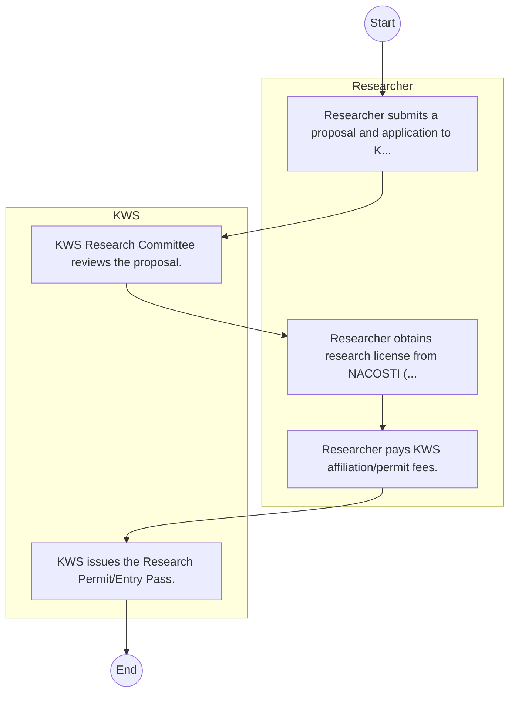

# STANDARD BPM TEMPLATE – Kenya Wildlife Service

## Cover Page
- **Ministry/Department/Agency (MDA):** Kenya Wildlife Service
- **Process Name:** To sustainably conserve Kenya's wildlife heritage and its habitats for the well-being of nature and people; to provide security for both wildlife and visitors within national parks, wildlife conservation areas, and sanctuaries; to effectively protect and manage national parks, reserves, sanctuaries, and marine parks; to conduct and coordinate research activities in wildlife conservation and management; to promote and undertake extension service programs to enhance wildlife conservation, education, and training; to enforce the provisions of the Wildlife Conservation and Management Act (WCMA, 2013); to undertake wildlife rescue and rehabilitation of orphaned or confiscated wildlife; to mitigate human-wildlife conflicts; to foster partnerships and collaboration with local and international stakeholders; and to contribute to national security through wildlife protection.
- **Document Version:** 1.0
- **Date:** 2026-02-14
- **Classification:** Official

---

## Executive Summary
The Kenya Wildlife Service (KWS) is a state corporation responsible for the conservation and management of Kenya's wildlife and its habitats. Established under the Wildlife Conservation and Management Act of 2013, KWS is mandated to protect wildlife and visitors within national parks and reserves, conduct research, engage communities, enforce wildlife laws, and mitigate human-wildlife conflicts. Its vision is to ensure thriving wildlife and healthy habitats for all, forever, contributing significantly to Kenya's natural heritage and tourism sector.

---

## Process Flowchart (BPMN 2.0 - Mermaid)
*Guidance: This diagram visualizes the process flow across different actors (Swimlanes).*

---

## Process Overview
### Process Name
To sustainably conserve Kenya's wildlife heritage and its habitats for the well-being of nature and people; to provide security for both wildlife and visitors within national parks, wildlife conservation areas, and sanctuaries; to effectively protect and manage national parks, reserves, sanctuaries, and marine parks; to conduct and coordinate research activities in wildlife conservation and management; to promote and undertake extension service programs to enhance wildlife conservation, education, and training; to enforce the provisions of the Wildlife Conservation and Management Act (WCMA, 2013); to undertake wildlife rescue and rehabilitation of orphaned or confiscated wildlife; to mitigate human-wildlife conflicts; to foster partnerships and collaboration with local and international stakeholders; and to contribute to national security through wildlife protection.

### Service Category
- G2C/G2B

### Process Objective
- To sustainably conserve Kenya's wildlife heritage and its habitats for the well-being of nature and people; to provide security for both wildlife and visitors within national parks, wildlife conservation areas, and sanctuaries; to effectively protect and manage national parks, reserves, sanctuaries, and marine parks; to conduct and coordinate research activities in wildlife conservation and management; to promote and undertake extension service programs to enhance wildlife conservation, education, and training; to enforce the provisions of the Wildlife Conservation and Management Act (WCMA, 2013); to undertake wildlife rescue and rehabilitation of orphaned or confiscated wildlife; to mitigate human-wildlife conflicts; to foster partnerships and collaboration with local and international stakeholders; and to contribute to national security through wildlife protection.

### Scope
- **In Scope:** End-to-end processing within Kenya Wildlife Service.
- **Out of Scope:** External agency approvals.

### Triggers
- Submission of application/request by Researcher.

### End States
- **Successful:** License / Permit / Certificate, Compliance Inspection Report, Official Receipt, Gazette Notice
- **Unsuccessful:** Application rejected due to non-compliance.

### Policy Context
- The Kenya Wildlife Service Act; The Constitution of Kenya 2010; Data Protection Act 2019.

---

## Stakeholders
| Stakeholder | Role | Responsibilities |
|---|---|---|
| Researcher | Process Actor | Performs actions as defined in steps. |
| KWS | Process Actor | Performs actions as defined in steps. |

---

## Inputs & Outputs
- **Inputs:** Application Form (License/Permit), Compliance Documents (Tax Compliance, CR12), Technical Reports / Site Plans, Proof of Payment
- **Outputs:** License / Permit / Certificate, Compliance Inspection Report, Official Receipt, Gazette Notice

---

## Detailed Process (AS-IS)
| Step | Role | Action | Tool | Notes |
|---|---|---|---|---|
| 1 | Researcher | Researcher submits a proposal and application to KWS. | Manual | |
| 2 | KWS | KWS Research Committee reviews the proposal. | Manual | |
| 3 | Researcher | Researcher obtains research license from NACOSTI (prerequisite). | Manual | |
| 4 | Researcher | Researcher pays KWS affiliation/permit fees. | Manual | |
| 5 | KWS | KWS issues the Research Permit/Entry Pass. | Manual | |

---

## Pain Points & Opportunities
### Pain Points
- Manual document verification takes time.
- High cost and time for physical inspections.
- Risk of counterfeit licenses/certificates.
- Lack of real-time monitoring of licensees.

### Opportunities
- Online Licensing Management System (LMS).
- Integration with IPRS and BRS for auto-verification.
- Mobile field inspection apps with GIS.
- QR-coded verifiable certificates.

---

## KPIs
| KPI | Baseline | Target |
|---|---|---|
| Turnaround Time | 30 Days | 5 Days |
| CSAT | 50% | 90% |
