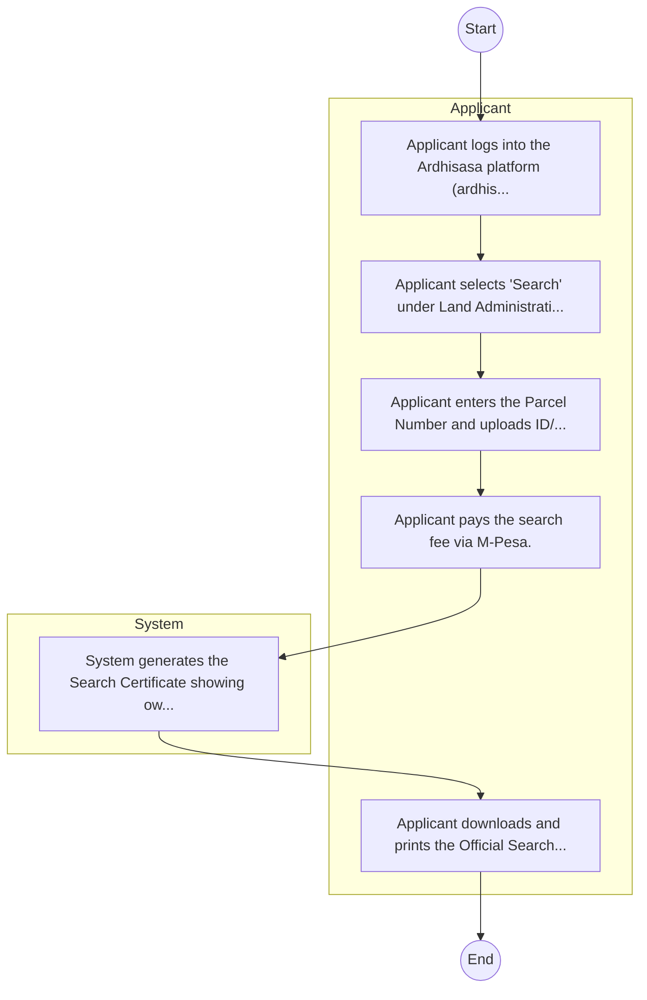

# STANDARD BPM TEMPLATE – Lands Limited(subsidiary of ADC)

## Cover Page
- **Ministry/Department/Agency (MDA):** Lands Limited(subsidiary of ADC)
- **Process Name:** Represents 'Agriculture Rural and Urban Development' cluster for balanced coverage; entity type: Agency. Included as Tier 3 for light‑touch desk review/survey.
- **Document Version:** 1.0
- **Date:** 2026-02-14
- **Classification:** Official

---

## Executive Summary
Represents 'Agriculture Rural and Urban Development' cluster for balanced coverage; entity type: Agency. Included as Tier 3 for light‑touch desk review/survey.

---

## Process Flowchart (BPMN 2.0 - Mermaid)
*Guidance: This diagram visualizes the process flow across different actors (Swimlanes).*

---

## Process Overview
### Process Name
Represents 'Agriculture Rural and Urban Development' cluster for balanced coverage; entity type: Agency. Included as Tier 3 for light‑touch desk review/survey.

### Service Category
- G2C/G2B

### Process Objective
- Represents 'Agriculture Rural and Urban Development' cluster for balanced coverage; entity type: Agency. Included as Tier 3 for light‑touch desk review/survey.

### Scope
- **In Scope:** End-to-end processing within Lands Limited(subsidiary of ADC).
- **Out of Scope:** External agency approvals.

### Triggers
- Submission of application/request by Applicant.

### End States
- **Successful:** Search Certificate, New Title Deed, Green Card Entry
- **Unsuccessful:** Application rejected due to non-compliance.

### Policy Context
- The Lands Limited(subsidiary of ADC) Act; The Constitution of Kenya 2010; Data Protection Act 2019.

---

## Stakeholders
| Stakeholder | Role | Responsibilities |
|---|---|---|
| Applicant | Process Actor | Performs actions as defined in steps. |
| System | Process Actor | Performs actions as defined in steps. |

---

## Inputs & Outputs
- **Inputs:** Transfer Form, Title Deed, Land Rent Clearance
- **Outputs:** Search Certificate, New Title Deed, Green Card Entry

---

## Detailed Process (AS-IS)
| Step | Role | Action | Tool | Notes |
|---|---|---|---|---|
| 1 | Applicant | Applicant logs into the Ardhisasa platform (ardhisasa.lands.go.ke). | Manual | |
| 2 | Applicant | Applicant selects 'Search' under Land Administration. | Manual | |
| 3 | Applicant | Applicant enters the Parcel Number and uploads ID/Consent if required. | Manual | |
| 4 | Applicant | Applicant pays the search fee via M-Pesa. | Manual | |
| 5 | System | System generates the Search Certificate showing ownership and encumbrances. | Manual | |
| 6 | Applicant | Applicant downloads and prints the Official Search Result. | Manual | |

---

## Pain Points & Opportunities
### Pain Points
- Missing green cards
- Fraud/Double allocation
- Manual search

### Opportunities
- Blockchain for land registry
- GIS digitization
- Fully cashless

---

## KPIs
| KPI | Baseline | Target |
|---|---|---|
| Turnaround Time | 30 Days | 5 Days |
| CSAT | 50% | 90% |
