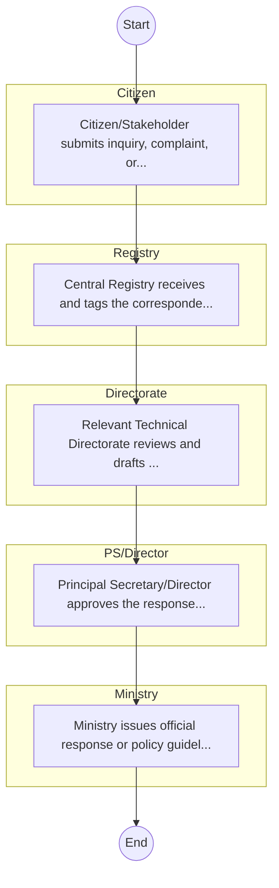

# STANDARD BPM TEMPLATE – MINISTRY OF  ENERGY AND PETROLEUM

## Cover Page
- **Ministry/Department/Agency (MDA):** MINISTRY OF  ENERGY AND PETROLEUM
- **Process Name:** To develop and manage national energy policy, promote various power developments (thermal, hydro, geothermal), oversee rural electrification, and encourage renewable energy sources for efficient operation and growth of the energy sector, aiming to facilitate access to reliable and competitive energy services for all Kenyans.
- **Document Version:** 1.0
- **Date:** 2026-02-14
- **Classification:** Official

---

## Executive Summary
The Ministry of Energy and Petroleum Kenya is mandated to develop and implement policies that foster an efficient and growing energy sector. It sets strategic directions, ensures energy security, and provides a long-term vision for stakeholders in Kenya's energy (including petroleum) sector. Its mission is to facilitate access to reliable and competitive energy services through sustainable management and exploitation of energy resources.

---

## Process Flowchart (BPMN 2.0 - Mermaid)
*Guidance: This diagram visualizes the process flow across different actors (Swimlanes).*

---

## Process Overview
### Process Name
To develop and manage national energy policy, promote various power developments (thermal, hydro, geothermal), oversee rural electrification, and encourage renewable energy sources for efficient operation and growth of the energy sector, aiming to facilitate access to reliable and competitive energy services for all Kenyans.

### Service Category
- G2C/G2B

### Process Objective
- To develop and manage national energy policy, promote various power developments (thermal, hydro, geothermal), oversee rural electrification, and encourage renewable energy sources for efficient operation and growth of the energy sector, aiming to facilitate access to reliable and competitive energy services for all Kenyans.

### Scope
- **In Scope:** End-to-end processing within MINISTRY OF  ENERGY AND PETROLEUM.
- **Out of Scope:** External agency approvals.

### Triggers
- Submission of application/request by Citizen.

### End States
- **Successful:** Policy Guidelines / Circulars, Official Response Letters, Cabinet Resolutions, Public Service Reports
- **Unsuccessful:** Application rejected due to non-compliance.

### Policy Context
- The MINISTRY OF  ENERGY AND PETROLEUM Act; The Constitution of Kenya 2010; Data Protection Act 2019.

---

## Stakeholders
| Stakeholder | Role | Responsibilities |
|---|---|---|
| Registry | Process Actor | Performs actions as defined in steps. |
| Directorate | Process Actor | Performs actions as defined in steps. |
| Citizen | Process Actor | Performs actions as defined in steps. |
| Ministry | Process Actor | Performs actions as defined in steps. |
| PS/Director | Process Actor | Performs actions as defined in steps. |

---

## Inputs & Outputs
- **Inputs:** Public Inquiries / Petitions, Policy Proposals / Memos, Inter-agency Correspondence, Cabinet Memos
- **Outputs:** Policy Guidelines / Circulars, Official Response Letters, Cabinet Resolutions, Public Service Reports

---

## Detailed Process (AS-IS)
| Step | Role | Action | Tool | Notes |
|---|---|---|---|---|
| 1 | Citizen | Citizen/Stakeholder submits inquiry, complaint, or policy proposal via email or office. | Manual | |
| 2 | Registry | Central Registry receives and tags the correspondence. | Manual | |
| 3 | Directorate | Relevant Technical Directorate reviews and drafts response/action. | Manual | |
| 4 | PS/Director | Principal Secretary/Director approves the response. | Manual | |
| 5 | Ministry | Ministry issues official response or policy guideline. | Manual | |

---

## Pain Points & Opportunities
### Pain Points
- Slow movement of physical files (Bureaucracy).
- Loss of institutional memory (Manual registries).
- Difficulty in tracking correspondence status.
- Siloed operations between departments.

### Opportunities
- Electronic Document and Records Management System (EDRMS).
- Digital dashboard for project monitoring.
- Unified communication and collaboration platforms.
- Knowledge Management Systems.

---

## KPIs
| KPI | Baseline | Target |
|---|---|---|
| Turnaround Time | 30 Days | 5 Days |
| CSAT | 50% | 90% |
