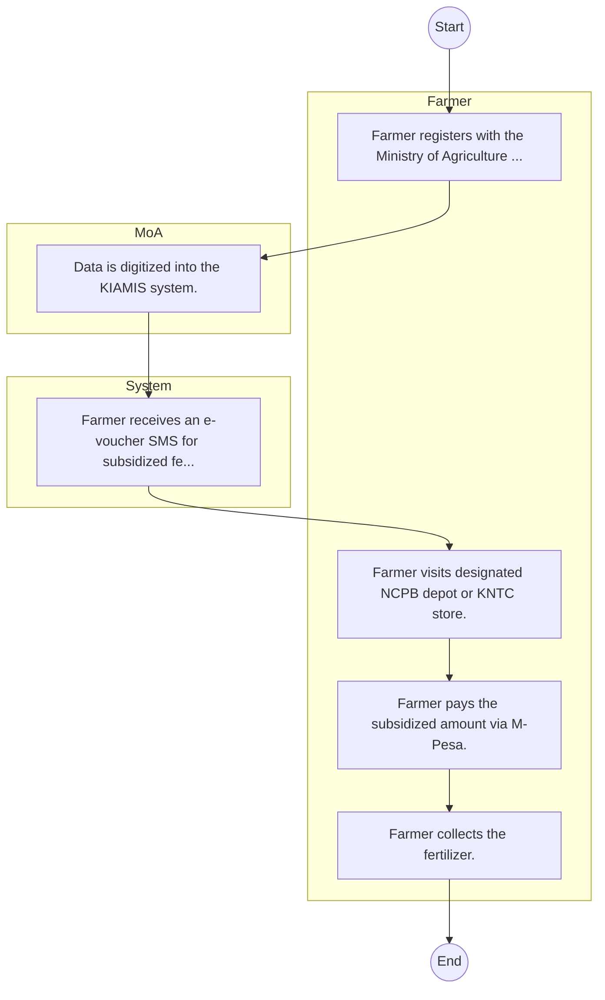

# STANDARD BPM TEMPLATE – National Cereals and Produce Board

## Cover Page
- **Ministry/Department/Agency (MDA):** National Cereals and Produce Board
- **Process Name:** To ensure national food security through efficient strategic grain reserve management; to stabilize cereal prices by managing market interventions to protect farmers and ensure affordable food for consumers; to regulate the cereal and produce market by setting quality standards, monitoring market trends, and enforcing fair trade practices; to supply essential farm inputs such as fertilizers and seeds to enhance agricultural productivity; to offer comprehensive post-harvest services including drying, cleaning, storage, and fumigation to farmers and other clients; to facilitate the marketing and export of cereals and produce to regional and international markets; to conduct research and development activities to improve agricultural practices and enhance produce quality; to provide capacity building for farmers, traders, and other stakeholders; to operate a robust Warehouse Receipt System (WRS); and to offer clearing and forwarding services for grain imports and exports.
- **Document Version:** 1.0
- **Date:** 2026-02-14
- **Classification:** Official

---

## Executive Summary
The National Cereals and Produce Board (NCPB) is a commercial State Corporation in Kenya operating under the Ministry of Agriculture, Livestock, Fisheries and Cooperatives. Its primary mandate is to provide logistics support services to the government on food security matters and to carry out market intervention for grains and farm inputs on behalf of the government. Additionally, NCPB engages in commercial trading of agricultural commodities, especially cereals, and is responsible for managing the National Food Reserves (NFR), playing a critical role in stabilizing food supply and prices across the nation.

---

## Process Flowchart (BPMN 2.0 - Mermaid)
*Guidance: This diagram visualizes the process flow across different actors (Swimlanes).*

---

## Process Overview
### Process Name
To ensure national food security through efficient strategic grain reserve management; to stabilize cereal prices by managing market interventions to protect farmers and ensure affordable food for consumers; to regulate the cereal and produce market by setting quality standards, monitoring market trends, and enforcing fair trade practices; to supply essential farm inputs such as fertilizers and seeds to enhance agricultural productivity; to offer comprehensive post-harvest services including drying, cleaning, storage, and fumigation to farmers and other clients; to facilitate the marketing and export of cereals and produce to regional and international markets; to conduct research and development activities to improve agricultural practices and enhance produce quality; to provide capacity building for farmers, traders, and other stakeholders; to operate a robust Warehouse Receipt System (WRS); and to offer clearing and forwarding services for grain imports and exports.

### Service Category
- G2B (Government to Business)

### Process Objective
- To ensure national food security through efficient strategic grain reserve management; to stabilize cereal prices by managing market interventions to protect farmers and ensure affordable food for consumers; to regulate the cereal and produce market by setting quality standards, monitoring market trends, and enforcing fair trade practices; to supply essential farm inputs such as fertilizers and seeds to enhance agricultural productivity; to offer comprehensive post-harvest services including drying, cleaning, storage, and fumigation to farmers and other clients; to facilitate the marketing and export of cereals and produce to regional and international markets; to conduct research and development activities to improve agricultural practices and enhance produce quality; to provide capacity building for farmers, traders, and other stakeholders; to operate a robust Warehouse Receipt System (WRS); and to offer clearing and forwarding services for grain imports and exports.

### Scope
- **In Scope:** End-to-end processing within National Cereals and Produce Board.
- **Out of Scope:** External agency approvals.

### Triggers
- Submission of application/request by Farmer.

### End States
- **Successful:** License / Permit / Certificate, Compliance Inspection Report, Official Receipt, Gazette Notice
- **Unsuccessful:** Application rejected due to non-compliance.

### Policy Context
- The National Cereals and Produce Board Act; The Constitution of Kenya 2010; Data Protection Act 2019.

---

## Stakeholders
| Stakeholder | Role | Responsibilities |
|---|---|---|
| System | Process Actor | Performs actions as defined in steps. |
| Farmer | Process Actor | Performs actions as defined in steps. |
| MoA | Process Actor | Performs actions as defined in steps. |

---

## Inputs & Outputs
- **Inputs:** Application Form (License/Permit), Compliance Documents (Tax Compliance, CR12), Technical Reports / Site Plans, Proof of Payment
- **Outputs:** License / Permit / Certificate, Compliance Inspection Report, Official Receipt, Gazette Notice

---

## Detailed Process (AS-IS)
| Step | Role | Action | Tool | Notes |
|---|---|---|---|---|
| 1 | Farmer | Farmer registers with the Ministry of Agriculture (Chief/Assistant Chief). | Manual | |
| 2 | MoA | Data is digitized into the KIAMIS system. | Manual | |
| 3 | System | Farmer receives an e-voucher SMS for subsidized fertilizer. | Manual | |
| 4 | Farmer | Farmer visits designated NCPB depot or KNTC store. | Manual | |
| 5 | Farmer | Farmer pays the subsidized amount via M-Pesa. | Manual | |
| 6 | Farmer | Farmer collects the fertilizer. | Manual | |

---

## Pain Points & Opportunities
### Pain Points
- Manual document verification takes time.
- High cost and time for physical inspections.
- Risk of counterfeit licenses/certificates.
- Lack of real-time monitoring of licensees.

### Opportunities
- Online Licensing Management System (LMS).
- Integration with IPRS and BRS for auto-verification.
- Mobile field inspection apps with GIS.
- QR-coded verifiable certificates.

---

## KPIs
| KPI | Baseline | Target |
|---|---|---|
| Turnaround Time | 30 Days | 5 Days |
| CSAT | 50% | 90% |
