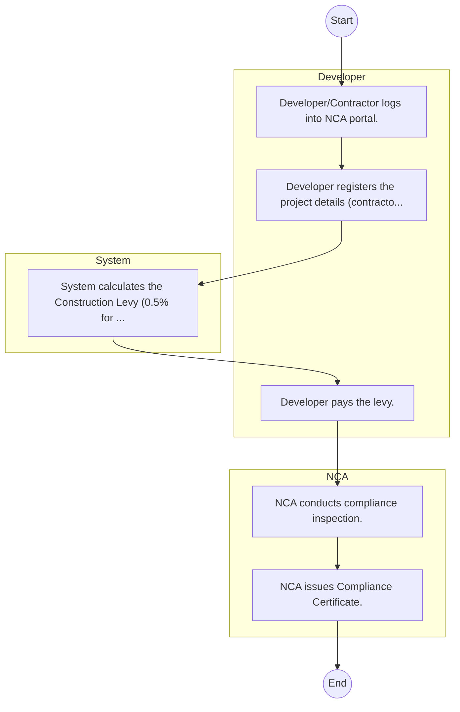

# STANDARD BPM TEMPLATE – National Construction Authority

## Cover Page
- **Ministry/Department/Agency (MDA):** National Construction Authority
- **Process Name:** To regulate the construction industry through the registration and certification of contractors, accreditation of skilled construction workers and site supervisors, and mandatory registration of construction projects; to enhance industry capacity through continuous professional development and training for all practitioners; to undertake or commission research related to the building sector and maintain a comprehensive construction industry information system; to encourage the standardization and improvement of construction techniques, technologies, and materials; to assist in the exportation of construction services; and to enforce building codes and industry regulations to ensure quality, safety, and sustainability in the built environment.
- **Document Version:** 1.0
- **Date:** 2026-02-14
- **Classification:** Official

---

## Executive Summary
The National Construction Authority (NCA) is a state corporation established under Section 3 of the NCA Act No. 41 of 2011. Its primary mandate is to oversee, coordinate, regulate, and promote the development of a sustainable and vibrant construction industry in Kenya. NCA ensures quality, safety, and adherence to standards within Kenya's built environment, while also protecting consumers from substandard workmanship and fostering capacity building within the sector for both contractors and skilled labor.

---

## Process Flowchart (BPMN 2.0 - Mermaid)
*Guidance: This diagram visualizes the process flow across different actors (Swimlanes).*

---

## Process Overview
### Process Name
To regulate the construction industry through the registration and certification of contractors, accreditation of skilled construction workers and site supervisors, and mandatory registration of construction projects; to enhance industry capacity through continuous professional development and training for all practitioners; to undertake or commission research related to the building sector and maintain a comprehensive construction industry information system; to encourage the standardization and improvement of construction techniques, technologies, and materials; to assist in the exportation of construction services; and to enforce building codes and industry regulations to ensure quality, safety, and sustainability in the built environment.

### Service Category
- G2B (Government to Business)

### Process Objective
- To regulate the construction industry through the registration and certification of contractors, accreditation of skilled construction workers and site supervisors, and mandatory registration of construction projects; to enhance industry capacity through continuous professional development and training for all practitioners; to undertake or commission research related to the building sector and maintain a comprehensive construction industry information system; to encourage the standardization and improvement of construction techniques, technologies, and materials; to assist in the exportation of construction services; and to enforce building codes and industry regulations to ensure quality, safety, and sustainability in the built environment.

### Scope
- **In Scope:** End-to-end processing within National Construction Authority.
- **Out of Scope:** External agency approvals.

### Triggers
- Submission of application/request by Developer.

### End States
- **Successful:** License / Permit / Certificate, Compliance Inspection Report, Official Receipt, Gazette Notice
- **Unsuccessful:** Application rejected due to non-compliance.

### Policy Context
- The National Construction Authority Act; The Constitution of Kenya 2010; Data Protection Act 2019.

---

## Stakeholders
| Stakeholder | Role | Responsibilities |
|---|---|---|
| System | Process Actor | Performs actions as defined in steps. |
| NCA | Process Actor | Performs actions as defined in steps. |
| Developer | Process Actor | Performs actions as defined in steps. |

---

## Inputs & Outputs
- **Inputs:** Application Form (License/Permit), Compliance Documents (Tax Compliance, CR12), Technical Reports / Site Plans, Proof of Payment
- **Outputs:** License / Permit / Certificate, Compliance Inspection Report, Official Receipt, Gazette Notice

---

## Detailed Process (AS-IS)
| Step | Role | Action | Tool | Notes |
|---|---|---|---|---|
| 1 | Developer | Developer/Contractor logs into NCA portal. | Digital | |
| 2 | Developer | Developer registers the project details (contractor, consultants, value). | Manual | |
| 3 | System | System calculates the Construction Levy (0.5% for projects >5M). | Manual | |
| 4 | Developer | Developer pays the levy. | Manual | |
| 5 | NCA | NCA conducts compliance inspection. | Manual | |
| 6 | NCA | NCA issues Compliance Certificate. | Manual | |

---

## Pain Points & Opportunities
### Pain Points
- Manual document verification takes time.
- High cost and time for physical inspections.
- Risk of counterfeit licenses/certificates.
- Lack of real-time monitoring of licensees.

### Opportunities
- Online Licensing Management System (LMS).
- Integration with IPRS and BRS for auto-verification.
- Mobile field inspection apps with GIS.
- QR-coded verifiable certificates.

---

## KPIs
| KPI | Baseline | Target |
|---|---|---|
| Turnaround Time | 30 Days | 5 Days |
| CSAT | 50% | 90% |
