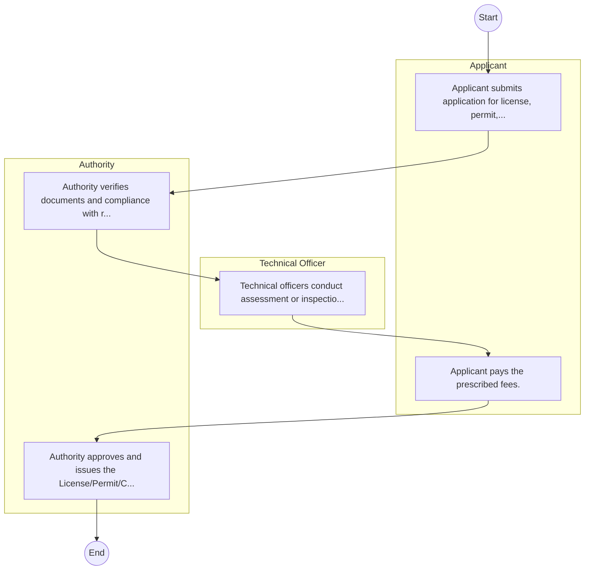

# STANDARD BPM TEMPLATE – National Employment Authority

## Cover Page
- **Ministry/Department/Agency (MDA):** National Employment Authority
- **Process Name:** To register individuals seeking employment and facilitate their placement in various forms of employment; to maintain an integrated and up-to-date database of all job seekers; to enhance employment promotion interventions and increase access to employment for youth, minorities, and marginalized groups; to circulate job vacancies to job seekers through multiple channels; to require employers to comply with the National Employment Authority Act, including filing annual returns, notifying vacancies, and reporting employee terminations and internship opportunities; to protect the unemployed against any form of abuse or exploitation; to facilitate the implementation of national policies on employment and advise the Cabinet Secretary on employment-related matters; to undertake due diligence, facilitate training, and provide counseling related to employment; and to take steps to encourage equal opportunity employment practices across the country.
- **Document Version:** 1.0
- **Date:** 2026-02-14
- **Classification:** Official

---

## Executive Summary
The National Employment Authority (NEA) in Kenya is a state agency established in 2016 by the National Employment Authority Act, 2016, and became operational in May 2019. It provides a comprehensive institutional framework for employment management, with a primary mandate to regulate and promote employment services, skills development, and labor market information. NEA focuses on facilitating job placement for individuals, both locally and internationally, and particularly for youth, minorities, and marginalized groups, thereby contributing to national economic growth and poverty reduction.

---

## Process Flowchart (BPMN 2.0 - Mermaid)
*Guidance: This diagram visualizes the process flow across different actors (Swimlanes).*

---

## Process Overview
### Process Name
To register individuals seeking employment and facilitate their placement in various forms of employment; to maintain an integrated and up-to-date database of all job seekers; to enhance employment promotion interventions and increase access to employment for youth, minorities, and marginalized groups; to circulate job vacancies to job seekers through multiple channels; to require employers to comply with the National Employment Authority Act, including filing annual returns, notifying vacancies, and reporting employee terminations and internship opportunities; to protect the unemployed against any form of abuse or exploitation; to facilitate the implementation of national policies on employment and advise the Cabinet Secretary on employment-related matters; to undertake due diligence, facilitate training, and provide counseling related to employment; and to take steps to encourage equal opportunity employment practices across the country.

### Service Category
- G2B (Government to Business)

### Process Objective
- To register individuals seeking employment and facilitate their placement in various forms of employment; to maintain an integrated and up-to-date database of all job seekers; to enhance employment promotion interventions and increase access to employment for youth, minorities, and marginalized groups; to circulate job vacancies to job seekers through multiple channels; to require employers to comply with the National Employment Authority Act, including filing annual returns, notifying vacancies, and reporting employee terminations and internship opportunities; to protect the unemployed against any form of abuse or exploitation; to facilitate the implementation of national policies on employment and advise the Cabinet Secretary on employment-related matters; to undertake due diligence, facilitate training, and provide counseling related to employment; and to take steps to encourage equal opportunity employment practices across the country.

### Scope
- **In Scope:** End-to-end processing within National Employment Authority.
- **Out of Scope:** External agency approvals.

### Triggers
- Submission of application/request by Applicant.

### End States
- **Successful:** License / Permit / Certificate, Compliance Inspection Report, Official Receipt, Gazette Notice
- **Unsuccessful:** Application rejected due to non-compliance.

### Policy Context
- The National Employment Authority Act; The Constitution of Kenya 2010; Data Protection Act 2019.

---

## Stakeholders
| Stakeholder | Role | Responsibilities |
|---|---|---|
| Applicant | Process Actor | Performs actions as defined in steps. |
| Authority | Process Actor | Performs actions as defined in steps. |
| Technical Officer | Process Actor | Performs actions as defined in steps. |

---

## Inputs & Outputs
- **Inputs:** Application Form (License/Permit), Compliance Documents (Tax Compliance, CR12), Technical Reports / Site Plans, Proof of Payment
- **Outputs:** License / Permit / Certificate, Compliance Inspection Report, Official Receipt, Gazette Notice

---

## Detailed Process (AS-IS)
| Step | Role | Action | Tool | Notes |
|---|---|---|---|---|
| 1 | Applicant | Applicant submits application for license, permit, or service. | Manual | |
| 2 | Authority | Authority verifies documents and compliance with regulations. | Manual | |
| 3 | Technical Officer | Technical officers conduct assessment or inspection. | Manual | |
| 4 | Applicant | Applicant pays the prescribed fees. | Manual | |
| 5 | Authority | Authority approves and issues the License/Permit/Certificate. | Manual | |

---

## Pain Points & Opportunities
### Pain Points
- Manual document verification takes time.
- High cost and time for physical inspections.
- Risk of counterfeit licenses/certificates.
- Lack of real-time monitoring of licensees.

### Opportunities
- Online Licensing Management System (LMS).
- Integration with IPRS and BRS for auto-verification.
- Mobile field inspection apps with GIS.
- QR-coded verifiable certificates.

---

## KPIs
| KPI | Baseline | Target |
|---|---|---|
| Turnaround Time | 30 Days | 5 Days |
| CSAT | 50% | 90% |
