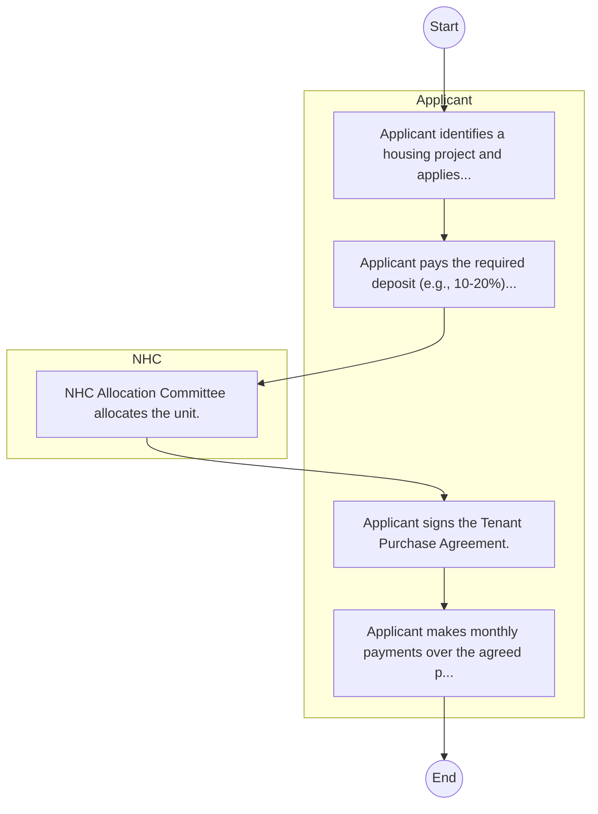

# STANDARD BPM TEMPLATE – National Housing Corporation

## Cover Page
- **Ministry/Department/Agency (MDA):** National Housing Corporation
- **Process Name:** To promote low-cost housing development across Kenya; to stimulate the building industry by encouraging local production and use of building materials and technologies; to encourage and assist housing research and development; to serve as the government's main agency for channeling public funds for low-cost housing to Local Authorities and County Governments; to provide technical assistance to Local Authorities and County Governments for the design and implementation of their housing schemes; to assist citizens and Local Authorities in constructing affordable housing through various schemes including Tenant Purchase, Outright Sale, Rural and Peri-Urban Housing Loans, and Rental Housing; to undertake direct construction of housing in areas where Local Authorities are unable or unwilling to do so; to promote appropriate and innovative building technologies, such as the manufacturing of EPS panels; and to provide housing loans to eligible individuals and organizations.
- **Document Version:** 1.0
- **Date:** 2026-02-14
- **Classification:** Official

---

## Executive Summary
The National Housing Corporation (NHC) plays a principal role in the implementation of the Kenyan Government's Housing Policies and Programmes. Established as a state corporation, its primary mandate is to promote, develop, and provide affordable housing solutions for all income groups across Kenya. NHC aims to stimulate the building industry, encourage and assist housing research, and facilitate increased access to decent and affordable housing, thereby contributing significantly to national development and improving living standards.

---

## Process Flowchart (BPMN 2.0 - Mermaid)
*Guidance: This diagram visualizes the process flow across different actors (Swimlanes).*

---

## Process Overview
### Process Name
To promote low-cost housing development across Kenya; to stimulate the building industry by encouraging local production and use of building materials and technologies; to encourage and assist housing research and development; to serve as the government's main agency for channeling public funds for low-cost housing to Local Authorities and County Governments; to provide technical assistance to Local Authorities and County Governments for the design and implementation of their housing schemes; to assist citizens and Local Authorities in constructing affordable housing through various schemes including Tenant Purchase, Outright Sale, Rural and Peri-Urban Housing Loans, and Rental Housing; to undertake direct construction of housing in areas where Local Authorities are unable or unwilling to do so; to promote appropriate and innovative building technologies, such as the manufacturing of EPS panels; and to provide housing loans to eligible individuals and organizations.

### Service Category
- G2B (Government to Business)

### Process Objective
- To promote low-cost housing development across Kenya; to stimulate the building industry by encouraging local production and use of building materials and technologies; to encourage and assist housing research and development; to serve as the government's main agency for channeling public funds for low-cost housing to Local Authorities and County Governments; to provide technical assistance to Local Authorities and County Governments for the design and implementation of their housing schemes; to assist citizens and Local Authorities in constructing affordable housing through various schemes including Tenant Purchase, Outright Sale, Rural and Peri-Urban Housing Loans, and Rental Housing; to undertake direct construction of housing in areas where Local Authorities are unable or unwilling to do so; to promote appropriate and innovative building technologies, such as the manufacturing of EPS panels; and to provide housing loans to eligible individuals and organizations.

### Scope
- **In Scope:** End-to-end processing within National Housing Corporation.
- **Out of Scope:** External agency approvals.

### Triggers
- Submission of application/request by Applicant.

### End States
- **Successful:** Loan Disbursement / Service Delivery, Statement of Account, Contract / Agreement, Receipt / Invoice
- **Unsuccessful:** Application rejected due to non-compliance.

### Policy Context
- The National Housing Corporation Act; The Constitution of Kenya 2010; Data Protection Act 2019.

---

## Stakeholders
| Stakeholder | Role | Responsibilities |
|---|---|---|
| Applicant | Process Actor | Performs actions as defined in steps. |
| NHC | Process Actor | Performs actions as defined in steps. |

---

## Inputs & Outputs
- **Inputs:** Loan/Service Application Form, Business Proposal / Plan, Financial Statements / Bank Records, Collateral / Security Documents
- **Outputs:** Loan Disbursement / Service Delivery, Statement of Account, Contract / Agreement, Receipt / Invoice

---

## Detailed Process (AS-IS)
| Step | Role | Action | Tool | Notes |
|---|---|---|---|---|
| 1 | Applicant | Applicant identifies a housing project and applies. | Manual | |
| 2 | Applicant | Applicant pays the required deposit (e.g., 10-20%). | Manual | |
| 3 | NHC | NHC Allocation Committee allocates the unit. | Manual | |
| 4 | Applicant | Applicant signs the Tenant Purchase Agreement. | Manual | |
| 5 | Applicant | Applicant makes monthly payments over the agreed period. | Manual | |

---

## Pain Points & Opportunities
### Pain Points
- Lengthy credit appraisal processes.
- Manual debt collection and reconciliation.
- High paperwork for loan processing.
- Lack of 360-degree customer view.

### Opportunities
- Automated Credit Scoring and Appraisal.
- Mobile-based loan application and repayment.
- Customer Relationship Management (CRM) systems.
- Data analytics for risk management.

---

## KPIs
| KPI | Baseline | Target |
|---|---|---|
| Turnaround Time | 30 Days | 5 Days |
| CSAT | 50% | 90% |
