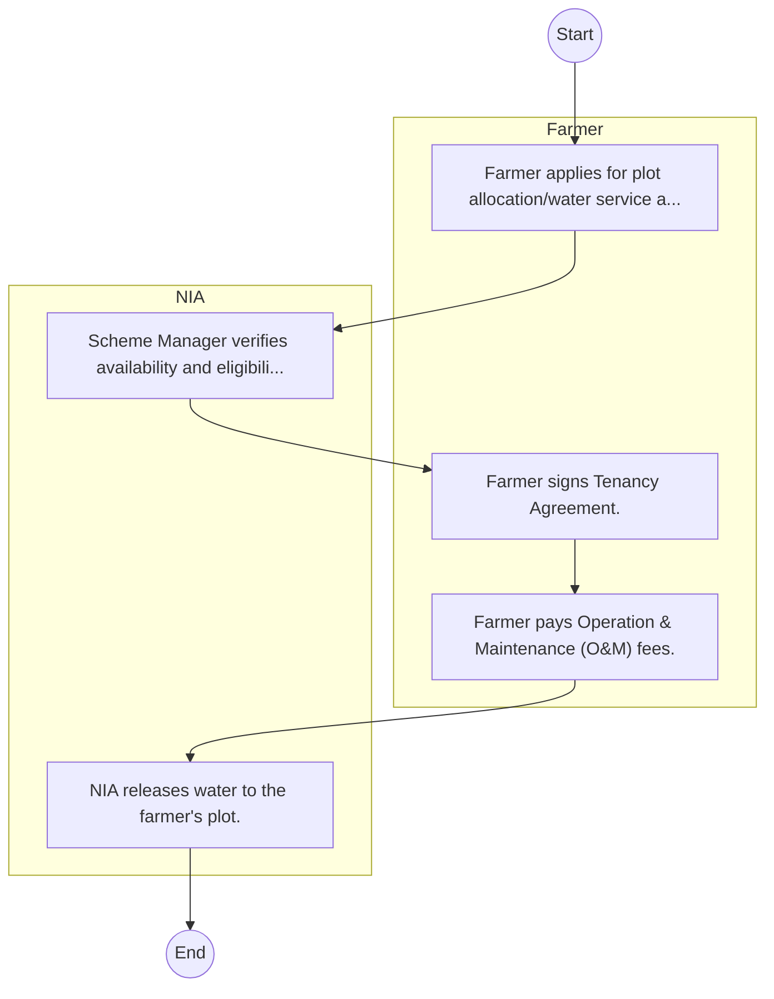

# STANDARD BPM TEMPLATE – National Irrigation Authority

## Cover Page
- **Ministry/Department/Agency (MDA):** National Irrigation Authority
- **Process Name:** To develop and enhance irrigation infrastructure for both national and public schemes; to offer irrigation support services to private medium and smallholder schemes in collaboration with county governments and other relevant parties; to provide technical advisory services for irrigation schemes covering design, construction supervision, administration, operation, and maintenance; to advise the Cabinet Secretary on matters related to the development, maintenance, expansion, and availability of irrigation support services; to allocate land within national irrigation schemes for public use; to promote the marketing, safe storage, and processing of agricultural products from irrigation schemes in partnership with county governments and other agencies; to conduct research to recommend fair prices for agricultural products from irrigation schemes; to facilitate the establishment and strengthening of irrigation water users' associations and scheme management committees for effective operation and management; to coordinate and plan settlement on national or public irrigation schemes and determine settler numbers; and to offer commercial technical advisory services on irrigation water management, including water harvesting, storage, and wastewater recycling.
- **Document Version:** 1.0
- **Date:** 2026-02-14
- **Classification:** Official

---

## Executive Summary
The National Irrigation Authority (NIA) is a state corporation in Kenya operating under the Irrigation Act 2019. Its primary mandate is to foster sustainable food security and socio-economic development through the development, expansion, management, oversight, and regulation of irrigation practices and infrastructure across the country. NIA plays a crucial role in increasing agricultural productivity, mitigating the effects of climate change, and improving the livelihoods of farming communities by ensuring efficient and reliable water use for agriculture.

---

## Process Flowchart (BPMN 2.0 - Mermaid)
*Guidance: This diagram visualizes the process flow across different actors (Swimlanes).*

---

## Process Overview
### Process Name
To develop and enhance irrigation infrastructure for both national and public schemes; to offer irrigation support services to private medium and smallholder schemes in collaboration with county governments and other relevant parties; to provide technical advisory services for irrigation schemes covering design, construction supervision, administration, operation, and maintenance; to advise the Cabinet Secretary on matters related to the development, maintenance, expansion, and availability of irrigation support services; to allocate land within national irrigation schemes for public use; to promote the marketing, safe storage, and processing of agricultural products from irrigation schemes in partnership with county governments and other agencies; to conduct research to recommend fair prices for agricultural products from irrigation schemes; to facilitate the establishment and strengthening of irrigation water users' associations and scheme management committees for effective operation and management; to coordinate and plan settlement on national or public irrigation schemes and determine settler numbers; and to offer commercial technical advisory services on irrigation water management, including water harvesting, storage, and wastewater recycling.

### Service Category
- G2B (Government to Business)

### Process Objective
- To develop and enhance irrigation infrastructure for both national and public schemes; to offer irrigation support services to private medium and smallholder schemes in collaboration with county governments and other relevant parties; to provide technical advisory services for irrigation schemes covering design, construction supervision, administration, operation, and maintenance; to advise the Cabinet Secretary on matters related to the development, maintenance, expansion, and availability of irrigation support services; to allocate land within national irrigation schemes for public use; to promote the marketing, safe storage, and processing of agricultural products from irrigation schemes in partnership with county governments and other agencies; to conduct research to recommend fair prices for agricultural products from irrigation schemes; to facilitate the establishment and strengthening of irrigation water users' associations and scheme management committees for effective operation and management; to coordinate and plan settlement on national or public irrigation schemes and determine settler numbers; and to offer commercial technical advisory services on irrigation water management, including water harvesting, storage, and wastewater recycling.

### Scope
- **In Scope:** End-to-end processing within National Irrigation Authority.
- **Out of Scope:** External agency approvals.

### Triggers
- Submission of application/request by Farmer.

### End States
- **Successful:** License / Permit / Certificate, Compliance Inspection Report, Official Receipt, Gazette Notice
- **Unsuccessful:** Application rejected due to non-compliance.

### Policy Context
- The National Irrigation Authority Act; The Constitution of Kenya 2010; Data Protection Act 2019.

---

## Stakeholders
| Stakeholder | Role | Responsibilities |
|---|---|---|
| NIA | Process Actor | Performs actions as defined in steps. |
| Farmer | Process Actor | Performs actions as defined in steps. |

---

## Inputs & Outputs
- **Inputs:** Application Form (License/Permit), Compliance Documents (Tax Compliance, CR12), Technical Reports / Site Plans, Proof of Payment
- **Outputs:** License / Permit / Certificate, Compliance Inspection Report, Official Receipt, Gazette Notice

---

## Detailed Process (AS-IS)
| Step | Role | Action | Tool | Notes |
|---|---|---|---|---|
| 1 | Farmer | Farmer applies for plot allocation/water service at Scheme Office. | Manual | |
| 2 | NIA | Scheme Manager verifies availability and eligibility. | Manual | |
| 3 | Farmer | Farmer signs Tenancy Agreement. | Manual | |
| 4 | Farmer | Farmer pays Operation & Maintenance (O&M) fees. | Manual | |
| 5 | NIA | NIA releases water to the farmer's plot. | Manual | |

---

## Pain Points & Opportunities
### Pain Points
- Manual document verification takes time.
- High cost and time for physical inspections.
- Risk of counterfeit licenses/certificates.
- Lack of real-time monitoring of licensees.

### Opportunities
- Online Licensing Management System (LMS).
- Integration with IPRS and BRS for auto-verification.
- Mobile field inspection apps with GIS.
- QR-coded verifiable certificates.

---

## KPIs
| KPI | Baseline | Target |
|---|---|---|
| Turnaround Time | 30 Days | 5 Days |
| CSAT | 50% | 90% |
