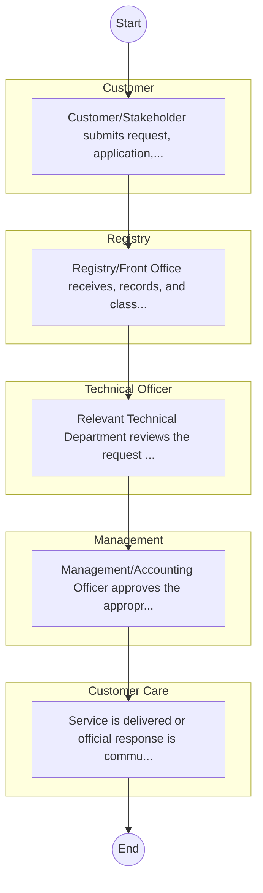

# STANDARD BPM TEMPLATE – National Museums of Kenya

## Cover Page
- **Ministry/Department/Agency (MDA):** National Museums of Kenya
- **Process Name:** To collect, preserve, study, document, and present Kenya's past and present cultural and natural heritage; to manage numerous Regional Museums, Sites, and Monuments of national and international importance; to contribute to national development by responding to the growing needs of society through heritage conservation; to safeguard and conserve Kenya's cultural and natural heritage through continuous research and documentation; to promote public awareness and understanding of Kenya's heritage through educational programs, exhibitions, and community outreach; to develop and maintain engaging exhibits that showcase the nation's artifacts, artworks, and historical items; to oversee the operations and management of various museums and heritage sites across the country; to provide expert advice to the government and other stakeholders on matters related to heritage conservation and management; to facilitate cultural exchanges and collaborations with national and international museums and institutions; to enhance the skills and capabilities of museum staff and other stakeholders involved in heritage conservation; to encourage tourism to Kenya's cultural and natural heritage sites to foster economic development; and to contribute to the development of national policies related to heritage management, cultural preservation, and museum practices.
- **Document Version:** 1.0
- **Date:** 2026-02-14
- **Classification:** Official

---

## Executive Summary
The National Museums of Kenya (NMK) is a state corporation established by the Museums and Heritage Act 2006. Its primary mandate is to collect, preserve, study, document, and present Kenya's past and present cultural and natural heritage. NMK manages numerous regional museums, sites, and monuments of national and international importance, housing priceless collections of Kenya's living cultural and natural heritage. Through these efforts, NMK aims to enhance knowledge, appreciation, respect, and sustainable utilization of these resources for the benefit of Kenya and the world, contributing significantly to national development and tourism.

---

## Process Flowchart (BPMN 2.0 - Mermaid)
*Guidance: This diagram visualizes the process flow across different actors (Swimlanes).*

---

## Process Overview
### Process Name
To collect, preserve, study, document, and present Kenya's past and present cultural and natural heritage; to manage numerous Regional Museums, Sites, and Monuments of national and international importance; to contribute to national development by responding to the growing needs of society through heritage conservation; to safeguard and conserve Kenya's cultural and natural heritage through continuous research and documentation; to promote public awareness and understanding of Kenya's heritage through educational programs, exhibitions, and community outreach; to develop and maintain engaging exhibits that showcase the nation's artifacts, artworks, and historical items; to oversee the operations and management of various museums and heritage sites across the country; to provide expert advice to the government and other stakeholders on matters related to heritage conservation and management; to facilitate cultural exchanges and collaborations with national and international museums and institutions; to enhance the skills and capabilities of museum staff and other stakeholders involved in heritage conservation; to encourage tourism to Kenya's cultural and natural heritage sites to foster economic development; and to contribute to the development of national policies related to heritage management, cultural preservation, and museum practices.

### Service Category
- G2C/G2B

### Process Objective
- To collect, preserve, study, document, and present Kenya's past and present cultural and natural heritage; to manage numerous Regional Museums, Sites, and Monuments of national and international importance; to contribute to national development by responding to the growing needs of society through heritage conservation; to safeguard and conserve Kenya's cultural and natural heritage through continuous research and documentation; to promote public awareness and understanding of Kenya's heritage through educational programs, exhibitions, and community outreach; to develop and maintain engaging exhibits that showcase the nation's artifacts, artworks, and historical items; to oversee the operations and management of various museums and heritage sites across the country; to provide expert advice to the government and other stakeholders on matters related to heritage conservation and management; to facilitate cultural exchanges and collaborations with national and international museums and institutions; to enhance the skills and capabilities of museum staff and other stakeholders involved in heritage conservation; to encourage tourism to Kenya's cultural and natural heritage sites to foster economic development; and to contribute to the development of national policies related to heritage management, cultural preservation, and museum practices.

### Scope
- **In Scope:** End-to-end processing within National Museums of Kenya.
- **Out of Scope:** External agency approvals.

### Triggers
- Submission of application/request by Customer.

### End States
- **Successful:** License / Permit / Certificate, Compliance Inspection Report, Official Receipt, Gazette Notice
- **Unsuccessful:** Application rejected due to non-compliance.

### Policy Context
- The National Museums of Kenya Act; The Constitution of Kenya 2010; Data Protection Act 2019.

---

## Stakeholders
| Stakeholder | Role | Responsibilities |
|---|---|---|
| Registry | Process Actor | Performs actions as defined in steps. |
| Customer Care | Process Actor | Performs actions as defined in steps. |
| Management | Process Actor | Performs actions as defined in steps. |
| Customer | Process Actor | Performs actions as defined in steps. |
| Technical Officer | Process Actor | Performs actions as defined in steps. |

---

## Inputs & Outputs
- **Inputs:** Application Form (License/Permit), Compliance Documents (Tax Compliance, CR12), Technical Reports / Site Plans, Proof of Payment
- **Outputs:** License / Permit / Certificate, Compliance Inspection Report, Official Receipt, Gazette Notice

---

## Detailed Process (AS-IS)
| Step | Role | Action | Tool | Notes |
|---|---|---|---|---|
| 1 | Customer | Customer/Stakeholder submits request, application, or inquiry via official channels (Email, Letter, or Portal). | Digital | |
| 2 | Registry | Registry/Front Office receives, records, and classifies the request. | Manual | |
| 3 | Technical Officer | Relevant Technical Department reviews the request against internal policies and regulations. | Manual | |
| 4 | Management | Management/Accounting Officer approves the appropriate action or service delivery. | Manual | |
| 5 | Customer Care | Service is delivered or official response is communicated to the customer. | Manual | |

---

## Pain Points & Opportunities
### Pain Points
- Manual document verification takes time.
- High cost and time for physical inspections.
- Risk of counterfeit licenses/certificates.
- Lack of real-time monitoring of licensees.

### Opportunities
- Online Licensing Management System (LMS).
- Integration with IPRS and BRS for auto-verification.
- Mobile field inspection apps with GIS.
- QR-coded verifiable certificates.

---

## KPIs
| KPI | Baseline | Target |
|---|---|---|
| Turnaround Time | 30 Days | 5 Days |
| CSAT | 50% | 90% |
