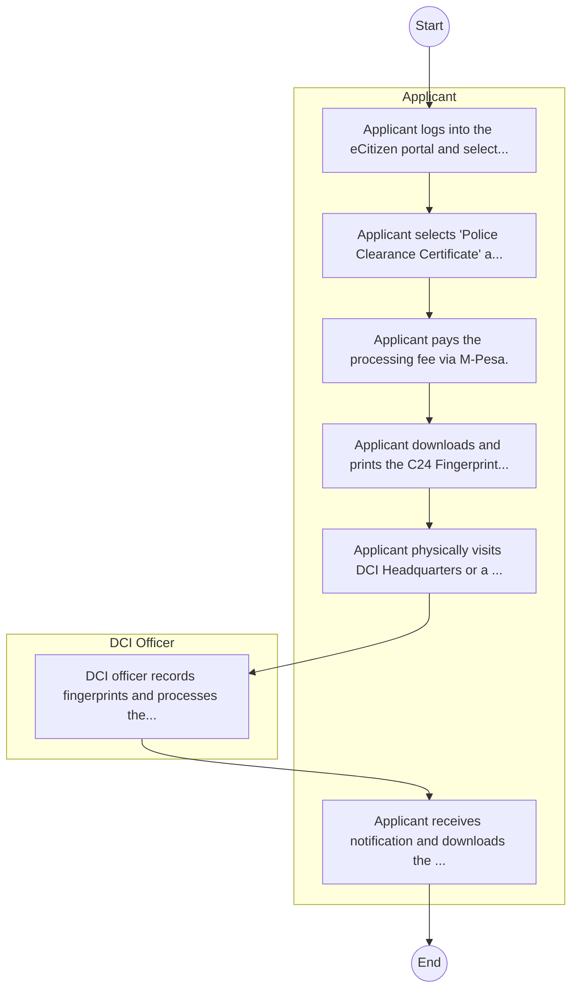

# STANDARD BPM TEMPLATE – NATIONAL POLICE SERVICE (NPS)

## Cover Page
- **Ministry/Department/Agency (MDA):** NATIONAL POLICE SERVICE (NPS)
- **Process Name:** To create an enabling environment for sustainable agricultural and livestock development, enhance food and nutrition security, improve rural livelihoods, and drive economic growth through the formulation and implementation of effective agricultural policies, research, extension services, and regulation.
- **Document Version:** 1.0
- **Date:** 2026-02-14
- **Classification:** Official

---

## Executive Summary
The Ministry of Agriculture and Livestock Development Kenya is mandated to promote sustainable development and management of crops and livestock, ensuring the nation's food and nutrition security. It aims to transform the agricultural sector into a competitive, commercially oriented, and economically responsive contributor to national development.

---

## Process Flowchart (BPMN 2.0 - Mermaid)
*Guidance: This diagram visualizes the process flow across different actors (Swimlanes).*

---

## Process Overview
### Process Name
To create an enabling environment for sustainable agricultural and livestock development, enhance food and nutrition security, improve rural livelihoods, and drive economic growth through the formulation and implementation of effective agricultural policies, research, extension services, and regulation.

### Service Category
- G2C/G2B

### Process Objective
- To create an enabling environment for sustainable agricultural and livestock development, enhance food and nutrition security, improve rural livelihoods, and drive economic growth through the formulation and implementation of effective agricultural policies, research, extension services, and regulation.

### Scope
- **In Scope:** End-to-end processing within NATIONAL POLICE SERVICE (NPS).
- **Out of Scope:** External agency approvals.

### Triggers
- Submission of application/request by Applicant.

### End States
- **Successful:** P3 Form, Police Abstract, Good Conduct Cert
- **Unsuccessful:** Application rejected due to non-compliance.

### Policy Context
- The NATIONAL POLICE SERVICE (NPS) Act; The Constitution of Kenya 2010; Data Protection Act 2019.

---

## Stakeholders
| Stakeholder | Role | Responsibilities |
|---|---|---|
| Applicant | Process Actor | Performs actions as defined in steps. |
| DCI Officer | Process Actor | Performs actions as defined in steps. |

---

## Inputs & Outputs
- **Inputs:** Complaint/Statement, Fingerprints, Evidence
- **Outputs:** P3 Form, Police Abstract, Good Conduct Cert

---

## Detailed Process (AS-IS)
| Step | Role | Action | Tool | Notes |
|---|---|---|---|---|
| 1 | Applicant | Applicant logs into the eCitizen portal and selects Directorate of Criminal Investigations (DCI). | Digital | |
| 2 | Applicant | Applicant selects 'Police Clearance Certificate' application. | Manual | |
| 3 | Applicant | Applicant pays the processing fee via M-Pesa. | Manual | |
| 4 | Applicant | Applicant downloads and prints the C24 Fingerprint Form and receipt. | Manual | |
| 5 | Applicant | Applicant physically visits DCI Headquarters or a Huduma Center for fingerprint recording. | Manual | |
| 6 | DCI Officer | DCI officer records fingerprints and processes the check. | Manual | |
| 7 | Applicant | Applicant receives notification and downloads the certificate from eCitizen. | Manual | |

---

## Pain Points & Opportunities
### Pain Points
- Lost case files
- Manual OB (Occurrence Book)
- Slow response

### Opportunities
- Digitized OB
- Integrated Case Management
- CCTV surveillance

---

## KPIs
| KPI | Baseline | Target |
|---|---|---|
| Turnaround Time | 30 Days | 5 Days |
| CSAT | 50% | 90% |
