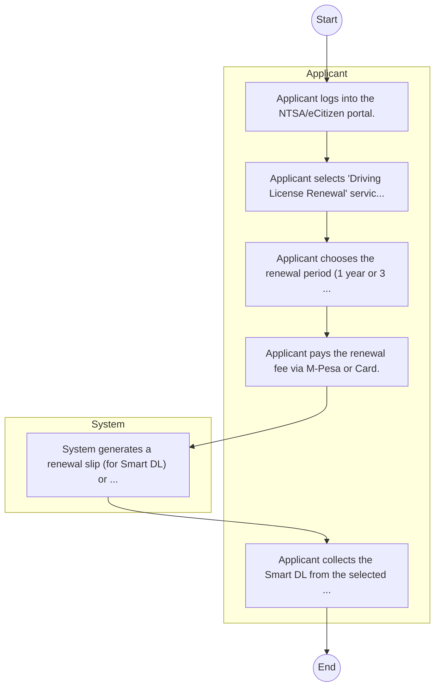

# STANDARD BPM TEMPLATE – NATIONAL TRANSPORT AND SAFETY AUTHORITY (NTSA)

## Cover Page
- **Ministry/Department/Agency (MDA):** NATIONAL TRANSPORT AND SAFETY AUTHORITY (NTSA)
- **Process Name:** To coordinate the formulation and implementation of the government's legislative agenda, strengthen policy coordination across MDAs and stakeholders, facilitate effective interaction between the Executive and Parliament, and enhance accountability and compliance through legislative oversight and public participation in policy and legislation development.
- **Document Version:** 1.0
- **Date:** 2026-02-14
- **Classification:** Official

---

## Executive Summary
The State Department for Parliamentary Affairs in Kenya is mandated to coordinate the National Government's legislative agenda, strengthen policy coordination across Ministries, Departments, and Agencies (MDAs), and facilitate seamless interaction between the Executive and Parliament. It plays a crucial role in ensuring effective government business and enhancing accountability.

---

## Process Flowchart (BPMN 2.0 - Mermaid)
*Guidance: This diagram visualizes the process flow across different actors (Swimlanes).*

---

## Process Overview
### Process Name
To coordinate the formulation and implementation of the government's legislative agenda, strengthen policy coordination across MDAs and stakeholders, facilitate effective interaction between the Executive and Parliament, and enhance accountability and compliance through legislative oversight and public participation in policy and legislation development.

### Service Category
- G2B (Government to Business)

### Process Objective
- To coordinate the formulation and implementation of the government's legislative agenda, strengthen policy coordination across MDAs and stakeholders, facilitate effective interaction between the Executive and Parliament, and enhance accountability and compliance through legislative oversight and public participation in policy and legislation development.

### Scope
- **In Scope:** End-to-end processing within NATIONAL TRANSPORT AND SAFETY AUTHORITY (NTSA).
- **Out of Scope:** External agency approvals.

### Triggers
- Submission of application/request by Applicant.

### End States
- **Successful:** Smart DL, Number Plate, Inspection Cert
- **Unsuccessful:** Application rejected due to non-compliance.

### Policy Context
- The NATIONAL TRANSPORT AND SAFETY AUTHORITY (NTSA) Act; The Constitution of Kenya 2010; Data Protection Act 2019.

---

## Stakeholders
| Stakeholder | Role | Responsibilities |
|---|---|---|
| Applicant | Process Actor | Performs actions as defined in steps. |
| System | Process Actor | Performs actions as defined in steps. |

---

## Inputs & Outputs
- **Inputs:** Old DL, Police Abstract, Vehicle Logbook
- **Outputs:** Smart DL, Number Plate, Inspection Cert

---

## Detailed Process (AS-IS)
| Step | Role | Action | Tool | Notes |
|---|---|---|---|---|
| 1 | Applicant | Applicant logs into the NTSA/eCitizen portal. | Digital | |
| 2 | Applicant | Applicant selects 'Driving License Renewal' service. | Manual | |
| 3 | Applicant | Applicant chooses the renewal period (1 year or 3 years). | Manual | |
| 4 | Applicant | Applicant pays the renewal fee via M-Pesa or Card. | Manual | |
| 5 | System | System generates a renewal slip (for Smart DL) or updates the record. | Manual | |
| 6 | Applicant | Applicant collects the Smart DL from the selected center (if applying for a card) or prints the renewal slip. | Manual | |

---

## Pain Points & Opportunities
### Pain Points
- Fake licenses
- Road safety data gaps
- Manual inspection

### Opportunities
- Smart traffic cameras
- Telematics
- Digital number plates

---

## KPIs
| KPI | Baseline | Target |
|---|---|---|
| Turnaround Time | 30 Days | 5 Days |
| CSAT | 50% | 90% |
