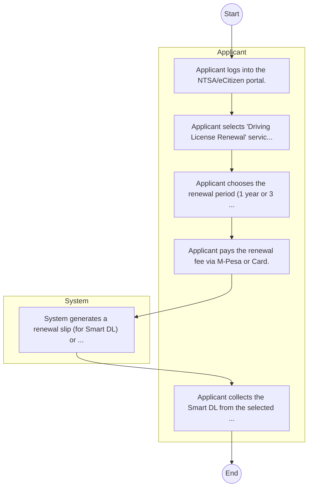

# STANDARD BPM TEMPLATE – National Transport and Safety Authority

## Cover Page
- **Ministry/Department/Agency (MDA):** National Transport and Safety Authority
- **Process Name:** To ensure an accessible and safe road transport system in Kenya by regulating driver and vehicle licensing, managing vehicle registration and transfers, overseeing transport service providers, and implementing road safety initiatives to reduce road accidents and fatalities; to develop and implement policies and strategies for road safety management; to conduct and coordinate research on road safety; to enforce road transport regulations and traffic laws; to provide transport safety education and awareness; and to contribute to the development of a modern, integrated, and efficient transport sector.
- **Document Version:** 1.0
- **Date:** 2026-02-14
- **Classification:** Official

---

## Executive Summary
The National Transport and Safety Authority (NTSA) is a Kenyan government agency established to continually improve the accessibility, safety, and reliability of the country's road transport system. NTSA provides comprehensive online and physical services for individuals, vehicles, and transport service providers, and regulates various aspects of road transport. Its core mandate involves enhancing road safety for all users, reducing road accidents and fatalities, and fostering a disciplined and efficient transport sector in Kenya.

---

## Process Flowchart (BPMN 2.0 - Mermaid)
*Guidance: This diagram visualizes the process flow across different actors (Swimlanes).*

---

## Process Overview
### Process Name
To ensure an accessible and safe road transport system in Kenya by regulating driver and vehicle licensing, managing vehicle registration and transfers, overseeing transport service providers, and implementing road safety initiatives to reduce road accidents and fatalities; to develop and implement policies and strategies for road safety management; to conduct and coordinate research on road safety; to enforce road transport regulations and traffic laws; to provide transport safety education and awareness; and to contribute to the development of a modern, integrated, and efficient transport sector.

### Service Category
- G2B (Government to Business)

### Process Objective
- To ensure an accessible and safe road transport system in Kenya by regulating driver and vehicle licensing, managing vehicle registration and transfers, overseeing transport service providers, and implementing road safety initiatives to reduce road accidents and fatalities; to develop and implement policies and strategies for road safety management; to conduct and coordinate research on road safety; to enforce road transport regulations and traffic laws; to provide transport safety education and awareness; and to contribute to the development of a modern, integrated, and efficient transport sector.

### Scope
- **In Scope:** End-to-end processing within National Transport and Safety Authority.
- **Out of Scope:** External agency approvals.

### Triggers
- Submission of application/request by Applicant.

### End States
- **Successful:** Smart DL, Number Plate, Inspection Cert
- **Unsuccessful:** Application rejected due to non-compliance.

### Policy Context
- The National Transport and Safety Authority Act; The Constitution of Kenya 2010; Data Protection Act 2019.

---

## Stakeholders
| Stakeholder | Role | Responsibilities |
|---|---|---|
| Applicant | Process Actor | Performs actions as defined in steps. |
| System | Process Actor | Performs actions as defined in steps. |

---

## Inputs & Outputs
- **Inputs:** Old DL, Police Abstract, Vehicle Logbook
- **Outputs:** Smart DL, Number Plate, Inspection Cert

---

## Detailed Process (AS-IS)
| Step | Role | Action | Tool | Notes |
|---|---|---|---|---|
| 1 | Applicant | Applicant logs into the NTSA/eCitizen portal. | Digital | |
| 2 | Applicant | Applicant selects 'Driving License Renewal' service. | Manual | |
| 3 | Applicant | Applicant chooses the renewal period (1 year or 3 years). | Manual | |
| 4 | Applicant | Applicant pays the renewal fee via M-Pesa or Card. | Manual | |
| 5 | System | System generates a renewal slip (for Smart DL) or updates the record. | Manual | |
| 6 | Applicant | Applicant collects the Smart DL from the selected center (if applying for a card) or prints the renewal slip. | Manual | |

---

## Pain Points & Opportunities
### Pain Points
- Fake licenses
- Road safety data gaps
- Manual inspection

### Opportunities
- Smart traffic cameras
- Telematics
- Digital number plates

---

## KPIs
| KPI | Baseline | Target |
|---|---|---|
| Turnaround Time | 30 Days | 5 Days |
| CSAT | 50% | 90% |
