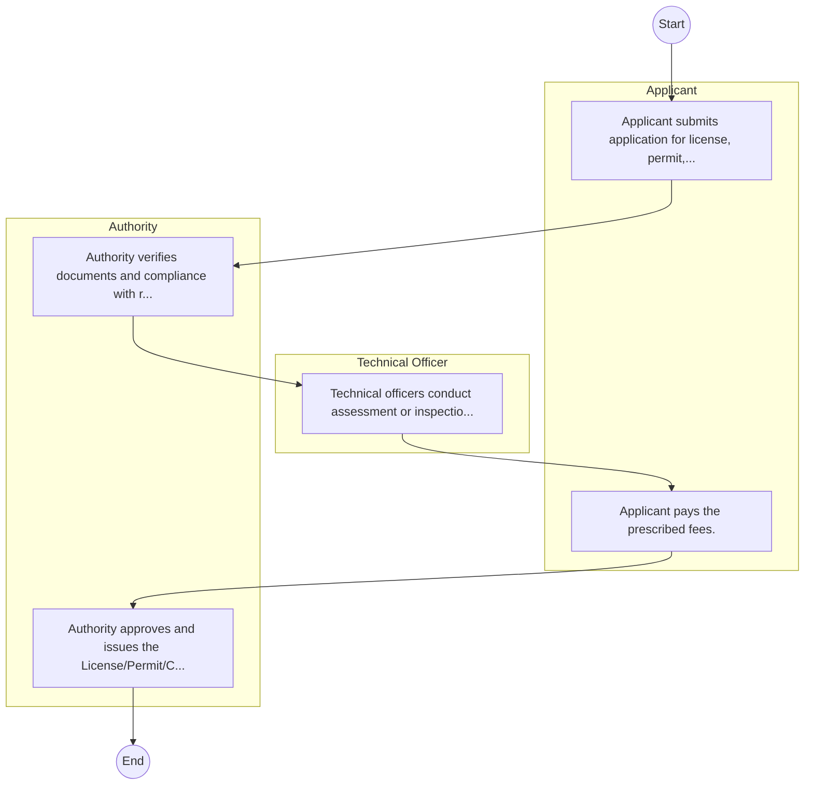

# STANDARD BPM TEMPLATE – National Youth Service

## Cover Page
- **Ministry/Department/Agency (MDA):** National Youth Service
- **Process Name:** To train and mentor Kenyan youth, imparting paramilitary and vocational skills (including construction, engineering, hospitality, agriculture, textiles, and security) to enhance their employability, discipline, patriotism, and self-reliance; to engage youth in community service and public projects, such as infrastructure development (roads, housing), environmental conservation (reforestation, waste management), slum upgrading programs, traffic control, and agriculture; to provide rapid deployment for emergency relief and disaster management, and offer support to security agencies during national emergencies; to foster national unity, civic pride, leadership skills, and promote cross-cultural integration among youth; and to undertake viable commercial enterprises to generate revenue and ensure the sustainability of its operations and programs.
- **Document Version:** 1.0
- **Date:** 2026-02-14
- **Classification:** Official

---

## Executive Summary
The National Youth Service (NYS) is a semi-autonomous state corporation in Kenya, established in 1964 and transformed in 2019 following the enactment of the NYS Act, 2018. Its core mandate is to instill discipline, patriotism, and practical skills in Kenyan youth through rigorous paramilitary training, engagement in national service projects, and provision of Technical and Vocational Education and Training (TVET). NYS aims to develop a disciplined, skilled, and organized human resource pool to support national development programs, foster social cohesion, and enhance youth employability and self-reliance, while also contributing to national security and disaster response.

---

## Process Flowchart (BPMN 2.0 - Mermaid)
*Guidance: This diagram visualizes the process flow across different actors (Swimlanes).*

---

## Process Overview
### Process Name
To train and mentor Kenyan youth, imparting paramilitary and vocational skills (including construction, engineering, hospitality, agriculture, textiles, and security) to enhance their employability, discipline, patriotism, and self-reliance; to engage youth in community service and public projects, such as infrastructure development (roads, housing), environmental conservation (reforestation, waste management), slum upgrading programs, traffic control, and agriculture; to provide rapid deployment for emergency relief and disaster management, and offer support to security agencies during national emergencies; to foster national unity, civic pride, leadership skills, and promote cross-cultural integration among youth; and to undertake viable commercial enterprises to generate revenue and ensure the sustainability of its operations and programs.

### Service Category
- G2C/G2B

### Process Objective
- To train and mentor Kenyan youth, imparting paramilitary and vocational skills (including construction, engineering, hospitality, agriculture, textiles, and security) to enhance their employability, discipline, patriotism, and self-reliance; to engage youth in community service and public projects, such as infrastructure development (roads, housing), environmental conservation (reforestation, waste management), slum upgrading programs, traffic control, and agriculture; to provide rapid deployment for emergency relief and disaster management, and offer support to security agencies during national emergencies; to foster national unity, civic pride, leadership skills, and promote cross-cultural integration among youth; and to undertake viable commercial enterprises to generate revenue and ensure the sustainability of its operations and programs.

### Scope
- **In Scope:** End-to-end processing within National Youth Service.
- **Out of Scope:** External agency approvals.

### Triggers
- Submission of application/request by Applicant.

### End States
- **Successful:** License / Permit / Certificate, Compliance Inspection Report, Official Receipt, Gazette Notice
- **Unsuccessful:** Application rejected due to non-compliance.

### Policy Context
- The National Youth Service Act; The Constitution of Kenya 2010; Data Protection Act 2019.

---

## Stakeholders
| Stakeholder | Role | Responsibilities |
|---|---|---|
| Applicant | Process Actor | Performs actions as defined in steps. |
| Authority | Process Actor | Performs actions as defined in steps. |
| Technical Officer | Process Actor | Performs actions as defined in steps. |

---

## Inputs & Outputs
- **Inputs:** Application Form (License/Permit), Compliance Documents (Tax Compliance, CR12), Technical Reports / Site Plans, Proof of Payment
- **Outputs:** License / Permit / Certificate, Compliance Inspection Report, Official Receipt, Gazette Notice

---

## Detailed Process (AS-IS)
| Step | Role | Action | Tool | Notes |
|---|---|---|---|---|
| 1 | Applicant | Applicant submits application for license, permit, or service. | Manual | |
| 2 | Authority | Authority verifies documents and compliance with regulations. | Manual | |
| 3 | Technical Officer | Technical officers conduct assessment or inspection. | Manual | |
| 4 | Applicant | Applicant pays the prescribed fees. | Manual | |
| 5 | Authority | Authority approves and issues the License/Permit/Certificate. | Manual | |

---

## Pain Points & Opportunities
### Pain Points
- Manual document verification takes time.
- High cost and time for physical inspections.
- Risk of counterfeit licenses/certificates.
- Lack of real-time monitoring of licensees.

### Opportunities
- Online Licensing Management System (LMS).
- Integration with IPRS and BRS for auto-verification.
- Mobile field inspection apps with GIS.
- QR-coded verifiable certificates.

---

## KPIs
| KPI | Baseline | Target |
|---|---|---|
| Turnaround Time | 30 Days | 5 Days |
| CSAT | 50% | 90% |
