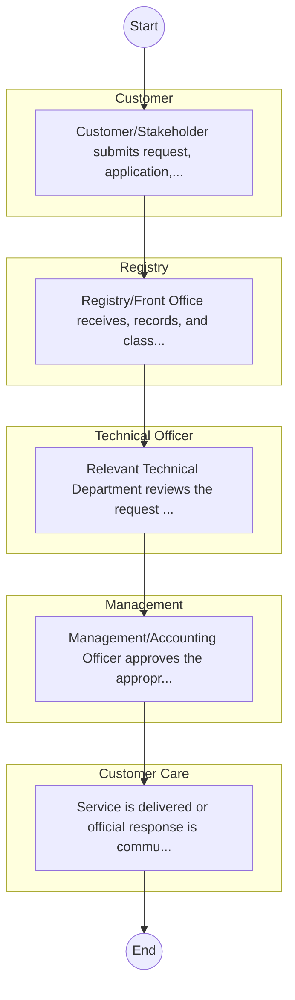

# STANDARD BPM TEMPLATE – OFFICE OF THE ATTORNEY GENERAL  (AG)

## Cover Page
- **Ministry/Department/Agency (MDA):** OFFICE OF THE ATTORNEY GENERAL  (AG)
- **Process Name:** To provide comprehensive legal advice to the national government, represent it in legal proceedings (excluding criminal cases), and promote, protect, and uphold the rule of law and access to justice for all Kenyans.
- **Document Version:** 1.0
- **Date:** 2026-02-14
- **Classification:** Official

---

## Executive Summary
The Office of the Attorney General (OAG) in Kenya serves as the principal legal advisor to the National Government, upholding the rule of law and ensuring equal access to justice. It represents the government in legal proceedings, safeguards the Constitution, and promotes good governance and human rights.

---

## Process Flowchart (BPMN 2.0 - Mermaid)
*Guidance: This diagram visualizes the process flow across different actors (Swimlanes).*

---

## Process Overview
### Process Name
To provide comprehensive legal advice to the national government, represent it in legal proceedings (excluding criminal cases), and promote, protect, and uphold the rule of law and access to justice for all Kenyans.

### Service Category
- G2C/G2B

### Process Objective
- To provide comprehensive legal advice to the national government, represent it in legal proceedings (excluding criminal cases), and promote, protect, and uphold the rule of law and access to justice for all Kenyans.

### Scope
- **In Scope:** End-to-end processing within OFFICE OF THE ATTORNEY GENERAL  (AG).
- **Out of Scope:** External agency approvals.

### Triggers
- Submission of application/request by Customer.

### End States
- **Successful:** Policy Guidelines / Circulars, Official Response Letters, Cabinet Resolutions, Public Service Reports
- **Unsuccessful:** Application rejected due to non-compliance.

### Policy Context
- The OFFICE OF THE ATTORNEY GENERAL  (AG) Act; The Constitution of Kenya 2010; Data Protection Act 2019.

---

## Stakeholders
| Stakeholder | Role | Responsibilities |
|---|---|---|
| Registry | Process Actor | Performs actions as defined in steps. |
| Customer Care | Process Actor | Performs actions as defined in steps. |
| Management | Process Actor | Performs actions as defined in steps. |
| Customer | Process Actor | Performs actions as defined in steps. |
| Technical Officer | Process Actor | Performs actions as defined in steps. |

---

## Inputs & Outputs
- **Inputs:** Public Inquiries / Petitions, Policy Proposals / Memos, Inter-agency Correspondence, Cabinet Memos
- **Outputs:** Policy Guidelines / Circulars, Official Response Letters, Cabinet Resolutions, Public Service Reports

---

## Detailed Process (AS-IS)
| Step | Role | Action | Tool | Notes |
|---|---|---|---|---|
| 1 | Customer | Customer/Stakeholder submits request, application, or inquiry via official channels (Email, Letter, or Portal). | Digital | |
| 2 | Registry | Registry/Front Office receives, records, and classifies the request. | Manual | |
| 3 | Technical Officer | Relevant Technical Department reviews the request against internal policies and regulations. | Manual | |
| 4 | Management | Management/Accounting Officer approves the appropriate action or service delivery. | Manual | |
| 5 | Customer Care | Service is delivered or official response is communicated to the customer. | Manual | |

---

## Pain Points & Opportunities
### Pain Points
- Slow movement of physical files (Bureaucracy).
- Loss of institutional memory (Manual registries).
- Difficulty in tracking correspondence status.
- Siloed operations between departments.

### Opportunities
- Electronic Document and Records Management System (EDRMS).
- Digital dashboard for project monitoring.
- Unified communication and collaboration platforms.
- Knowledge Management Systems.

---

## KPIs
| KPI | Baseline | Target |
|---|---|---|
| Turnaround Time | 30 Days | 5 Days |
| CSAT | 50% | 90% |
