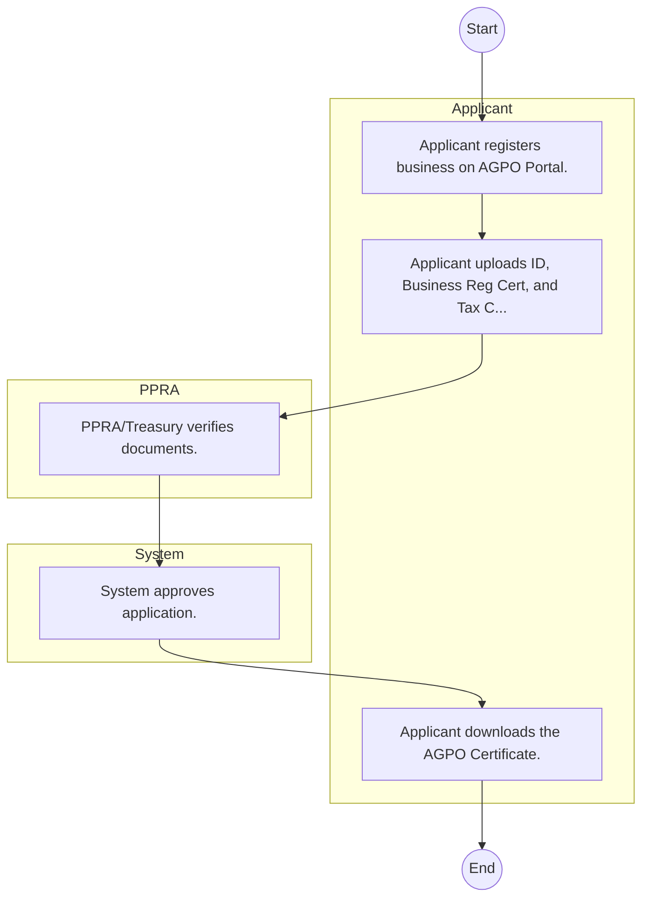

# STANDARD BPM TEMPLATE – Public Procurement Regulatory Authority

## Cover Page
- **Ministry/Department/Agency (MDA):** Public Procurement Regulatory Authority
- **Process Name:** To monitor, assess, and review the public procurement and asset disposal system to ensure compliance with national values and constitutional provisions, and make recommendations for improvements; to develop procurement policies, regulations, and guidelines; to monitor and evaluate procurement performance to ensure compliance with procurement laws and regulations, and enforce standards by imposing sanctions for non-compliance; to investigate and resolve complaints and disputes related to procurement processes; to develop, promote, and support the training and capacity development of individuals involved in procurement and asset disposal; to provide guidance and technical support to public institutions on procurement matters; to promote the participation of disadvantaged groups (women, youth, and persons with disabilities) in public procurement through preferential policies; to promote the use of technology in procurement processes; to report to Parliament and relevant county assemblies on the functioning of the procurement system; to develop a code of ethics to guide procuring entities and bidders; to collaborate with state and non-state actors to improve public procurement and disposal; to maintain and update supplier and contractor databases, and develop standard procurement documents; and to conduct market research and procurement audits.
- **Document Version:** 1.0
- **Date:** 2026-02-14
- **Classification:** Official

---

## Executive Summary
The Public Procurement Regulatory Authority (PPRA) is an autonomous government agency in Kenya established under Section 8 of the Public Procurement and Asset Disposal Act, 2015. Its primary mandate is to monitor, assess, and report on the overall functioning of the public procurement and asset disposal system in Kenya. PPRA ensures that procuring entities adhere to national values, constitutional provisions, and principles of fairness, equity, transparency, competition, and cost-effectiveness, thereby promoting sustainable development and safeguarding public resources.

---

## Process Flowchart (BPMN 2.0 - Mermaid)
*Guidance: This diagram visualizes the process flow across different actors (Swimlanes).*

---

## Process Overview
### Process Name
To monitor, assess, and review the public procurement and asset disposal system to ensure compliance with national values and constitutional provisions, and make recommendations for improvements; to develop procurement policies, regulations, and guidelines; to monitor and evaluate procurement performance to ensure compliance with procurement laws and regulations, and enforce standards by imposing sanctions for non-compliance; to investigate and resolve complaints and disputes related to procurement processes; to develop, promote, and support the training and capacity development of individuals involved in procurement and asset disposal; to provide guidance and technical support to public institutions on procurement matters; to promote the participation of disadvantaged groups (women, youth, and persons with disabilities) in public procurement through preferential policies; to promote the use of technology in procurement processes; to report to Parliament and relevant county assemblies on the functioning of the procurement system; to develop a code of ethics to guide procuring entities and bidders; to collaborate with state and non-state actors to improve public procurement and disposal; to maintain and update supplier and contractor databases, and develop standard procurement documents; and to conduct market research and procurement audits.

### Service Category
- G2B (Government to Business)

### Process Objective
- To monitor, assess, and review the public procurement and asset disposal system to ensure compliance with national values and constitutional provisions, and make recommendations for improvements; to develop procurement policies, regulations, and guidelines; to monitor and evaluate procurement performance to ensure compliance with procurement laws and regulations, and enforce standards by imposing sanctions for non-compliance; to investigate and resolve complaints and disputes related to procurement processes; to develop, promote, and support the training and capacity development of individuals involved in procurement and asset disposal; to provide guidance and technical support to public institutions on procurement matters; to promote the participation of disadvantaged groups (women, youth, and persons with disabilities) in public procurement through preferential policies; to promote the use of technology in procurement processes; to report to Parliament and relevant county assemblies on the functioning of the procurement system; to develop a code of ethics to guide procuring entities and bidders; to collaborate with state and non-state actors to improve public procurement and disposal; to maintain and update supplier and contractor databases, and develop standard procurement documents; and to conduct market research and procurement audits.

### Scope
- **In Scope:** End-to-end processing within Public Procurement Regulatory Authority.
- **Out of Scope:** External agency approvals.

### Triggers
- Submission of application/request by Applicant.

### End States
- **Successful:** License / Permit / Certificate, Compliance Inspection Report, Official Receipt, Gazette Notice
- **Unsuccessful:** Application rejected due to non-compliance.

### Policy Context
- The Public Procurement Regulatory Authority Act; The Constitution of Kenya 2010; Data Protection Act 2019.

---

## Stakeholders
| Stakeholder | Role | Responsibilities |
|---|---|---|
| Applicant | Process Actor | Performs actions as defined in steps. |
| System | Process Actor | Performs actions as defined in steps. |
| PPRA | Process Actor | Performs actions as defined in steps. |

---

## Inputs & Outputs
- **Inputs:** Application Form (License/Permit), Compliance Documents (Tax Compliance, CR12), Technical Reports / Site Plans, Proof of Payment
- **Outputs:** License / Permit / Certificate, Compliance Inspection Report, Official Receipt, Gazette Notice

---

## Detailed Process (AS-IS)
| Step | Role | Action | Tool | Notes |
|---|---|---|---|---|
| 1 | Applicant | Applicant registers business on AGPO Portal. | Digital | |
| 2 | Applicant | Applicant uploads ID, Business Reg Cert, and Tax Compliance Cert. | Manual | |
| 3 | PPRA | PPRA/Treasury verifies documents. | Manual | |
| 4 | System | System approves application. | Manual | |
| 5 | Applicant | Applicant downloads the AGPO Certificate. | Manual | |

---

## Pain Points & Opportunities
### Pain Points
- Manual document verification takes time.
- High cost and time for physical inspections.
- Risk of counterfeit licenses/certificates.
- Lack of real-time monitoring of licensees.

### Opportunities
- Online Licensing Management System (LMS).
- Integration with IPRS and BRS for auto-verification.
- Mobile field inspection apps with GIS.
- QR-coded verifiable certificates.

---

## KPIs
| KPI | Baseline | Target |
|---|---|---|
| Turnaround Time | 30 Days | 5 Days |
| CSAT | 50% | 90% |
