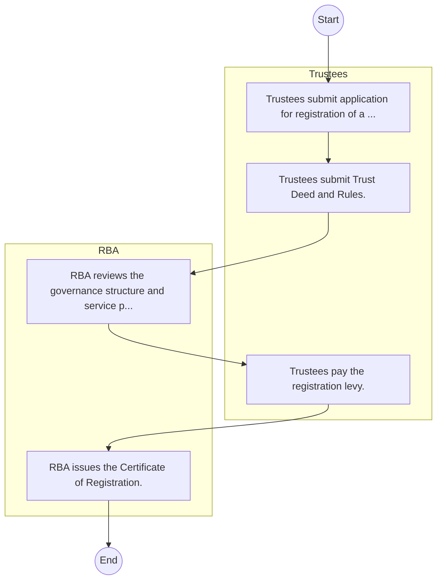

# STANDARD BPM TEMPLATE – Retirement Benefits Authority

## Cover Page
- **Ministry/Department/Agency (MDA):** Retirement Benefits Authority
- **Process Name:** To regulate and supervise the establishment and management of all retirement benefits schemes in Kenya, including licensing and registering schemes, trustees, fund managers, and administrators, and setting investment guidelines; to protect the interests of members and sponsors of retirement benefits schemes by safeguarding their savings and rights, providing a platform for resolving complaints and disputes, and enforcing penalties for non-compliance; to promote the growth and development of the retirement benefits sector through public awareness campaigns, education programs on retirement planning and financial literacy, and supporting reforms and innovations within the industry; and to advise the government on matters related to retirement benefits and implement government policies concerning the sector.
- **Document Version:** 1.0
- **Date:** 2026-02-14
- **Classification:** Official

---

## Executive Summary
The Retirement Benefits Authority (RBA) in Kenya is a regulatory body established under the Retirement Benefits Act of 1997, operating under the National Treasury. Its primary mandate encompasses the regulation, supervision, protection, and promotion of the retirement benefits sector in Kenya. RBA plays a crucial role in ensuring the security of members' savings, fostering the growth and development of the sector, and promoting public understanding and confidence in retirement planning and benefits.

---

## Process Flowchart (BPMN 2.0 - Mermaid)
*Guidance: This diagram visualizes the process flow across different actors (Swimlanes).*

---

## Process Overview
### Process Name
To regulate and supervise the establishment and management of all retirement benefits schemes in Kenya, including licensing and registering schemes, trustees, fund managers, and administrators, and setting investment guidelines; to protect the interests of members and sponsors of retirement benefits schemes by safeguarding their savings and rights, providing a platform for resolving complaints and disputes, and enforcing penalties for non-compliance; to promote the growth and development of the retirement benefits sector through public awareness campaigns, education programs on retirement planning and financial literacy, and supporting reforms and innovations within the industry; and to advise the government on matters related to retirement benefits and implement government policies concerning the sector.

### Service Category
- G2B (Government to Business)

### Process Objective
- To regulate and supervise the establishment and management of all retirement benefits schemes in Kenya, including licensing and registering schemes, trustees, fund managers, and administrators, and setting investment guidelines; to protect the interests of members and sponsors of retirement benefits schemes by safeguarding their savings and rights, providing a platform for resolving complaints and disputes, and enforcing penalties for non-compliance; to promote the growth and development of the retirement benefits sector through public awareness campaigns, education programs on retirement planning and financial literacy, and supporting reforms and innovations within the industry; and to advise the government on matters related to retirement benefits and implement government policies concerning the sector.

### Scope
- **In Scope:** End-to-end processing within Retirement Benefits Authority.
- **Out of Scope:** External agency approvals.

### Triggers
- Submission of application/request by Trustees.

### End States
- **Successful:** License / Permit / Certificate, Compliance Inspection Report, Official Receipt, Gazette Notice
- **Unsuccessful:** Application rejected due to non-compliance.

### Policy Context
- The Retirement Benefits Authority Act; The Constitution of Kenya 2010; Data Protection Act 2019.

---

## Stakeholders
| Stakeholder | Role | Responsibilities |
|---|---|---|
| Trustees | Process Actor | Performs actions as defined in steps. |
| RBA | Process Actor | Performs actions as defined in steps. |

---

## Inputs & Outputs
- **Inputs:** Application Form (License/Permit), Compliance Documents (Tax Compliance, CR12), Technical Reports / Site Plans, Proof of Payment
- **Outputs:** License / Permit / Certificate, Compliance Inspection Report, Official Receipt, Gazette Notice

---

## Detailed Process (AS-IS)
| Step | Role | Action | Tool | Notes |
|---|---|---|---|---|
| 1 | Trustees | Trustees submit application for registration of a scheme. | Manual | |
| 2 | Trustees | Trustees submit Trust Deed and Rules. | Manual | |
| 3 | RBA | RBA reviews the governance structure and service provider contracts. | Manual | |
| 4 | Trustees | Trustees pay the registration levy. | Manual | |
| 5 | RBA | RBA issues the Certificate of Registration. | Manual | |

---

## Pain Points & Opportunities
### Pain Points
- Manual document verification takes time.
- High cost and time for physical inspections.
- Risk of counterfeit licenses/certificates.
- Lack of real-time monitoring of licensees.

### Opportunities
- Online Licensing Management System (LMS).
- Integration with IPRS and BRS for auto-verification.
- Mobile field inspection apps with GIS.
- QR-coded verifiable certificates.

---

## KPIs
| KPI | Baseline | Target |
|---|---|---|
| Turnaround Time | 30 Days | 5 Days |
| CSAT | 50% | 90% |
