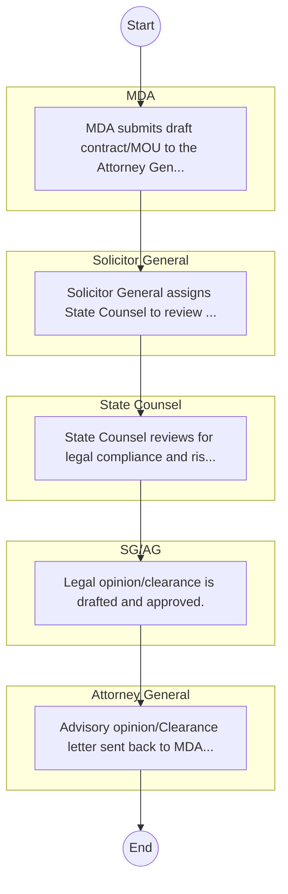

# STANDARD BPM TEMPLATE – Solicitor General

## Cover Page
- **Ministry/Department/Agency (MDA):** Solicitor General
- **Process Name:** Represents 'Governance Justice Law and Order' cluster for balanced coverage; entity type: Department. Included as Tier 3 for light‑touch desk review/survey.
- **Document Version:** 1.0
- **Date:** 2026-02-14
- **Classification:** Official

---

## Executive Summary
Represents 'Governance Justice Law and Order' cluster for balanced coverage; entity type: Department. Included as Tier 3 for light‑touch desk review/survey.

---

## Process Flowchart (BPMN 2.0 - Mermaid)
*Guidance: This diagram visualizes the process flow across different actors (Swimlanes).*

---

## Process Overview
### Process Name
Represents 'Governance Justice Law and Order' cluster for balanced coverage; entity type: Department. Included as Tier 3 for light‑touch desk review/survey.

### Service Category
- G2C/G2B

### Process Objective
- Represents 'Governance Justice Law and Order' cluster for balanced coverage; entity type: Department. Included as Tier 3 for light‑touch desk review/survey.

### Scope
- **In Scope:** End-to-end processing within Solicitor General.
- **Out of Scope:** External agency approvals.

### Triggers
- Submission of application/request by MDA.

### End States
- **Successful:** License / Permit / Certificate, Compliance Inspection Report, Official Receipt, Gazette Notice
- **Unsuccessful:** Application rejected due to non-compliance.

### Policy Context
- The Solicitor General Act; The Constitution of Kenya 2010; Data Protection Act 2019.

---

## Stakeholders
| Stakeholder | Role | Responsibilities |
|---|---|---|
| Attorney General | Process Actor | Performs actions as defined in steps. |
| MDA | Process Actor | Performs actions as defined in steps. |
| State Counsel | Process Actor | Performs actions as defined in steps. |
| SG/AG | Process Actor | Performs actions as defined in steps. |
| Solicitor General | Process Actor | Performs actions as defined in steps. |

---

## Inputs & Outputs
- **Inputs:** Application Form (License/Permit), Compliance Documents (Tax Compliance, CR12), Technical Reports / Site Plans, Proof of Payment
- **Outputs:** License / Permit / Certificate, Compliance Inspection Report, Official Receipt, Gazette Notice

---

## Detailed Process (AS-IS)
| Step | Role | Action | Tool | Notes |
|---|---|---|---|---|
| 1 | MDA | MDA submits draft contract/MOU to the Attorney General. | Manual | |
| 2 | Solicitor General | Solicitor General assigns State Counsel to review the document. | Manual | |
| 3 | State Counsel | State Counsel reviews for legal compliance and risks. | Manual | |
| 4 | SG/AG | Legal opinion/clearance is drafted and approved. | Manual | |
| 5 | Attorney General | Advisory opinion/Clearance letter sent back to MDA. | Manual | |

---

## Pain Points & Opportunities
### Pain Points
- Manual document verification takes time.
- High cost and time for physical inspections.
- Risk of counterfeit licenses/certificates.
- Lack of real-time monitoring of licensees.

### Opportunities
- Online Licensing Management System (LMS).
- Integration with IPRS and BRS for auto-verification.
- Mobile field inspection apps with GIS.
- QR-coded verifiable certificates.

---

## KPIs
| KPI | Baseline | Target |
|---|---|---|
| Turnaround Time | 30 Days | 5 Days |
| CSAT | 50% | 90% |
