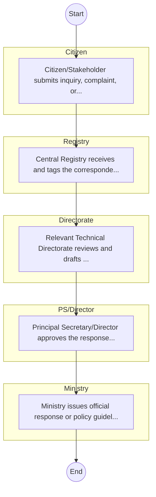

# STANDARD BPM TEMPLATE – STATE DEPARTMENT FOR BASIC EDUCATION

## Cover Page
- **Ministry/Department/Agency (MDA):** STATE DEPARTMENT FOR BASIC EDUCATION
- **Process Name:** To formulate and manage transport policy, oversee rail transport and civil aviation, manage national transport safety, coordinate major transport corridor projects (Northern and LAPSSET), and regulate vehicle registration, inspection, and axle load control to ensure a safe, efficient, and sustainable transport system in Kenya.
- **Document Version:** 1.0
- **Date:** 2026-02-14
- **Classification:** Official

---

## Executive Summary
The State Department for Transport in Kenya operates under the Ministry of Roads and Transport, with a mandate encompassing transport policy management, rail and civil aviation infrastructure development, national transport safety, and oversight of key transport institutions. It aims to develop an integrated, efficient, effective, and sustainable transport system.

---

## Process Flowchart (BPMN 2.0 - Mermaid)
*Guidance: This diagram visualizes the process flow across different actors (Swimlanes).*

---

## Process Overview
### Process Name
To formulate and manage transport policy, oversee rail transport and civil aviation, manage national transport safety, coordinate major transport corridor projects (Northern and LAPSSET), and regulate vehicle registration, inspection, and axle load control to ensure a safe, efficient, and sustainable transport system in Kenya.

### Service Category
- G2C/G2B

### Process Objective
- To formulate and manage transport policy, oversee rail transport and civil aviation, manage national transport safety, coordinate major transport corridor projects (Northern and LAPSSET), and regulate vehicle registration, inspection, and axle load control to ensure a safe, efficient, and sustainable transport system in Kenya.

### Scope
- **In Scope:** End-to-end processing within STATE DEPARTMENT FOR BASIC EDUCATION.
- **Out of Scope:** External agency approvals.

### Triggers
- Submission of application/request by Citizen.

### End States
- **Successful:** Policy Guidelines / Circulars, Official Response Letters, Cabinet Resolutions, Public Service Reports
- **Unsuccessful:** Application rejected due to non-compliance.

### Policy Context
- The STATE DEPARTMENT FOR BASIC EDUCATION Act; The Constitution of Kenya 2010; Data Protection Act 2019.

---

## Stakeholders
| Stakeholder | Role | Responsibilities |
|---|---|---|
| Registry | Process Actor | Performs actions as defined in steps. |
| Directorate | Process Actor | Performs actions as defined in steps. |
| Citizen | Process Actor | Performs actions as defined in steps. |
| Ministry | Process Actor | Performs actions as defined in steps. |
| PS/Director | Process Actor | Performs actions as defined in steps. |

---

## Inputs & Outputs
- **Inputs:** Public Inquiries / Petitions, Policy Proposals / Memos, Inter-agency Correspondence, Cabinet Memos
- **Outputs:** Policy Guidelines / Circulars, Official Response Letters, Cabinet Resolutions, Public Service Reports

---

## Detailed Process (AS-IS)
| Step | Role | Action | Tool | Notes |
|---|---|---|---|---|
| 1 | Citizen | Citizen/Stakeholder submits inquiry, complaint, or policy proposal via email or office. | Manual | |
| 2 | Registry | Central Registry receives and tags the correspondence. | Manual | |
| 3 | Directorate | Relevant Technical Directorate reviews and drafts response/action. | Manual | |
| 4 | PS/Director | Principal Secretary/Director approves the response. | Manual | |
| 5 | Ministry | Ministry issues official response or policy guideline. | Manual | |

---

## Pain Points & Opportunities
### Pain Points
- Slow movement of physical files (Bureaucracy).
- Loss of institutional memory (Manual registries).
- Difficulty in tracking correspondence status.
- Siloed operations between departments.

### Opportunities
- Electronic Document and Records Management System (EDRMS).
- Digital dashboard for project monitoring.
- Unified communication and collaboration platforms.
- Knowledge Management Systems.

---

## KPIs
| KPI | Baseline | Target |
|---|---|---|
| Turnaround Time | 30 Days | 5 Days |
| CSAT | 50% | 90% |
