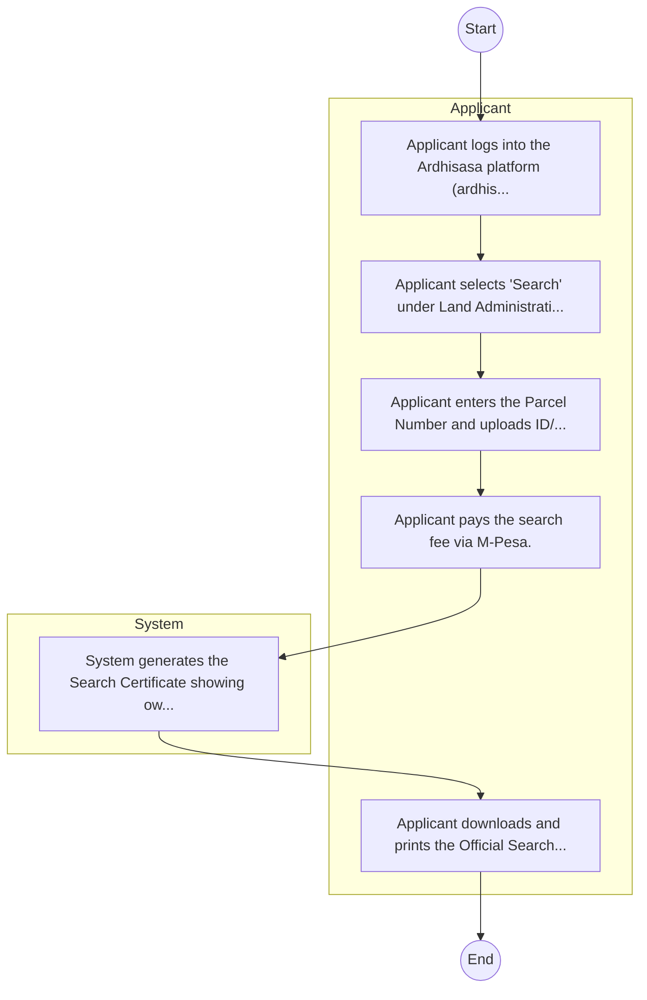

# STANDARD BPM TEMPLATE – STATE DEPARTMENT FOR LANDS AND PHYSICAL PLANNING

## Cover Page
- **Ministry/Department/Agency (MDA):** STATE DEPARTMENT FOR LANDS AND PHYSICAL PLANNING
- **Process Name:** To exercise general supervision and coordination over all matters relating to the environment, implement environmental policies, enforce environmental laws and regulations, promote public environmental awareness, and ensure sustainable environmental management and conservation across Kenya.
- **Document Version:** 1.0
- **Date:** 2026-02-14
- **Classification:** Official

---

## Executive Summary
The National Environment Management Authority (NEMA) is Kenya's principal government agency responsible for environmental management and policy. Established under EMCA 1999, it ensures the sustainable management of the environment through general supervision, coordination of environmental matters, and implementation of all environmental policies to maintain standards and regulations across Kenya.

---

## Process Flowchart (BPMN 2.0 - Mermaid)
*Guidance: This diagram visualizes the process flow across different actors (Swimlanes).*

---

## Process Overview
### Process Name
To exercise general supervision and coordination over all matters relating to the environment, implement environmental policies, enforce environmental laws and regulations, promote public environmental awareness, and ensure sustainable environmental management and conservation across Kenya.

### Service Category
- G2C/G2B

### Process Objective
- To exercise general supervision and coordination over all matters relating to the environment, implement environmental policies, enforce environmental laws and regulations, promote public environmental awareness, and ensure sustainable environmental management and conservation across Kenya.

### Scope
- **In Scope:** End-to-end processing within STATE DEPARTMENT FOR LANDS AND PHYSICAL PLANNING.
- **Out of Scope:** External agency approvals.

### Triggers
- Submission of application/request by Applicant.

### End States
- **Successful:** Search Certificate, New Title Deed, Green Card Entry
- **Unsuccessful:** Application rejected due to non-compliance.

### Policy Context
- The STATE DEPARTMENT FOR LANDS AND PHYSICAL PLANNING Act; The Constitution of Kenya 2010; Data Protection Act 2019.

---

## Stakeholders
| Stakeholder | Role | Responsibilities |
|---|---|---|
| Applicant | Process Actor | Performs actions as defined in steps. |
| System | Process Actor | Performs actions as defined in steps. |

---

## Inputs & Outputs
- **Inputs:** Transfer Form, Title Deed, Land Rent Clearance
- **Outputs:** Search Certificate, New Title Deed, Green Card Entry

---

## Detailed Process (AS-IS)
| Step | Role | Action | Tool | Notes |
|---|---|---|---|---|
| 1 | Applicant | Applicant logs into the Ardhisasa platform (ardhisasa.lands.go.ke). | Manual | |
| 2 | Applicant | Applicant selects 'Search' under Land Administration. | Manual | |
| 3 | Applicant | Applicant enters the Parcel Number and uploads ID/Consent if required. | Manual | |
| 4 | Applicant | Applicant pays the search fee via M-Pesa. | Manual | |
| 5 | System | System generates the Search Certificate showing ownership and encumbrances. | Manual | |
| 6 | Applicant | Applicant downloads and prints the Official Search Result. | Manual | |

---

## Pain Points & Opportunities
### Pain Points
- Missing green cards
- Fraud/Double allocation
- Manual search

### Opportunities
- Blockchain for land registry
- GIS digitization
- Fully cashless

---

## KPIs
| KPI | Baseline | Target |
|---|---|---|
| Turnaround Time | 30 Days | 5 Days |
| CSAT | 50% | 90% |
