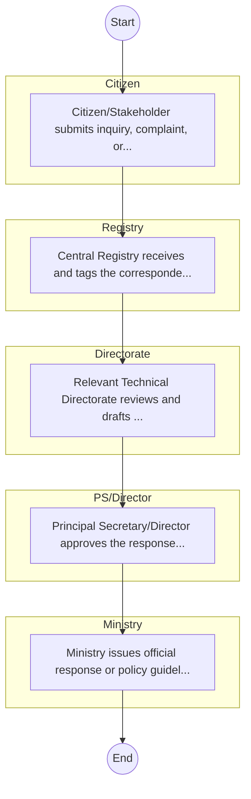

# STANDARD BPM TEMPLATE – STATE DEPARTMENT FOR PUBLIC HEALTH

## Cover Page
- **Ministry/Department/Agency (MDA):** STATE DEPARTMENT FOR PUBLIC HEALTH
- **Process Name:** To develop and implement policies for public health and sanitation, oversee preventive and promotive health services, strengthen disease surveillance and preparedness, scale up community health interventions, and ensure functional primary healthcare networks to achieve a nation free from preventable diseases and ill health through primary healthcare interventions.
- **Document Version:** 1.0
- **Date:** 2026-02-14
- **Classification:** Official

---

## Executive Summary
The State Department for Public Health and Professional Standards in Kenya, operating under the Ministry of Health, is tasked with ensuring the well-being of the Kenyan population. Its overarching goal is to achieve a nation free from preventable diseases and ill health through primary healthcare interventions, accelerating Universal Health Coverage (UHC), and contributing to Sustainable Development Goals (SDGs).

---

## Process Flowchart (BPMN 2.0 - Mermaid)
*Guidance: This diagram visualizes the process flow across different actors (Swimlanes).*

---

## Process Overview
### Process Name
To develop and implement policies for public health and sanitation, oversee preventive and promotive health services, strengthen disease surveillance and preparedness, scale up community health interventions, and ensure functional primary healthcare networks to achieve a nation free from preventable diseases and ill health through primary healthcare interventions.

### Service Category
- G2C/G2B

### Process Objective
- To develop and implement policies for public health and sanitation, oversee preventive and promotive health services, strengthen disease surveillance and preparedness, scale up community health interventions, and ensure functional primary healthcare networks to achieve a nation free from preventable diseases and ill health through primary healthcare interventions.

### Scope
- **In Scope:** End-to-end processing within STATE DEPARTMENT FOR PUBLIC HEALTH.
- **Out of Scope:** External agency approvals.

### Triggers
- Submission of application/request by Citizen.

### End States
- **Successful:** Patient File / EMR Record, Diagnostic Lab Reports, Prescription / Medication, Discharge Summary
- **Unsuccessful:** Application rejected due to non-compliance.

### Policy Context
- The STATE DEPARTMENT FOR PUBLIC HEALTH Act; The Constitution of Kenya 2010; Data Protection Act 2019.

---

## Stakeholders
| Stakeholder | Role | Responsibilities |
|---|---|---|
| Registry | Process Actor | Performs actions as defined in steps. |
| Directorate | Process Actor | Performs actions as defined in steps. |
| Citizen | Process Actor | Performs actions as defined in steps. |
| Ministry | Process Actor | Performs actions as defined in steps. |
| PS/Director | Process Actor | Performs actions as defined in steps. |

---

## Inputs & Outputs
- **Inputs:** Patient Personal/Bio-data, Insurance Card / NHIF Number, Medical History Records, Triage Vitals (BP, Temp, etc.)
- **Outputs:** Patient File / EMR Record, Diagnostic Lab Reports, Prescription / Medication, Discharge Summary

---

## Detailed Process (AS-IS)
| Step | Role | Action | Tool | Notes |
|---|---|---|---|---|
| 1 | Citizen | Citizen/Stakeholder submits inquiry, complaint, or policy proposal via email or office. | Manual | |
| 2 | Registry | Central Registry receives and tags the correspondence. | Manual | |
| 3 | Directorate | Relevant Technical Directorate reviews and drafts response/action. | Manual | |
| 4 | PS/Director | Principal Secretary/Director approves the response. | Manual | |
| 5 | Ministry | Ministry issues official response or policy guideline. | Manual | |

---

## Pain Points & Opportunities
### Pain Points
- Loss of physical patient files.
- Long patient wait times at triage and pharmacy.
- Lack of interoperability between departments (Lab, Pharmacy, Billing).
- Revenue leakage in cash collections.

### Opportunities
- Comprehensive Electronic Medical Records (EMR).
- Telemedicine for remote consultations.
- AI-assisted diagnostics and radiology.
- Automated inventory management for pharmacy.

---

## KPIs
| KPI | Baseline | Target |
|---|---|---|
| Turnaround Time | 30 Days | 5 Days |
| CSAT | 50% | 90% |
