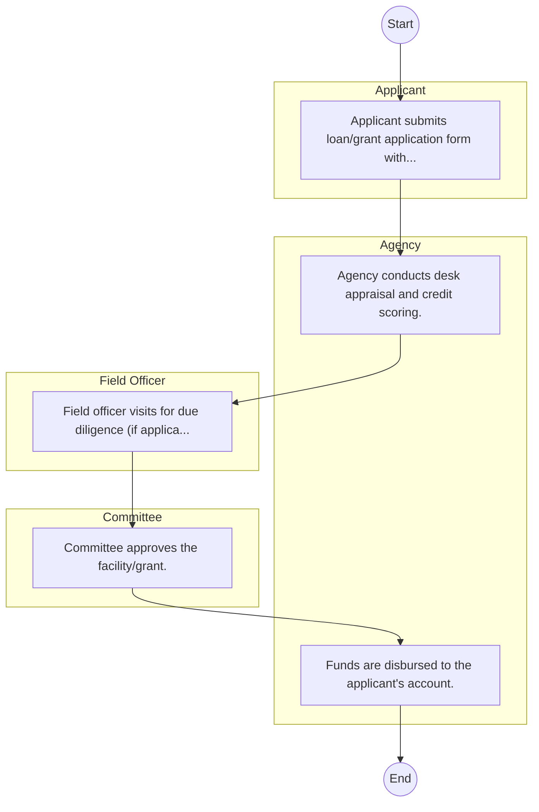

# STANDARD BPM TEMPLATE – STATE DEPARTMENT FOR PUBLIC SERVICE AND HUMAN CAPITAL

## Cover Page
- **Ministry/Department/Agency (MDA):** STATE DEPARTMENT FOR PUBLIC SERVICE AND HUMAN CAPITAL
- **Process Name:** To develop and implement policies and strategies for technical and vocational skills training, oversee the provision and quality of TVET programs, manage TVET institutions, enhance access and relevance, and foster strong linkages with industry to meet labor market needs.
- **Document Version:** 1.0
- **Date:** 2026-02-14
- **Classification:** Official

---

## Executive Summary
The State Department for Technical and Vocational Education and Training (TVET) in Kenya coordinates national skills training and fosters an effectively harmonized TVET system. Its goal is to produce a skilled human resource base with the necessary attitudes and values to contribute to the growth and prosperity of various economic sectors.

---

## Process Flowchart (BPMN 2.0 - Mermaid)
*Guidance: This diagram visualizes the process flow across different actors (Swimlanes).*

---

## Process Overview
### Process Name
To develop and implement policies and strategies for technical and vocational skills training, oversee the provision and quality of TVET programs, manage TVET institutions, enhance access and relevance, and foster strong linkages with industry to meet labor market needs.

### Service Category
- G2C/G2B

### Process Objective
- To develop and implement policies and strategies for technical and vocational skills training, oversee the provision and quality of TVET programs, manage TVET institutions, enhance access and relevance, and foster strong linkages with industry to meet labor market needs.

### Scope
- **In Scope:** End-to-end processing within STATE DEPARTMENT FOR PUBLIC SERVICE AND HUMAN CAPITAL.
- **Out of Scope:** External agency approvals.

### Triggers
- Submission of application/request by Applicant.

### End States
- **Successful:** Policy Guidelines / Circulars, Official Response Letters, Cabinet Resolutions, Public Service Reports
- **Unsuccessful:** Application rejected due to non-compliance.

### Policy Context
- The STATE DEPARTMENT FOR PUBLIC SERVICE AND HUMAN CAPITAL Act; The Constitution of Kenya 2010; Data Protection Act 2019.

---

## Stakeholders
| Stakeholder | Role | Responsibilities |
|---|---|---|
| Applicant | Process Actor | Performs actions as defined in steps. |
| Field Officer | Process Actor | Performs actions as defined in steps. |
| Committee | Process Actor | Performs actions as defined in steps. |
| Agency | Process Actor | Performs actions as defined in steps. |

---

## Inputs & Outputs
- **Inputs:** Public Inquiries / Petitions, Policy Proposals / Memos, Inter-agency Correspondence, Cabinet Memos
- **Outputs:** Policy Guidelines / Circulars, Official Response Letters, Cabinet Resolutions, Public Service Reports

---

## Detailed Process (AS-IS)
| Step | Role | Action | Tool | Notes |
|---|---|---|---|---|
| 1 | Applicant | Applicant submits loan/grant application form with business proposal. | Manual | |
| 2 | Agency | Agency conducts desk appraisal and credit scoring. | Manual | |
| 3 | Field Officer | Field officer visits for due diligence (if applicable). | Manual | |
| 4 | Committee | Committee approves the facility/grant. | Manual | |
| 5 | Agency | Funds are disbursed to the applicant's account. | Manual | |

---

## Pain Points & Opportunities
### Pain Points
- Slow movement of physical files (Bureaucracy).
- Loss of institutional memory (Manual registries).
- Difficulty in tracking correspondence status.
- Siloed operations between departments.

### Opportunities
- Electronic Document and Records Management System (EDRMS).
- Digital dashboard for project monitoring.
- Unified communication and collaboration platforms.
- Knowledge Management Systems.

---

## KPIs
| KPI | Baseline | Target |
|---|---|---|
| Turnaround Time | 30 Days | 5 Days |
| CSAT | 50% | 90% |
