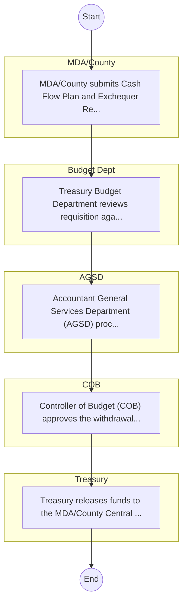

# STANDARD BPM TEMPLATE – The National Treasury

## Cover Page
- **Ministry/Department/Agency (MDA):** The National Treasury
- **Process Name:** Represents 'Public Administration and International Relations' cluster for balanced coverage; entity type: Department. Included as Tier 3 for light‑touch desk review/survey.
- **Document Version:** 1.0
- **Date:** 2026-02-14
- **Classification:** Official

---

## Executive Summary
Represents 'Public Administration and International Relations' cluster for balanced coverage; entity type: Department. Included as Tier 3 for light‑touch desk review/survey.

---

## Process Flowchart (BPMN 2.0 - Mermaid)
*Guidance: This diagram visualizes the process flow across different actors (Swimlanes).*

---

## Process Overview
### Process Name
Represents 'Public Administration and International Relations' cluster for balanced coverage; entity type: Department. Included as Tier 3 for light‑touch desk review/survey.

### Service Category
- G2C/G2B

### Process Objective
- Represents 'Public Administration and International Relations' cluster for balanced coverage; entity type: Department. Included as Tier 3 for light‑touch desk review/survey.

### Scope
- **In Scope:** End-to-end processing within The National Treasury.
- **Out of Scope:** External agency approvals.

### Triggers
- Submission of application/request by MDA/County.

### End States
- **Successful:** Loan Disbursement / Service Delivery, Statement of Account, Contract / Agreement, Receipt / Invoice
- **Unsuccessful:** Application rejected due to non-compliance.

### Policy Context
- The The National Treasury Act; The Constitution of Kenya 2010; Data Protection Act 2019.

---

## Stakeholders
| Stakeholder | Role | Responsibilities |
|---|---|---|
| Budget Dept | Process Actor | Performs actions as defined in steps. |
| COB | Process Actor | Performs actions as defined in steps. |
| AGSD | Process Actor | Performs actions as defined in steps. |
| Treasury | Process Actor | Performs actions as defined in steps. |
| MDA/County | Process Actor | Performs actions as defined in steps. |

---

## Inputs & Outputs
- **Inputs:** Loan/Service Application Form, Business Proposal / Plan, Financial Statements / Bank Records, Collateral / Security Documents
- **Outputs:** Loan Disbursement / Service Delivery, Statement of Account, Contract / Agreement, Receipt / Invoice

---

## Detailed Process (AS-IS)
| Step | Role | Action | Tool | Notes |
|---|---|---|---|---|
| 1 | MDA/County | MDA/County submits Cash Flow Plan and Exchequer Requisition to Treasury. | Manual | |
| 2 | Budget Dept | Treasury Budget Department reviews requisition against approved estimates. | Manual | |
| 3 | AGSD | Accountant General Services Department (AGSD) processes the payment voucher. | Manual | |
| 4 | COB | Controller of Budget (COB) approves the withdrawal. | Manual | |
| 5 | Treasury | Treasury releases funds to the MDA/County Central Bank account via IFMIS. | Manual | |

---

## Pain Points & Opportunities
### Pain Points
- Lengthy credit appraisal processes.
- Manual debt collection and reconciliation.
- High paperwork for loan processing.
- Lack of 360-degree customer view.

### Opportunities
- Automated Credit Scoring and Appraisal.
- Mobile-based loan application and repayment.
- Customer Relationship Management (CRM) systems.
- Data analytics for risk management.

---

## KPIs
| KPI | Baseline | Target |
|---|---|---|
| Turnaround Time | 30 Days | 5 Days |
| CSAT | 50% | 90% |
