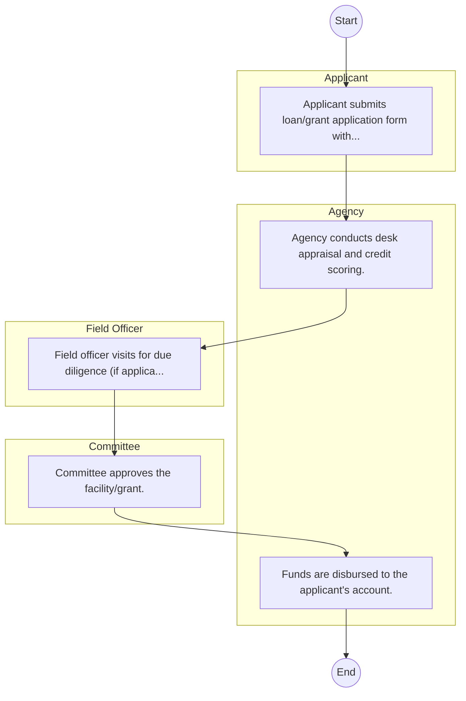

# Agricultural Development Corporation – Service Delivery

## Cover Page
- **Ministry/Department/Agency (MDA):** Agricultural Development Corporation
- **Process Name:** Service Delivery
- **Document Version:** 1.0
- **Date:** 2026-02-14
- **Classification:** Official

---

## Executive Summary
The Agricultural Development Corporation (ADC) Kenya is a government parastatal established in 1965 under an Act of Parliament (Cap 444 of 1986). Its primary mandate is to promote and execute agricultural schemes and reconstruction in Kenya, facilitating the commercialization of agriculture, promoting agro-industrial ventures, and enhancing national food security. ADC plays a crucial role in the production of essential agricultural inputs, particularly quality seeds and pedigree and high-grade livestock, to support farmers and drive agricultural transformation.

---

## Process Flowchart (BPMN 2.0 - Mermaid)
*Guidance: This diagram visualizes the AS-IS process flow across different actors.*

---

## Process Overview
### Process Name
Service Delivery

### Service Category
- G2B (Government to Business)

### Scope
- **In Scope:** End-to-end processing within Agricultural Development Corporation.

### Triggers
- Submission of application/request by Applicant.

### End States
- **Successful:** Loan Disbursement / Service Delivery, Statement of Account, Contract / Agreement, Receipt / Invoice

### Policy Context
- The Agricultural Development Corporation Act; The Constitution of Kenya 2010; Data Protection Act 2019.

---

## Stakeholders
| Stakeholder | Role | Responsibilities |
|---|---|---|
| Field Officer | Process Actor | Performs actions as defined in steps. |
| Agency | Process Actor | Performs actions as defined in steps. |
| Applicant | Process Actor | Performs actions as defined in steps. |
| Committee | Process Actor | Performs actions as defined in steps. |

---

## Inputs & Outputs
- **Inputs:** Loan/Service Application Form, Business Proposal / Plan, Financial Statements / Bank Records, Collateral / Security Documents
- **Outputs:** Loan Disbursement / Service Delivery, Statement of Account, Contract / Agreement, Receipt / Invoice

---

## Detailed Process (AS-IS)
| Step | Role | Action | Tool | Notes |
|---|---|---|---|---|
| 1 | Applicant | Applicant submits loan/grant application form with business proposal. | Manual | |
| 2 | Agency | Agency conducts desk appraisal and credit scoring. | Manual | |
| 3 | Field Officer | Field officer visits for due diligence (if applicable). | Manual | |
| 4 | Committee | Committee approves the facility/grant. | Manual | |
| 5 | Agency | Funds are disbursed to the applicant's account. | Manual | |

---

## Pain Points & Opportunities
### Pain Points
- Lengthy credit appraisal processes.
- Manual debt collection and reconciliation.
- High paperwork for loan processing.
- Lack of 360-degree customer view.

### Opportunities
- Integration with IPRS/BRS via Service Bus.
- Adoption of Government Payment Gateway.
- Implementation of Automated Rules Engine.
- Issuance of Digital Verifiable Credentials.

---

## Future State Process (TO-BE)
### Narrative
The To-Be process leverages the Government Service Bus to integrate with BRS (Business Registry) and the Payment Gateway. Manual data entry and document uploads are replaced by real-time API validations, enabling a paperless, cashless, and presence-less service experience.

### Optimized Steps (Digital)
| Step | Actor | Action | System |
|---|---|---|---|
| 1 | Applicant | Applicant logs in via Single Sign-On (SSO) and selects the service. | Citizen Portal / SSO |
| 2 | System | Applicant enters Business Registration Number; System auto-populates details from BRS (Business Registry) via the Service Bus. | Service Bus / Registry API |
| 3 | System | System performs auto-validation of compliance (e.g., KRA Tax Status) via Inter-Agency APIs. | Service Bus / Compliance Engine |
| 4 | Applicant | Applicant pays fees via the Government Payment Gateway; System auto-receipts. | Payment Gateway |
| 5 | System | Application is processed by the Rules Engine. (Low-risk cases are Auto-Approved). | Workflow Engine |
| 6 | Officer | Complex cases are routed to the Officer Workbench for digital review and approval. | Officer Workbench |
| 7 | System | System generates a Verifiable Digital Certificate (QR Code) and notifies the applicant. | Output Generator |

---

## References & Evidence
The information in this document was derived from the following official sources:

- [https://africa2trust.com/](https://africa2trust.com/)
- [https://saraka.info/](https://saraka.info/)
- [https://agrarian.co.ke/](https://agrarian.co.ke/)
- [https://youtube.com/](https://youtube.com/)
- [https://policyvault.africa/](https://policyvault.africa/)
- [https://fao.org/](https://fao.org/)

---

## Appendices
See attached ERD and System Design.
