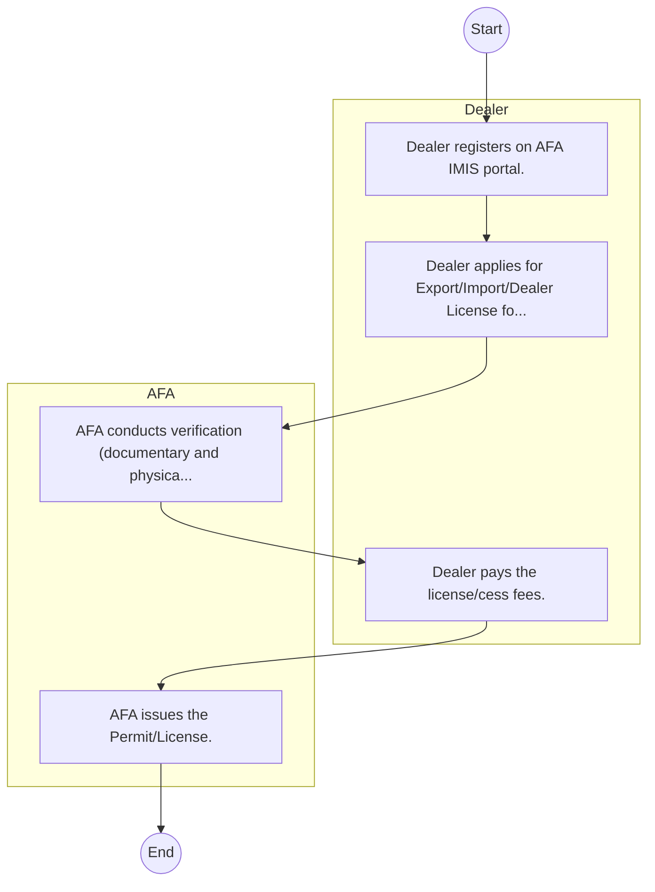

# Agriculture and Food Authority – Service Delivery

## Cover Page
- **Ministry/Department/Agency (MDA):** Agriculture and Food Authority
- **Process Name:** Service Delivery
- **Document Version:** 1.0
- **Date:** 2026-02-14
- **Classification:** Official

---

## Executive Summary
The Anti-Counterfeit Authority (ACA) Kenya is a State Corporation established under the Anti-Counterfeit Act 2008. Its primary mandate is to protect intellectual property rights and consumer rights by actively combating trade in counterfeit goods, raising public awareness, and coordinating with other organizations involved in anti-counterfeiting efforts in Kenya.

---

## Process Flowchart (BPMN 2.0 - Mermaid)
*Guidance: This diagram visualizes the AS-IS process flow across different actors.*

---

## Process Overview
### Process Name
Service Delivery

### Service Category
- G2B (Government to Business)

### Scope
- **In Scope:** End-to-end processing within Agriculture and Food Authority.

### Triggers
- Submission of application/request by Dealer.

### End States
- **Successful:** License / Permit / Certificate, Compliance Inspection Report, Official Receipt, Gazette Notice

### Policy Context
- The Agriculture and Food Authority Act; The Constitution of Kenya 2010; Data Protection Act 2019.

---

## Stakeholders
| Stakeholder | Role | Responsibilities |
|---|---|---|
| AFA | Process Actor | Performs actions as defined in steps. |
| Dealer | Process Actor | Performs actions as defined in steps. |

---

## Inputs & Outputs
- **Inputs:** Application Form (License/Permit), Compliance Documents (Tax Compliance, CR12), Technical Reports / Site Plans, Proof of Payment
- **Outputs:** License / Permit / Certificate, Compliance Inspection Report, Official Receipt, Gazette Notice

---

## Detailed Process (AS-IS)
| Step | Role | Action | Tool | Notes |
|---|---|---|---|---|
| 1 | Dealer | Dealer registers on AFA IMIS portal. | Digital | |
| 2 | Dealer | Dealer applies for Export/Import/Dealer License for specific crop (e.g., Coffee, Tea, Horticulture). | Manual | |
| 3 | AFA | AFA conducts verification (documentary and physical if needed). | Manual | |
| 4 | Dealer | Dealer pays the license/cess fees. | Manual | |
| 5 | AFA | AFA issues the Permit/License. | Manual | |

---

## Pain Points & Opportunities
### Pain Points
- Manual document verification takes time.
- High cost and time for physical inspections.
- Risk of counterfeit licenses/certificates.
- Lack of real-time monitoring of licensees.

### Opportunities
- Integration with IPRS/BRS via Service Bus.
- Adoption of Government Payment Gateway.
- Implementation of Automated Rules Engine.
- Issuance of Digital Verifiable Credentials.

---

## Future State Process (TO-BE)
### Narrative
The To-Be process leverages the Government Service Bus to integrate with BRS (Business Registry) and the Payment Gateway. Manual data entry and document uploads are replaced by real-time API validations, enabling a paperless, cashless, and presence-less service experience.

### Optimized Steps (Digital)
| Step | Actor | Action | System |
|---|---|---|---|
| 1 | Applicant | Applicant logs in via Single Sign-On (SSO) and selects the service. | Citizen Portal / SSO |
| 2 | System | Applicant enters Business Registration Number; System auto-populates details from BRS (Business Registry) via the Service Bus. | Service Bus / Registry API |
| 3 | System | System performs auto-validation of compliance (e.g., KRA Tax Status) via Inter-Agency APIs. | Service Bus / Compliance Engine |
| 4 | Applicant | Applicant pays fees via the Government Payment Gateway; System auto-receipts. | Payment Gateway |
| 5 | System | Application is processed by the Rules Engine. (Low-risk cases are Auto-Approved). | Workflow Engine |
| 6 | Officer | Complex cases are routed to the Officer Workbench for digital review and approval. | Officer Workbench |
| 7 | System | System generates a Verifiable Digital Certificate (QR Code) and notifies the applicant. | Output Generator |

---

## References & Evidence
The information in this document was derived from the following official sources:

- [https://aca.go.ke/](https://aca.go.ke/)
- [https://devex.com/](https://devex.com/)

---

## Appendices
See attached ERD and System Design.
