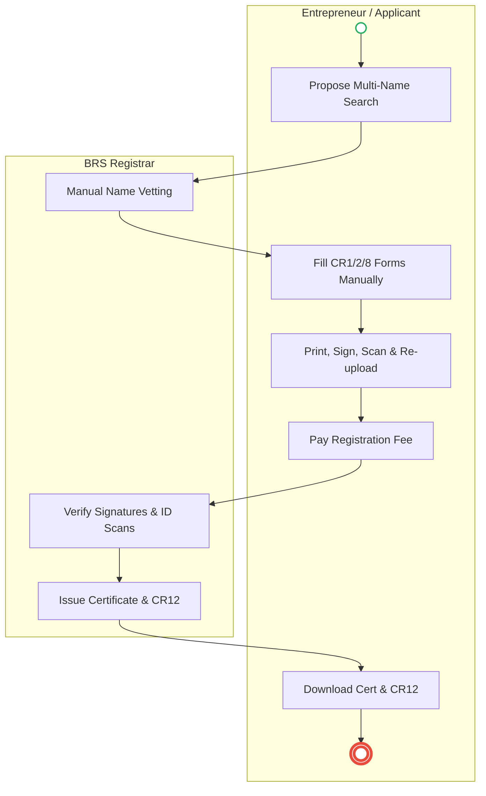

# BUSINESS REGISTRATION SERVICE (BRS) – Service Delivery

## Cover Page
- **Ministry/Department/Agency (MDA):** BUSINESS REGISTRATION SERVICE (BRS)
- **Process Name:** Business Name & Company Registration
- **Document Version:** 1.3
- **Date:** 2026-02-19
- **Classification:** Official

---

## Executive Summary
The Business Registration Service (BRS) is a semi-autonomous government agency under the Office of the Attorney General. It is responsible for the registration of Business Names, Private/Public Companies, Partnerships, and Societies. The process is conducted online via the **eCitizen (BRS)** portal but often faces delays in name search and manual document review.

---

### 1.1 AS-IS Process Flow (BPMN 2.0)


---

## Process Overview
### Process Name
Registration of Private Limited Company / Business Name

### Service Category
- G2B (Government to Business)

### Scope
- **In Scope:** Name Search; Business Name Registration (BN2); Company Incorporation (CR1, CR2, CR8); Official Search (CR12).
- **Out of Scope:** KRA PIN registration (separate system); Business Permit (County Govt).

### Triggers
- Entrepreneur starting a business.
- Need for a corporate bank account.

### End States
- **Successful:** Certificate of Incorporation / Business Registration Certificate.

### Policy Context
- Companies Act, 2015; Business Registration Service Act, 2015.

---

## Stakeholders
| Stakeholder | Role | Responsibilities |
|---|---|---|
| Entrepreneur | Applicant | Initiates application, provides details of directors/shareholders. |
| BRS Registrar | Reviewer | Vets name availability and compliance of forms. |
| KRA | Partner | Issues Company PIN automatically upon incorporation. |
| Bank | Consumer | Relies on CR12/Certificate to open accounts. |

---

## Detailed Process (AS-IS)
| Step | Role | Action | Tool | Notes |
|---|---|---|---|---|
| 1 | Entrepreneur | **Name Search:** Applicant proposes 1-3 names. Pays KES 150. | eCitizen Portal | |
| 2 | BRS Officer | **Vetting:** Registrar manually checks name against "Prohibited Names" list and existing entities. | Backend | *Pain Point:* Takes 1-3 days. Rejections often vague ("Name too similar"). |
| 3 | Entrepreneur | **Application:** Once approved, applicant fills CR1 (App), CR2 (Model Articles), CR8 (Director Address), and BO (Beneficial Owner) forms. Uploads scanned IDs and KRA PINs. | eCitizen Form | System creates PDFs for signature. Applicant must print, sign, scan, and re-upload. |
| 4 | Entrepreneur | **Payment:** Pays registration fee (KES 950 for BN; KES 10,650 for Company). | eCitizen Paybill | |
| 5 | BRS Officer | **Review:** Officer opens the digital file to verify signatures and ID copies. | Workflow Inbox | Backlogs common. "Pending Review" can last a week. |
| 6 | BRS Officer | **Approval:** If compliant, Officer approves. System generates Certificate. | Digital Signature | |
| 7 | Entrepreneur | **Output:** Downloads Certificate and CR12 (list of directors). | PDF Download | KRA PIN is usually generated automatically within 24 hours. |

---

## Pain Points & Opportunities
### Pain Points
- **Name Rejections:** Subjective rejection criteria lead to frustration and repeated fees.
- **Manual Signatures:** The "Print-Sign-Scan-Upload" cycle is tedious and unnecessary for digital services.
- **CR12 Delays:** Getting an official search (CR12) for banks often takes longer than registration itself.
- **Beneficial Ownership:** Complex forms for declaring BOs (Form BO1) confuse many applicants.
- **System Downtime:** BRS portal frequently goes offline or is slow during peak hours.

### Opportunities
- **AI Name Search:** Instant check against database rules (phonetic similarity, forbidden words) to give immediate feedback.
- **e-Signatures:** Allow digital signing (via ID/Phone) to eliminate the print-scan loop.
- **Auto-CR12:** Instant generation of CR12 upon payment (no manual officer review needed).
- **Mobile Reg:** Simple "Business Name" registration via USSD/App for small traders.

---

### 2.1 TO-BE Process (BPMN 2.0 - POC v2 Aligned)
```mermaid
flowchart TD
    subgraph Enterprise["Entrepreneur"]
        Start(( )) --> T1[Instant AI Name Availability Check]
    end

    subgraph eCitizen["eCitizen App"]
        T1 --> T2[Digital Consent Prompt to Directors]
    end

    subgraph Hub["Huduma Bridge / X-Road"]
        T2 --> H1[X-Road: Bundled Registration (KRA/NSSF/NHIF)]
    end

    subgraph BRS["BRS Core"]
        H1 --> B1[Instant Business Pack Generation]
        B1 --> End((( )))
    end

    style Start fill:#fff,stroke:#27ae60,stroke-width:2px
    style End fill:#fff,stroke:#e74c3c,stroke-width:4px
```

## Future State Process (TO-BE)
### Narrative
The process is **Algorithmic** and **Bundled**.
1.  **Instant Name Search:** The **WoG AI Engine** checks availability instantly against phonetic rules and prohibited lists. No human registrar needed for standard names.
2.  **Director Verification:** Directors are validated via **IPRS** using their ID Numbers. They receive a prompt on their **eCitizen App** to consent to being a director.
3.  **Digital Signatures:** Documents are signed digitally using the **Maisha Namba** key. No printing or scanning.
4.  **One-Stop Bundle:** A single application triggers BRS (Reg), KRA (PIN), NSSF, NHIF, and County (Permit) simultaneously via **X-Road**.
5.  **Output:** The entrepreneur receives a "Business Pack" containing all certificates instantly.

### Optimized Steps (Digital)
| Step | Actor | Action | System |
|---|---|---|---|
| 1 | Entrepreneur | Inputs name and directors' IDs. | eCitizen / BRS |
| 2 | WoG AI | Approves name and verifies directors. | AI / IPRS |
| 3 | Directors | Consent via App notification. | eCitizen App |
| 4 | Entrepreneur | Pays single bundled fee. | GPA |
| 5 | Integrated Systems | Issue all certificates instantly. | X-Road |

---

## 3. Standard Data Inputs
*Required fields for the WoG Digital Service.*

### A. Name Reservation (Instant)
| Field Name | Type | Source | Validation |
|---|---|---|---|
| Proposed Name | String | User Input | AI Check (Phonetic/Forbidden) |
| Entity Type | Enum | User Input | Private Ltd / Business Name |
| Nature of Business | String | User Input | ISIC Codes |

### B. Company Registration (Form CR1-Digital)
| Field Name | Type | Source | Validation |
|---|---|---|---|
| Reserved Name | String | System Fetch | Must be 'Available' |
| Director 1 ID | String | User Input | Must exist in IPRS |
| Director 1 Consent | Boolean | System (OTP/App) | Biometric/Pin |
| Share Capital | Currency | User Input | Min KES 0 |
| Reg Office | Geo-Loc | User Input | Google Maps Verified |
| Email | String | User Input | OTP Verified |

---

## References
- Companies Act.


---

### Validation Survey
Please provide your feedback here: [https://ee.kobotoolbox.org/x/4Ls7SlCG](https://ee.kobotoolbox.org/x/4Ls7SlCG)
