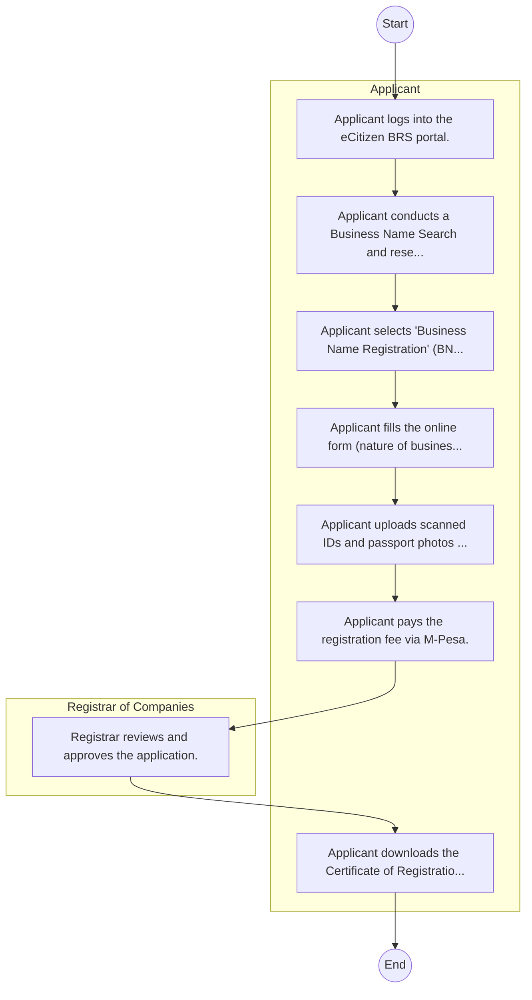

# Business Registration Service – Service Delivery

## Cover Page
- **Ministry/Department/Agency (MDA):** Business Registration Service
- **Process Name:** Service Delivery
- **Document Version:** 1.0
- **Date:** 2026-02-14
- **Classification:** Official

---

## Executive Summary
The Business Registration Service (BRS) in Kenya is a State Corporation established under the Business Registration Service Act, 2015. Its core mandate is to administer policies, laws, and other matters related to business registration, thereby improving the ease of doing business in Kenya and fostering economic growth through effective oversight of companies, partnerships, and firms.

---

## Process Flowchart (BPMN 2.0 - Mermaid)
*Guidance: This diagram visualizes the AS-IS process flow across different actors.*

---

## Process Overview
### Process Name
Service Delivery

### Service Category
- G2C (Government to Citizen)

### Scope
- **In Scope:** End-to-end processing within Business Registration Service.

### Triggers
- Submission of application/request by Applicant.

### End States
- **Successful:** License / Permit / Certificate, Compliance Inspection Report, Official Receipt, Gazette Notice

### Policy Context
- The Business Registration Service Act; The Constitution of Kenya 2010; Data Protection Act 2019.

---

## Stakeholders
| Stakeholder | Role | Responsibilities |
|---|---|---|
| Applicant | Process Actor | Performs actions as defined in steps. |
| Registrar of Companies | Process Actor | Performs actions as defined in steps. |

---

## Inputs & Outputs
- **Inputs:** Application Form (License/Permit), Compliance Documents (Tax Compliance, CR12), Technical Reports / Site Plans, Proof of Payment
- **Outputs:** License / Permit / Certificate, Compliance Inspection Report, Official Receipt, Gazette Notice

---

## Detailed Process (AS-IS)
| Step | Role | Action | Tool | Notes |
|---|---|---|---|---|
| 1 | Applicant | Applicant logs into the eCitizen BRS portal. | Digital | |
| 2 | Applicant | Applicant conducts a Business Name Search and reserves a name. | Manual | |
| 3 | Applicant | Applicant selects 'Business Name Registration' (BN2) once the name is approved. | Manual | |
| 4 | Applicant | Applicant fills the online form (nature of business, address, partners' details). | Manual | |
| 5 | Applicant | Applicant uploads scanned IDs and passport photos of partners. | Manual | |
| 6 | Applicant | Applicant pays the registration fee via M-Pesa. | Manual | |
| 7 | Registrar of Companies | Registrar reviews and approves the application. | Manual | |
| 8 | Applicant | Applicant downloads the Certificate of Registration. | Manual | |

---

## Pain Points & Opportunities
### Pain Points
- Manual document verification takes time.
- High cost and time for physical inspections.
- Risk of counterfeit licenses/certificates.
- Lack of real-time monitoring of licensees.

### Opportunities
- Integration with IPRS/BRS via Service Bus.
- Adoption of Government Payment Gateway.
- Implementation of Automated Rules Engine.
- Issuance of Digital Verifiable Credentials.

---

## Future State Process (TO-BE)
### Narrative
The To-Be process leverages the Government Service Bus to integrate with BRS (Business Registry) and the Payment Gateway. Manual data entry and document uploads are replaced by real-time API validations, enabling a paperless, cashless, and presence-less service experience.

### Optimized Steps (Digital)
| Step | Actor | Action | System |
|---|---|---|---|
| 1 | Applicant | Applicant logs in via Single Sign-On (SSO) and selects the service. | Citizen Portal / SSO |
| 2 | System | Applicant enters Business Registration Number; System auto-populates details from BRS (Business Registry) via the Service Bus. | Service Bus / Registry API |
| 3 | System | System performs auto-validation of compliance (e.g., KRA Tax Status) via Inter-Agency APIs. | Service Bus / Compliance Engine |
| 4 | Applicant | Applicant pays fees via the Government Payment Gateway; System auto-receipts. | Payment Gateway |
| 5 | System | Application is processed by the Rules Engine. (Low-risk cases are Auto-Approved). | Workflow Engine |
| 6 | Officer | Complex cases are routed to the Officer Workbench for digital review and approval. | Officer Workbench |
| 7 | System | System generates a Verifiable Digital Certificate (QR Code) and notifies the applicant. | Output Generator |

---

## References & Evidence
The information in this document was derived from the following official sources:

- [https://brs.go.ke/](https://brs.go.ke/)
- [https://capitaregistrars.co.ke/](https://capitaregistrars.co.ke/)
- [https://globallawexperts.com/](https://globallawexperts.com/)
- [https://cybermfukoni.co.ke/](https://cybermfukoni.co.ke/)

---

## Appendices
See attached ERD and System Design.
