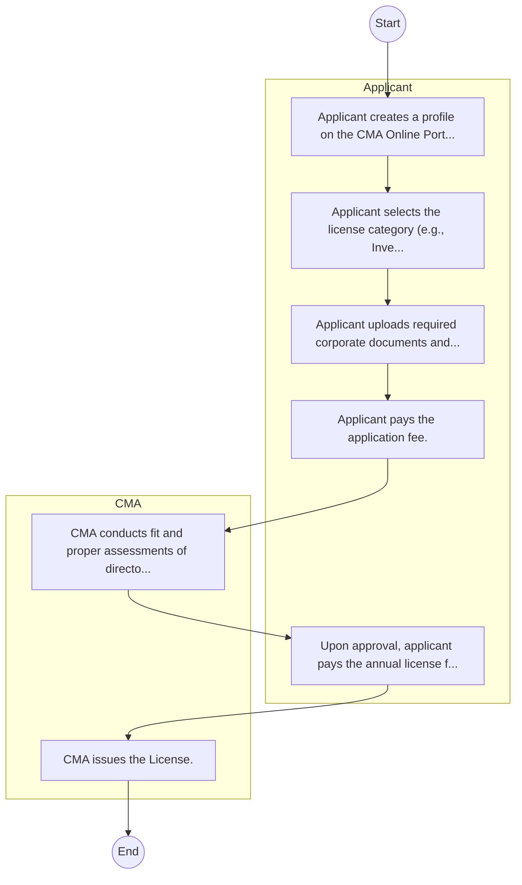
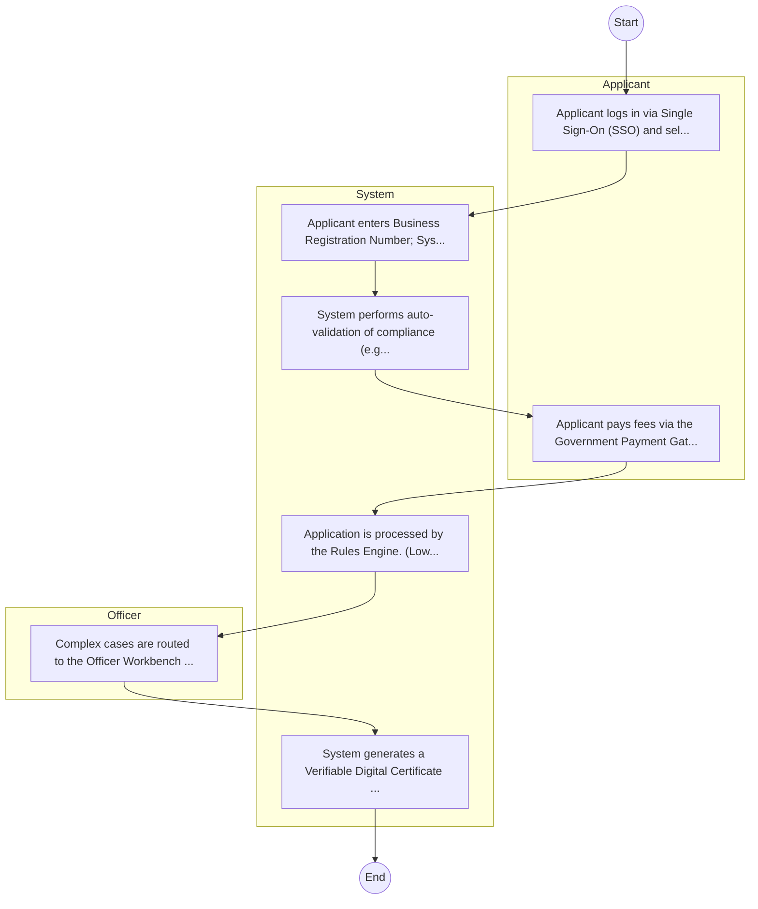

# Capital Markets Authority – Service Delivery

## Cover Page
- **Ministry/Department/Agency (MDA):** Capital Markets Authority
- **Process Name:** Service Delivery
- **Document Version:** 1.0
- **Date:** 2026-02-14
- **Classification:** Official

---

## Executive Summary
The Capital Markets Authority (CMA) Kenya is an independent public agency established in 1989 by the Capital Markets Act Cap 485A. Its dual mandate is to regulate and facilitate the development of orderly, fair, and efficient capital markets in Kenya. CMA's primary responsibility is to protect the interests of investors, government, employees, issuers of securities, and market intermediaries. By ensuring market integrity, transparency, and investor confidence, CMA plays a vital role in mobilizing and allocating capital resources to finance long-term productive investments for Kenya's economic growth and development.

---

## 1. AS-IS Process Flowchart (BPMN 2.0)
*Current State visualization.*

---

## Process Overview
### Process Name
Service Delivery

### Service Category
- G2B (Government to Business)

### Scope
- **In Scope:** End-to-end processing within Capital Markets Authority.

### Triggers
- Submission of application/request by Applicant.

### End States
- **Successful:** License / Permit / Certificate, Compliance Inspection Report, Official Receipt, Gazette Notice

### Policy Context
- The Capital Markets Authority Act; The Constitution of Kenya 2010; Data Protection Act 2019.

---

## Stakeholders
| Stakeholder | Role | Responsibilities |
|---|---|---|
| CMA | Process Actor | Performs actions as defined in steps. |
| Applicant | Process Actor | Performs actions as defined in steps. |

---

## Detailed Process (AS-IS)
| Step | Role | Action | Tool | Notes |
|---|---|---|---|---|
| 1 | Applicant | Applicant creates a profile on the CMA Online Portal. | Digital | |
| 2 | Applicant | Applicant selects the license category (e.g., Investment Bank, Broker). | Manual | |
| 3 | Applicant | Applicant uploads required corporate documents and business plan. | Manual | |
| 4 | Applicant | Applicant pays the application fee. | Manual | |
| 5 | CMA | CMA conducts fit and proper assessments of directors/shareholders. | Manual | |
| 6 | Applicant | Upon approval, applicant pays the annual license fee. | Manual | |
| 7 | CMA | CMA issues the License. | Manual | |

---

## Pain Points & Opportunities
### Pain Points
- Manual document verification takes time.
- High cost and time for physical inspections.
- Risk of counterfeit licenses/certificates.
- Lack of real-time monitoring of licensees.

### Opportunities
- Integration with IPRS/BRS via Service Bus.
- Adoption of Government Payment Gateway.
- Implementation of Automated Rules Engine.
- Issuance of Digital Verifiable Credentials.

---

## 2. TO-BE Process Flowchart (BPMN 2.0)
*Future State visualization (Optimized).*

## Future State Process (TO-BE)
### Narrative
The To-Be process leverages the Government Service Bus to integrate with BRS (Business Registry) and the Payment Gateway. Manual data entry and document uploads are replaced by real-time API validations, enabling a paperless, cashless, and presence-less service experience.

### Optimized Steps (Digital)
| Step | Actor | Action | System |
|---|---|---|---|
| 1 | Applicant | Applicant logs in via Single Sign-On (SSO) and selects the service. | Citizen Portal / SSO |
| 2 | System | Applicant enters Business Registration Number; System auto-populates details from BRS (Business Registry) via the Service Bus. | Service Bus / Registry API |
| 3 | System | System performs auto-validation of compliance (e.g., KRA Tax Status) via Inter-Agency APIs. | Service Bus / Compliance Engine |
| 4 | Applicant | Applicant pays fees via the Government Payment Gateway; System auto-receipts. | Payment Gateway |
| 5 | System | Application is processed by the Rules Engine. (Low-risk cases are Auto-Approved). | Workflow Engine |
| 6 | Officer | Complex cases are routed to the Officer Workbench for digital review and approval. | Officer Workbench |
| 7 | System | System generates a Verifiable Digital Certificate (QR Code) and notifies the applicant. | Output Generator |

---

## References
Derived from official mandates.
