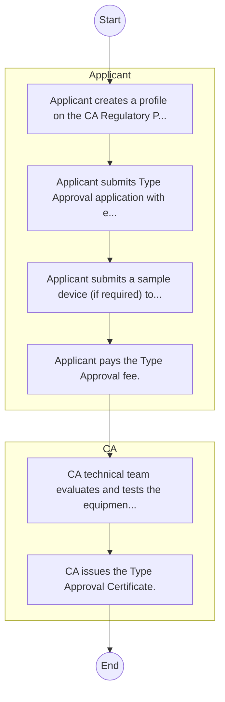
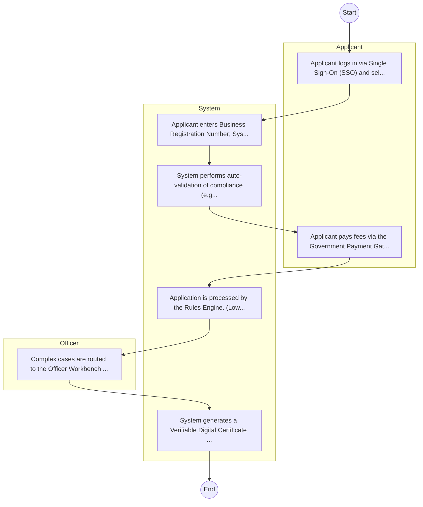

# Communications Authority of Kenya – Licensing and Permitting

## Cover Page
- **Ministry/Department/Agency (MDA):** Communications Authority of Kenya
- **Process Name:** Licensing and Permitting
- **Document Version:** 1.0
- **Date:** 2026-02-14
- **Classification:** Official

---

## Executive Summary
The Communications Authority of Kenya (CA) is the independent regulatory agency for the Information, Communications and Technology (ICT) industry in Kenya, established in 1999 by the Kenya Information and Communications Act, 1998. Its mandate encompasses licensing, spectrum management, market development, consumer protection, and cybersecurity. The CA aims to ensure a vibrant, accessible, secure, and well-regulated ICT sector that fosters innovation, economic growth, and social development, while upholding consumer rights and promoting fair competition.

---

## 1. AS-IS Process Flowchart (BPMN 2.0)
*Current State visualization.*

---

## Process Overview
### Process Name
Licensing and Permitting

### Service Category
- G2B (Government to Business)

### Scope
- **In Scope:** End-to-end processing within Communications Authority of Kenya.

### Triggers
- Submission of application/request by Applicant.

### End States
- **Successful:** License / Permit / Certificate, Compliance Inspection Report, Official Receipt, Gazette Notice

### Policy Context
- The Communications Authority of Kenya Act; The Constitution of Kenya 2010; Data Protection Act 2019.

---

## Stakeholders
| Stakeholder | Role | Responsibilities |
|---|---|---|
| CA | Process Actor | Performs actions as defined in steps. |
| Applicant | Process Actor | Performs actions as defined in steps. |

---

## Detailed Process (AS-IS)
| Step | Role | Action | Tool | Notes |
|---|---|---|---|---|
| 1 | Applicant | Applicant creates a profile on the CA Regulatory Portal. | Digital | |
| 2 | Applicant | Applicant submits Type Approval application with equipment specs and test reports. | Manual | |
| 3 | Applicant | Applicant submits a sample device (if required) to CA. | Manual | |
| 4 | Applicant | Applicant pays the Type Approval fee. | Manual | |
| 5 | CA | CA technical team evaluates and tests the equipment. | Manual | |
| 6 | CA | CA issues the Type Approval Certificate. | Manual | |

---

## Pain Points & Opportunities
### Pain Points
- Manual document verification takes time.
- High cost and time for physical inspections.
- Risk of counterfeit licenses/certificates.
- Lack of real-time monitoring of licensees.

### Opportunities
- Integration with IPRS/BRS via Service Bus.
- Adoption of Government Payment Gateway.
- Implementation of Automated Rules Engine.
- Issuance of Digital Verifiable Credentials.

---

## 2. TO-BE Process Flowchart (BPMN 2.0)
*Future State visualization (Optimized).*

## Future State Process (TO-BE)
### Narrative
The To-Be process leverages the Government Service Bus to integrate with BRS (Business Registry) and the Payment Gateway. Manual data entry and document uploads are replaced by real-time API validations, enabling a paperless, cashless, and presence-less service experience.

### Optimized Steps (Digital)
| Step | Actor | Action | System |
|---|---|---|---|
| 1 | Applicant | Applicant logs in via Single Sign-On (SSO) and selects the service. | Citizen Portal / SSO |
| 2 | System | Applicant enters Business Registration Number; System auto-populates details from BRS (Business Registry) via the Service Bus. | Service Bus / Registry API |
| 3 | System | System performs auto-validation of compliance (e.g., KRA Tax Status) via Inter-Agency APIs. | Service Bus / Compliance Engine |
| 4 | Applicant | Applicant pays fees via the Government Payment Gateway; System auto-receipts. | Payment Gateway |
| 5 | System | Application is processed by the Rules Engine. (Low-risk cases are Auto-Approved). | Workflow Engine |
| 6 | Officer | Complex cases are routed to the Officer Workbench for digital review and approval. | Officer Workbench |
| 7 | System | System generates a Verifiable Digital Certificate (QR Code) and notifies the applicant. | Output Generator |

---

## References
Derived from official mandates.
