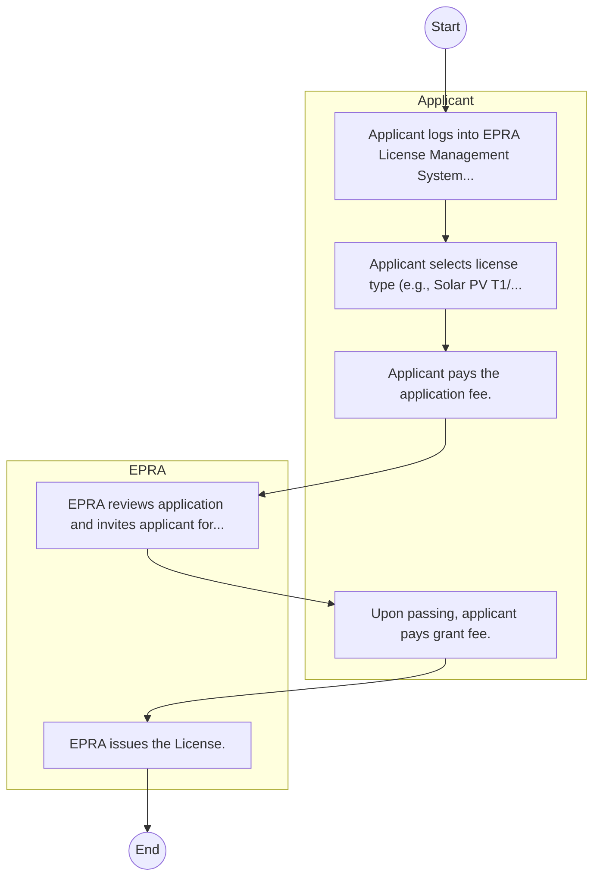
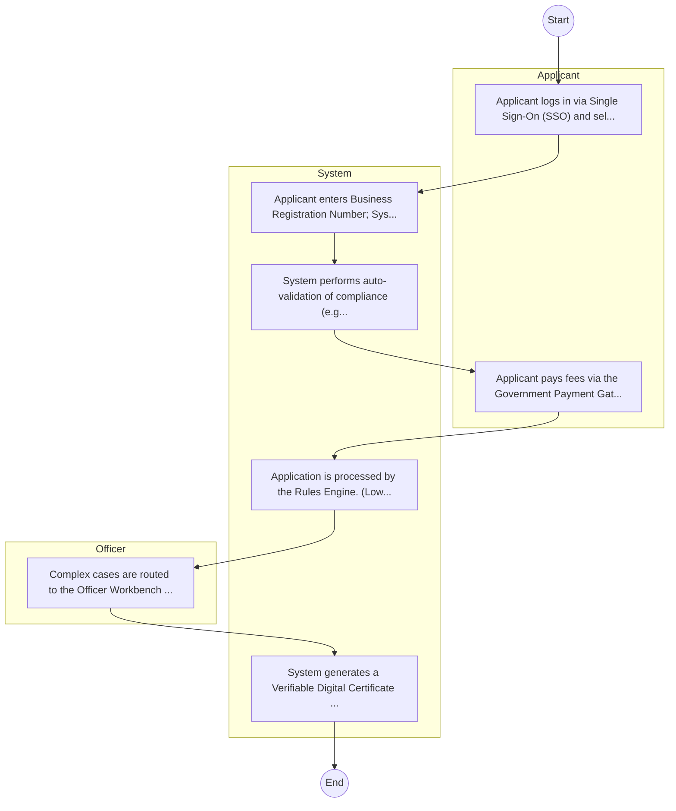

# Energy and Petroleum Regulatory Authority – Service Delivery

## Cover Page
- **Ministry/Department/Agency (MDA):** Energy and Petroleum Regulatory Authority
- **Process Name:** Service Delivery
- **Document Version:** 1.0
- **Date:** 2026-02-14
- **Classification:** Official

---

## Executive Summary
The Energy and Petroleum Regulatory Authority (EPRA) is a statutory body in Kenya, established under the Energy Act of 2019. It is mandated to regulate the energy and petroleum sectors, encompassing electricity, renewable energy, petroleum (upstream, midstream, and downstream), and coal, with the objective of ensuring fair pricing, efficiency, quality, and sustainability within these vital sectors.

---

## 1. AS-IS Process Flowchart (BPMN 2.0)
*Current State visualization.*

---

## Process Overview
### Process Name
Service Delivery

### Service Category
- G2B (Government to Business)

### Scope
- **In Scope:** End-to-end processing within Energy and Petroleum Regulatory Authority.

### Triggers
- Submission of application/request by Applicant.

### End States
- **Successful:** License / Permit / Certificate, Compliance Inspection Report, Official Receipt, Gazette Notice

### Policy Context
- The Energy and Petroleum Regulatory Authority Act; The Constitution of Kenya 2010; Data Protection Act 2019.

---

## Stakeholders
| Stakeholder | Role | Responsibilities |
|---|---|---|
| EPRA | Process Actor | Performs actions as defined in steps. |
| Applicant | Process Actor | Performs actions as defined in steps. |

---

## Detailed Process (AS-IS)
| Step | Role | Action | Tool | Notes |
|---|---|---|---|---|
| 1 | Applicant | Applicant logs into EPRA License Management System. | Manual | |
| 2 | Applicant | Applicant selects license type (e.g., Solar PV T1/T2) and uploads academic certs. | Manual | |
| 3 | Applicant | Applicant pays the application fee. | Manual | |
| 4 | EPRA | EPRA reviews application and invites applicant for interview/exam. | Manual | |
| 5 | Applicant | Upon passing, applicant pays grant fee. | Manual | |
| 6 | EPRA | EPRA issues the License. | Manual | |

---

## Pain Points & Opportunities
### Pain Points
- Manual document verification takes time.
- High cost and time for physical inspections.
- Risk of counterfeit licenses/certificates.
- Lack of real-time monitoring of licensees.

### Opportunities
- Integration with IPRS/BRS via Service Bus.
- Adoption of Government Payment Gateway.
- Implementation of Automated Rules Engine.
- Issuance of Digital Verifiable Credentials.

---

## 2. TO-BE Process Flowchart (BPMN 2.0)
*Future State visualization (Optimized).*

## Future State Process (TO-BE)
### Narrative
The To-Be process leverages the Government Service Bus to integrate with BRS (Business Registry) and the Payment Gateway. Manual data entry and document uploads are replaced by real-time API validations, enabling a paperless, cashless, and presence-less service experience.

### Optimized Steps (Digital)
| Step | Actor | Action | System |
|---|---|---|---|
| 1 | Applicant | Applicant logs in via Single Sign-On (SSO) and selects the service. | Citizen Portal / SSO |
| 2 | System | Applicant enters Business Registration Number; System auto-populates details from BRS (Business Registry) via the Service Bus. | Service Bus / Registry API |
| 3 | System | System performs auto-validation of compliance (e.g., KRA Tax Status) via Inter-Agency APIs. | Service Bus / Compliance Engine |
| 4 | Applicant | Applicant pays fees via the Government Payment Gateway; System auto-receipts. | Payment Gateway |
| 5 | System | Application is processed by the Rules Engine. (Low-risk cases are Auto-Approved). | Workflow Engine |
| 6 | Officer | Complex cases are routed to the Officer Workbench for digital review and approval. | Officer Workbench |
| 7 | System | System generates a Verifiable Digital Certificate (QR Code) and notifies the applicant. | Output Generator |

---

## References
Derived from official mandates.
