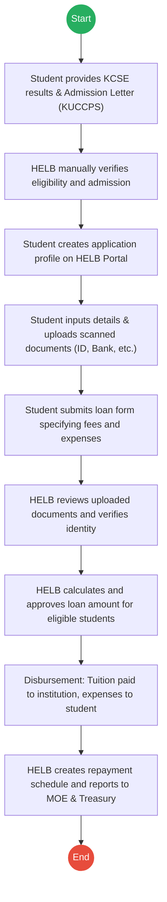
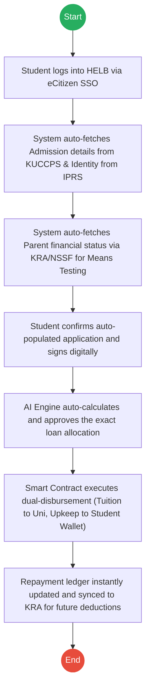

# HIGHER EDUCATION LOANS BOARD (HELB) – Loan Processing

## Cover Page
- **Ministry/Department/Agency (MDA):** HIGHER EDUCATION LOANS BOARD (HELB)
- **Process Name:** Loan Processing
- **Document Version:** 2.0
- **Date:** 2026-02-24
- **Classification:** Official

---

## Executive Summary
The Higher Education Loans Board (HELB) is a statutory body mandated to provide affordable loans, bursaries, and scholarships to Kenyan students pursuing higher education. It is a critical component of the "Childhood & Education" lifecycle, ensuring financial barriers do not prevent transition to tertiary education after KUCCPS placement.

---

## 1. AS-IS Process Flowchart (BPMN 2.0)
*Current State visualization (Manual/Semi-Digital Loan Processing).*

---

## Process Overview
### Process Name
Loan Processing

### Service Category
- G2C (Government to Citizen)

### Scope
- **In Scope:** Verifying candidate eligibility, processing applications, identity/document verification, means testing, loan approval, and disbursement to institutions and students.
- **Out of Scope:** Routine university admission (handled by KUCCPS).

### Triggers
- Admission into a tertiary institution via KUCCPS or direct placement.
- Opening of the HELB application window.

### End States
- **Successful:** Approved loan amount; Funds disbursed to institution and student; Record created in HELB database for future repayment tracking.

### Policy Context
- Higher Education Loans Board Act (Cap 213A).

---

## Detailed Process (AS-IS)
| Step | Role | Action | Tool/System | Notes |
|---|---|---|---|---|
| 1 | Student / HELB | **Eligibility Check:** Student provides KCSE slip, Admission Letter, ID, and Parent details. HELB verifies eligibility and admission. | Manual/Portal | |
| 2 | Student | **Profile Creation:** Creates a profile on the HELB portal, inputs academic details, and uploads scanned documents (ID, Bank account). | HELB Portal | |
| 3 | Student | **Submission:** Completes loan form specifying tuition fees, accommodation needs, and other expenses. | HELB Portal | |
| 4 | HELB | **Verification:** Reviews application and uploaded documents. Confirms admission and verifies student identity. | Manual | Prone to delays due to document review backlogs. |
| 5 | HELB | **Approval:** Calculates the loan amount based on tuition and means testing, then approves the loan. | Assessment Engine| |
| 6 | HELB | **Disbursement:** Disburses funds. Tuition is paid directly to the institution; other approved expenses are transferred to the student's bank account. | Bank Transfer | |
| 7 | HELB | **Reporting:** Maintains loan records and repayment schedules. Reports data to the Ministry of Education and National Treasury. | Core System | |

---

## Pain Points & Opportunities
### Pain Points
- **Duplicate Data Entry:** Students have to recreate profiles and re-upload documents they already submitted to KUCCPS or KNEC.
- **Manual Verification:** HELB staff manually verifying physical scans of IDs and Admission Letters is slow and susceptible to forgery.
- **Disbursement Delays:** Reconciling which student goes to which university bank account manually often leads to delayed disbursements.

### Opportunities
- **Instant Data Sync:** Direct API integration with KUCCPS to instantly fetch the admission letter and course details, bypassing manual uploads.
- **Means Testing APIs:** Integrate with KRA, NSSF, and Mobile Money APIs to accurately and automatically conduct means testing on the parents/guardians, rather than relying on self-reported forms.
- **Automated Disbursement:** Smart contracts that automatically split and disburse funds to the verified University account and the student's eCitizen digital wallet simultaneously.

---

## 2. TO-BE Process Flowchart (BPMN 2.0)
*Future State visualization (Automated API-Driven Loan Processing).*

## Future State Process (TO-BE)
### Narrative
**TO-BE Process: Automated API-Driven Loan Processing**

**Design Principles:**
- Zero Document Uploads
- Automated Inter-Agency Means Testing
- Smart Contract Disbursements

### Optimized Steps (Digital)
| Step | Actor | Action | System |
|---|---|---|---|
| 1 | Student | **SSO Login:** Logs into the HELB portal using the unified eCitizen identity (Maisha Namba/UPI). | eCitizen SSO |
| 2 | System | **Auto-Fetch (Academic/Identity):** Instantly retrieves verified identity from IPRS and confirmed university admission data directly from the KUCCPS API. No admission letter uploads needed. | X-Road (KUCCPS/IPRS) |
| 3 | System | **Auto-Fetch (Financial):** Automatically queries KRA and NSSF APIs using the parents' IDs to conduct instant, accurate means testing. | Inter-Agency Data Hub |
| 4 | Student | **Digital Signature:** Reviews the auto-populated application and signs a legally binding digital loan agreement. | eCitizen Portal |
| 5 | HELB AI | **Automated Assessment:** An AI assessment engine analyzes the fetched data and instantly calculates and approves the precise loan allocation. | Assessment AI Engine |
| 6 | System | **Smart Disbursement:** Smart contracts instantly execute a dual disbursement: tuition directly to the verified institution API, and upkeep to the student's digital wallet. | Payment Gateway |
| 7 | System | **Ecosystem Sync:** The repayment ledger is updated and securely synced with KRA to track future automatic deductions once the student gains employment. | KRA Integration API |

---

## References
- Higher Education Loans Board Act.