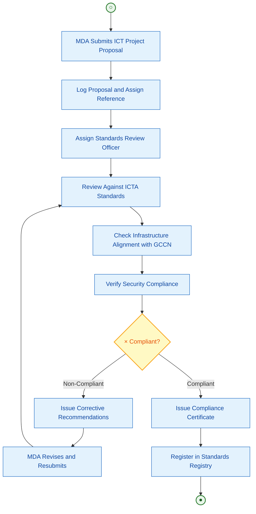
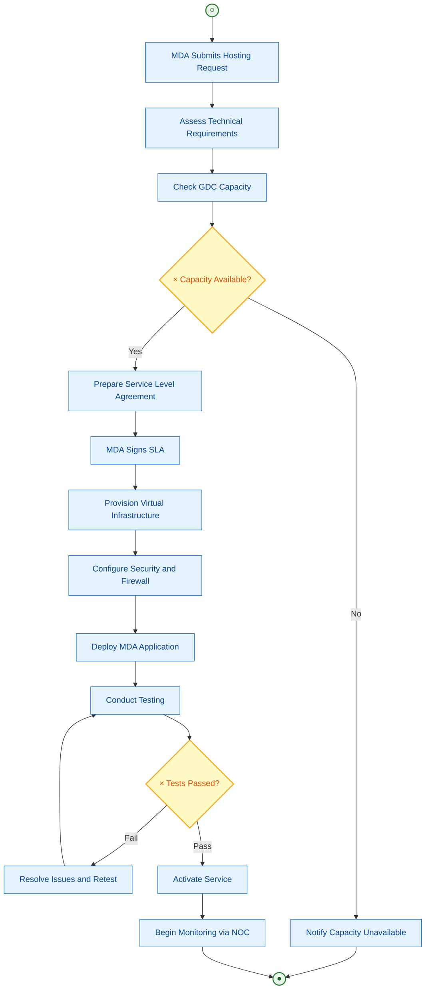
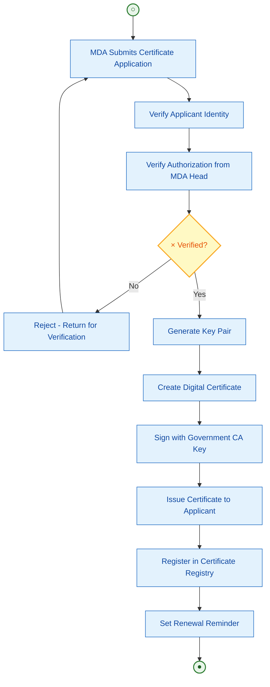
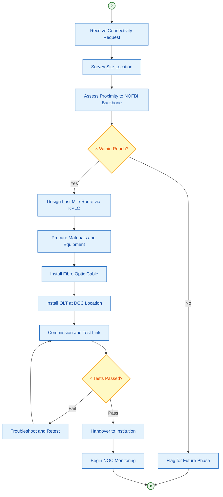
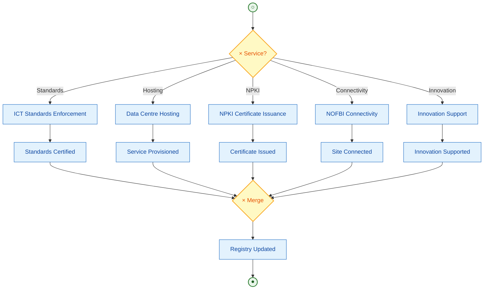

# ICT Authority (ICTA)
## Business Process Mapping Report

### Ministry of Information, Communications and The Digital Economy
### ICT Authority

## 1. Overview

The ICT Authority (ICTA) is a State Corporation established under Legal Notice 183 of August 2013 by merging Government Information Technology Services (GITS), Directorate of e-Government (DeG), and Kenya ICT Board (KICTB). ICTA enforces ICT standards in government, manages national digital infrastructure, operates the Government Data Centre, manages NPKI certification, and promotes digital literacy, innovation, and enterprise.

| Attribute | Description |
|-----------|-------------|
| Key Actors | MDAs, County Governments, ICT Officers, Innovators, Citizens, System Administrators |
| Key Systems | Government Data Centre, NOFBI, Government Common Core Network (GCCN), eCitizen (policy oversight), NPKI Government CA |
| Key Programmes | Digital Literacy Programme (DLP), County Connectivity Project, KDEAP (World Bank), Connected Africa Summit |

## 2. Services

### Process 1: Government ICT Standards Enforcement
- Receive MDA ICT project proposals
- Assess compliance with ICTA standards and guidelines
- Issue compliance certificates or corrective directives
- Monitor MDA implementation of ICT standards

### Process 2: Government Data Centre Services
- Receive hosting requests from MDAs
- Assess technical requirements and capacity
- Provision virtual infrastructure and cloud services
- Monitor service availability and performance
- Manage backups and disaster recovery

### Process 3: NPKI Digital Certificate Issuance
- Receive digital certificate application from MDA
- Verify applicant identity and authorization
- Generate and issue digital certificate
- Manage certificate lifecycle (renewal, revocation)

### Process 4: NOFBI Connectivity and Last Mile
- Receive connectivity request from institution
- Assess site location against NOFBI backbone
- Design last mile connection via KPLC infrastructure
- Install and commission fibre link
- Hand over to institution and begin monitoring

### Process 5: ICT Innovation Support
- Receive innovation ideas from public
- Evaluate viability and scalability
- Provide technical assistance and mentorship
- Link to investors, hubs, and accelerators
- Introduce viable innovations to government for adoption

## 3. Diagrams

### 3.1 Government ICT Standards Enforcement

### 3.2 Government Data Centre Hosting

### 3.3 NPKI Digital Certificate Issuance

### 3.4 NOFBI Connectivity and Last Mile

### 3.5 End-to-End ICTA Services

## 4. BPMN Legend

| Symbol | Meaning |
|--------|---------|
| ((○)) | Start Event |
| ((●)) | End Event |
| [Text] | Task/Activity |
| {×} | Exclusive Gateway - One path only |
| --> | Sequence Flow |
| -.-> | Loop Back / Return Flow |
