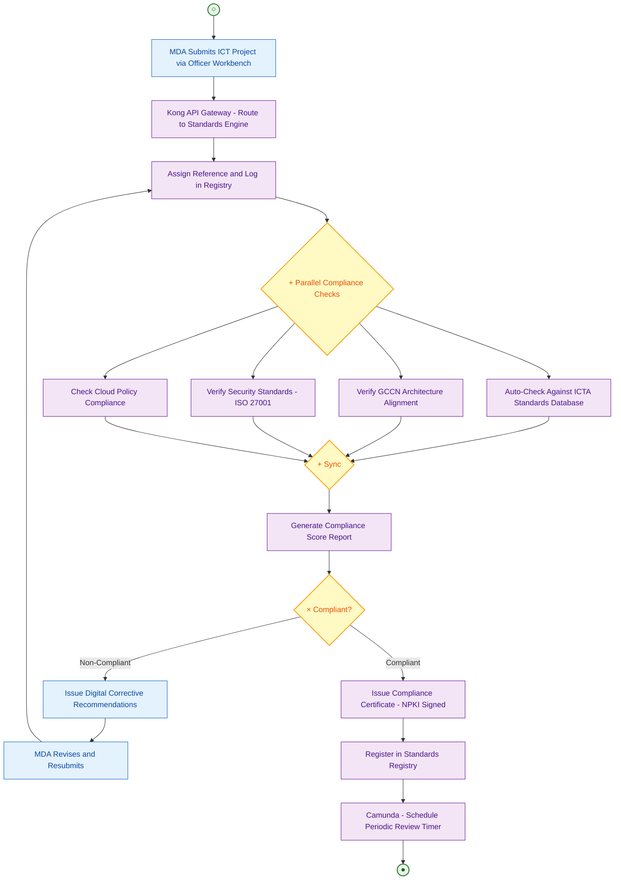
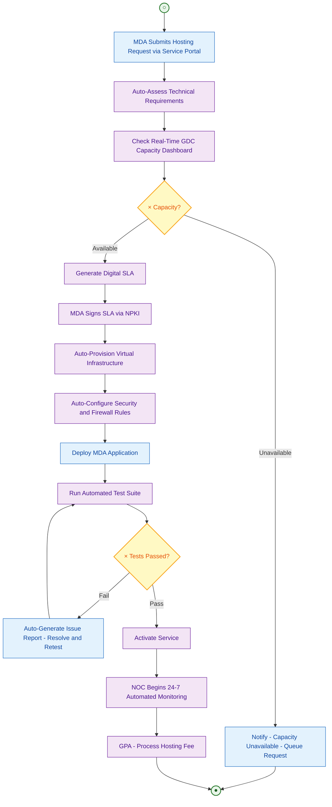
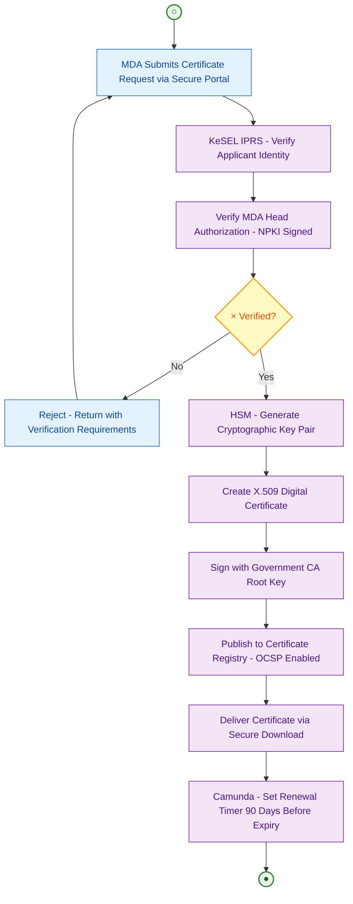
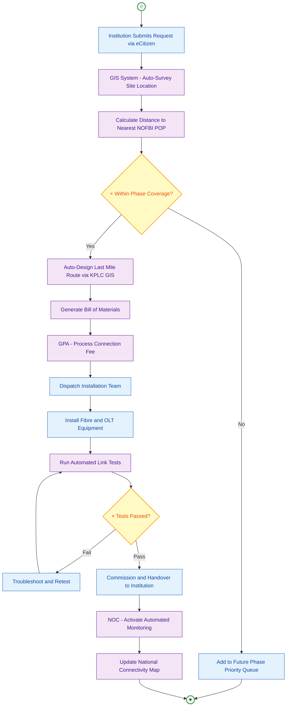
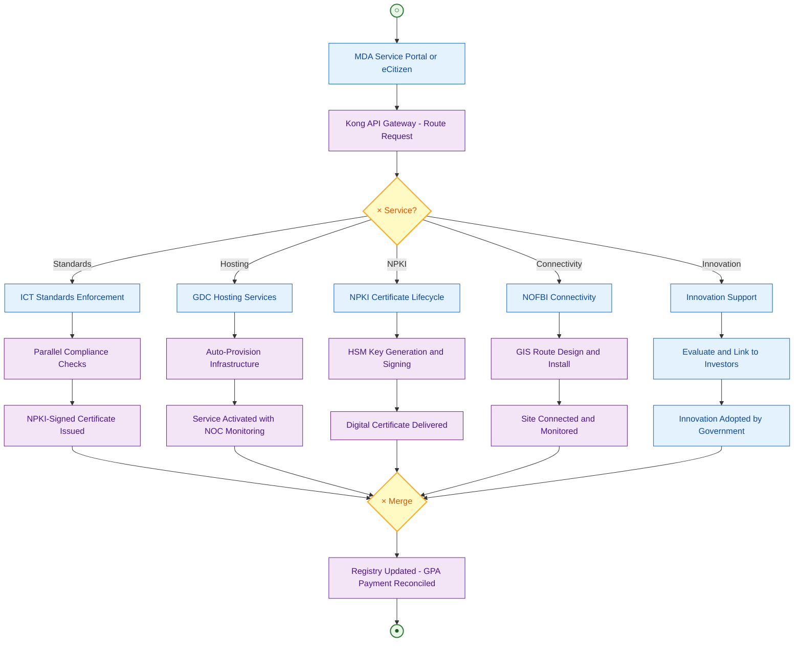

# ICT Authority (ICTA) — TO-BE
## Business Process Mapping Report

### Ministry of Information, Communications and The Digital Economy
### ICT Authority

## 1. Overview

| Attribute | Description |
|-----------|-------------|
| Process Scope | Digital transformation of ICT standards enforcement, Government Data Centre, NPKI, NOFBI connectivity, and innovation support |
| Huduma Bridge Integration | eCitizen Portal, Kong API Gateway, Camunda Workflow Engine, KeSEL, GPA, NPKI, Government Data Centre |
| GEA Principles | Standards-Driven, Reuse and Modularity, Data as Strategic Asset, Security by Design |
| ICTA Role in Huduma Bridge | Operates Government CA (NPKI), manages GDC hosting, enforces ICT standards, operates NOFBI/GCCN backbone |

## 2. TO-BE Processes

### 2.1 TO-BE: Digital ICT Standards Enforcement

#### Key Transformation

| AS-IS | TO-BE |
|-------|-------|
| Paper-based MDA project proposals | Digital submission via Officer Workbench |
| Manual standards review | Automated compliance checks against ICTA standards registry |
| No GCCN alignment verification | Automated GCCN architecture alignment check |
| Paper compliance certificates | NPKI-signed digital compliance certificates |
| No post-issuance monitoring | Camunda-scheduled periodic compliance reviews |

#### Process Diagram

### 2.2 TO-BE: Digital Government Data Centre Services

#### Key Transformation

| AS-IS | TO-BE |
|-------|-------|
| Manual hosting request by letter | Digital request via MDA Service Portal |
| Manual capacity assessment | Automated capacity dashboard with real-time metrics |
| Paper SLA signing | Digital SLA with NPKI signatures |
| Manual VM provisioning | Self-service VM provisioning with automated security config |
| Periodic manual monitoring | 24-7 NOC with automated alerting and incident management |

#### Process Diagram

### 2.3 TO-BE: Digital NPKI Certificate Lifecycle

#### Key Transformation

| AS-IS | TO-BE |
|-------|-------|
| Paper certificate application | Digital application via secure MDA portal |
| Manual identity verification | KeSEL IPRS query for applicant identity |
| Manual key generation | Automated HSM-based key pair generation |
| Paper certificate delivery | Digital certificate delivery with secure download |
| Manual renewal tracking | Camunda timer events for auto-renewal reminders |

#### Process Diagram

### 2.4 TO-BE: Digital NOFBI Connectivity

### 2.5 End-to-End ICTA Services

## 3. Integration Points

| System | Integration Method | Data Exchanged |
|--------|--------------------|----------------|
| eCitizen Portal | REST API via Kong | Connectivity requests, innovation submissions |
| MDA Service Portal | REST API via Kong | Standards proposals, hosting requests, NPKI applications |
| IPRS / Maisha Namba | KeSEL X-Road (NPKI signed) | Applicant identity verification for NPKI certificates |
| GDC Infrastructure | Internal VMware API | VM provisioning, firewall config, monitoring |
| NPKI HSM | Hardware Security Module | Cryptographic key generation and certificate signing |
| CA Root Certificate | Certificate chain | Root trust anchor for Government CA |
| NOFBI / GCCN | Network management | Backbone connectivity, last mile routing |
| GPA | Internal API | Hosting fees, connection fees |
| Camunda | Internal | Workflow, SLA timers, renewal reminders |
| GIS System | Internal API | Site surveys, route planning, coverage mapping |

## 4. BPMN Legend

| Symbol | Meaning |
|--------|---------|
| ((○)) | Start Event |
| ((●)) | End Event |
| [Text] | Task/Activity |
| {×} | Exclusive Gateway |
| {+} | Parallel Gateway |
| --> | Sequence Flow |
