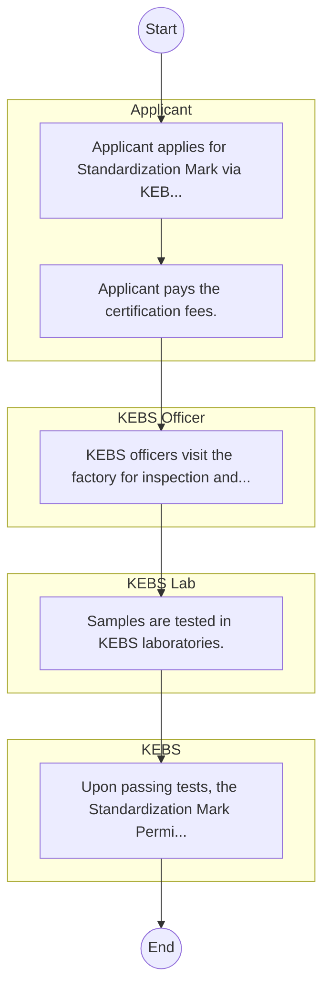

# Kenya Bureau of Standards – Licensing and Permitting

## Cover Page
- **Ministry/Department/Agency (MDA):** Kenya Bureau of Standards
- **Process Name:** Licensing and Permitting
- **Document Version:** 1.0
- **Date:** 2026-02-14
- **Classification:** Official

---

## Executive Summary
The Kenya Bureau of Standards (KEBS) is a government agency established by an Act of Parliament, responsible for maintaining standards and practices of metrology in Kenya. Its core mandate is to ensure quality through standardization, quality assurance and inspection, market surveillance, testing services, metrology, and certification, thereby protecting consumers and facilitating fair trade and industrial growth.

---

## Process Flowchart (BPMN 2.0 - Mermaid)
*Guidance: This diagram visualizes the AS-IS process flow across different actors.*

---

## Process Overview
### Process Name
Licensing and Permitting

### Service Category
- G2C/G2B

### Scope
- **In Scope:** End-to-end processing within Kenya Bureau of Standards.

### Triggers
- Submission of application/request by Applicant.

### End States
- **Successful:** License / Permit / Certificate, Compliance Inspection Report, Official Receipt, Gazette Notice

### Policy Context
- The Kenya Bureau of Standards Act; The Constitution of Kenya 2010; Data Protection Act 2019.

---

## Stakeholders
| Stakeholder | Role | Responsibilities |
|---|---|---|
| KEBS | Process Actor | Performs actions as defined in steps. |
| Applicant | Process Actor | Performs actions as defined in steps. |
| KEBS Lab | Process Actor | Performs actions as defined in steps. |
| KEBS Officer | Process Actor | Performs actions as defined in steps. |

---

## Inputs & Outputs
- **Inputs:** Application Form (License/Permit), Compliance Documents (Tax Compliance, CR12), Technical Reports / Site Plans, Proof of Payment
- **Outputs:** License / Permit / Certificate, Compliance Inspection Report, Official Receipt, Gazette Notice

---

## Detailed Process (AS-IS)
| Step | Role | Action | Tool | Notes |
|---|---|---|---|---|
| 1 | Applicant | Applicant applies for Standardization Mark via KEBS IMS portal. | Digital | |
| 2 | Applicant | Applicant pays the certification fees. | Manual | |
| 3 | KEBS Officer | KEBS officers visit the factory for inspection and sample collection. | Manual | |
| 4 | KEBS Lab | Samples are tested in KEBS laboratories. | Manual | |
| 5 | KEBS | Upon passing tests, the Standardization Mark Permit is issued. | Manual | |

---

## Pain Points & Opportunities
### Pain Points
- Manual document verification takes time.
- High cost and time for physical inspections.
- Risk of counterfeit licenses/certificates.
- Lack of real-time monitoring of licensees.

### Opportunities
- Integration with IPRS/BRS via Service Bus.
- Adoption of Government Payment Gateway.
- Implementation of Automated Rules Engine.
- Issuance of Digital Verifiable Credentials.

---

## Future State Process (TO-BE)
### Narrative
The To-Be process leverages the Government Service Bus to integrate with BRS (Business Registry) and the Payment Gateway. Manual data entry and document uploads are replaced by real-time API validations, enabling a paperless, cashless, and presence-less service experience.

### Optimized Steps (Digital)
| Step | Actor | Action | System |
|---|---|---|---|
| 1 | Applicant | Applicant logs in via Single Sign-On (SSO) and selects the service. | Citizen Portal / SSO |
| 2 | System | Applicant enters Business Registration Number; System auto-populates details from BRS (Business Registry) via the Service Bus. | Service Bus / Registry API |
| 3 | System | System performs auto-validation of compliance (e.g., KRA Tax Status) via Inter-Agency APIs. | Service Bus / Compliance Engine |
| 4 | Applicant | Applicant pays fees via the Government Payment Gateway; System auto-receipts. | Payment Gateway |
| 5 | System | Application is processed by the Rules Engine. (Low-risk cases are Auto-Approved). | Workflow Engine |
| 6 | Officer | Complex cases are routed to the Officer Workbench for digital review and approval. | Officer Workbench |
| 7 | System | System generates a Verifiable Digital Certificate (QR Code) and notifies the applicant. | Output Generator |

---

## References & Evidence
The information in this document was derived from the following official sources:

- [https://kebs.org/](https://kebs.org/)
- [https://wikipedia.org/](https://wikipedia.org/)

---

## Appendices
See attached ERD and System Design.
