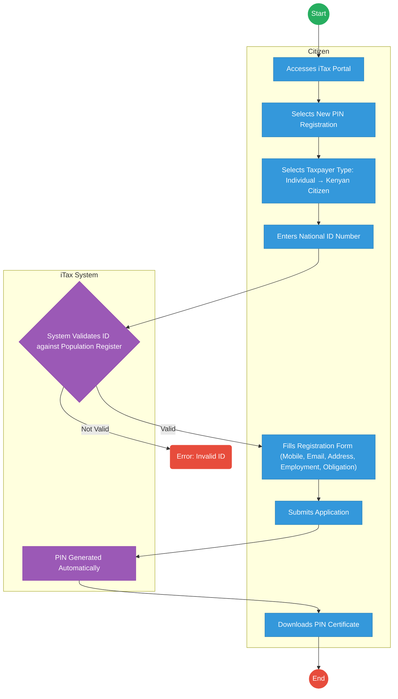

# KENYA REVENUE AUTHORITY (KRA) – PIN Registration (Individual)

## Cover Page
- **Ministry/Department/Agency (MDA):** KENYA REVENUE AUTHORITY (KRA)
- **Process Name:** PIN Registration (Individual)
- **Document Version:** 1.0
- **Date:** 2026-02-23
- **Classification:** Official

---

## Executive Summary
The Kenya Revenue Authority (KRA) mandates a **Personal Identification Number (PIN)** for all adult citizens participating in economic activities. This document outlines the AS-IS process for individual PIN registration via the iTax portal and proposes a highly automated TO-BE process integrated with the national identity ecosystem.

---

## 1. AS-IS PROCESS: KRA PIN Registration (Individual)

### BUSINESS PROCESS OVERVIEW
**Process Name:** KRA PIN Registration (Individual)
**Trigger:** Citizen requires a KRA PIN for employment, business, or other transactions.

### ACTORS
| Actor                 | Role                          |
|-----------------------|-------------------------------|
| Citizen               | Applies for PIN               |
| iTax System           | Captures and processes application |
| System (Population Register) | Validates National ID         |

### AS-IS Process Flowchart (BPMN 2.0)
*Current State visualization (iTax System / Manual Entry).*



### Detailed Process (AS-IS)
| Step | Actor                     | Action                                                                   | Tool / System        | Notes                                                |
|------|---------------------------|--------------------------------------------------------------------------|----------------------|------------------------------------------------------|
| 1    | Citizen                   | **Access iTax Portal:** Citizen opens the KRA iTax portal.             | iTax Portal          |                                                      |
| 2    | Citizen                   | **Select New PIN Registration:** Citizen clicks: New PIN Registration.   | iTax Portal          |                                                      |
| 3    | Citizen                   | **Select Taxpayer Type:** Citizen selects: Individual → Kenyan Citizen.  | iTax Portal          |                                                      |
| 4    | Citizen                   | **Enter National ID Number:** Citizen enters: National ID Number.        | iTax Portal          |                                                      |
| 5    | System (iTax / Population Register) | **System Validates ID:** System automatically verifies ID details against the population register. | iTax System / Population Register | If valid → proceeds; If not valid → error returned.  |
| 6    | Citizen                   | **Fill Registration Form:** Citizen enters: Mobile Number, Email Address, Postal Address, Physical Address, Employment Status, Tax obligation (usually Income Tax Resident Individual). | iTax Portal          |                                                      |
| 7    | Citizen                   | **Submit Application:** Citizen submits the completed registration form. | iTax Portal          |                                                      |
| 8    | System (iTax)             | **PIN Generated Automatically:** System generates: KRA PIN.            | iTax System          |                                                      |
| 9    | Citizen                   | **Download PIN Certificate:** Citizen downloads: KRA PIN Certificate (PDF). | iTax Portal          |                                                      |

### Output
**KRA PIN Generated**
**KRA PIN Certificate (PDF)**

---

## Pain Points & Opportunities (KRA PIN Registration)

### Pain Points
- **Manual ID Validation:** Relies on iTax system matching ID data to population register, which can lead to mismatches and errors if data isn't perfectly synchronized.
- **Redundant Data Entry:** Citizens re-enter personal details already captured during National ID registration.
- **Accessibility:** Requires internet access and familiarity with the iTax portal, potentially excluding some citizens.
- **Delayed Issuance:** While automated, still a separate process initiated by the citizen, not inherently linked to turning 18.

### Opportunities
- **Auto-PIN Generation with Maisha Namba:** Link directly with NRB/Maisha Namba to automatically generate a KRA PIN upon turning 18 or obtaining National ID.
- **Simplified eCitizen Integration:** Allow citizens to retrieve their KRA PIN directly from their eCitizen profile, pre-populated with verified data.
- **Proactive Notification:** Automatically notify citizens of their new KRA PIN when it's generated, possibly via SMS or eCitizen notification.
- **API-Driven Verification:** Provide APIs for other government agencies to verify KRA PINs without manual checks.

---

## 2. TO-BE PROCESS: KRA PIN Registration (Individual - Optimized)

### TO-BE Process Flowchart (BPMN 2.0)
*Future State visualization (WoG Platform / Automated via Maisha Namba).*

```mermaid
graph TD
    Start((Start)) --> T1

    subgraph NRB_Maisha_Namba [National Registration Bureau / Maisha Namba]
        T1["Citizen turns 18 / Receives National ID"]
        T2["NRB System Notifies WoG Platform of New Adult Citizen"]
    end

    subgraph WoG_Platform [WoG Platform (Identity Service Bus)]
        T3["WoG Platform Requests KRA PIN Allocation"]
    end

    subgraph KRA_System [KRA System]
        T4["KRA System Automatically Allocates PIN"]
        T5["KRA System Updates PIN Registry & Generates Digital Certificate"]
    end

    subgraph Citizen [Citizen]
        T6["Citizen Receives Notification of New KRA PIN"]
        T7["Citizen Accesses Digital KRA PIN Certificate via eCitizen"]
    end

    T1 --> T2
    T2 --> T3
    T3 --> T4
    T4 --> T5
    T5 --> T6
    T6 --> T7
    T7 --> End((End))

    classDef start fill:#27ae60,stroke:#27ae60,color:#fff;
    classDef endNode fill:#e74c3c,stroke:#e74c3c,color:#fff;
    classDef userTask fill:#3498db,stroke:#2980b9,color:#fff;
    classDef serviceTask fill:#9b59b6,stroke:#8e44ad,color:#fff;

    class Start start;
    class End endNode;
    class T1,T6,T7 userTask;
    class T2,T3,T4,T5 serviceTask;
```

### Detailed Process (TO-BE) - Configurable & Automated
| Step | Actor / System        | Action                                                                       | System Component          | Logic / Integration                                            |
|------|-----------------------|------------------------------------------------------------------------------|---------------------------|----------------------------------------------------------------|
| 1    | National Registration Bureau (NRB) | **Citizen Reaches Adulthood:** Citizen turns 18 or obtains National ID.   | NRB Registry              | Trigger for new KRA PIN.                                       |
| 2    | NRB System            | **Notify WoG Platform:** NRB system sends notification of new adult citizen. | Identity Service Bus      | Integration with `Maisha Namba` for central identity.          |
| 3    | WoG Platform          | **Request KRA PIN Allocation:** WoG Platform automatically requests KRA PIN allocation. | Service Orchestrator      | Orchestrates call to KRA PIN allocation API.                   |
| 4    | KRA System            | **Auto-Allocate PIN:** KRA system automatically allocates a unique KRA PIN. | KRA Backend / PIN Allocation Service | No manual intervention.                                        |
| 5    | KRA System            | **Update Registry & Generate Certificate:** KRA system updates its internal registry and generates a digital KRA PIN certificate. | KRA Registry / Output Generator | Ready for instant access.                                      |
| 6    | Citizen               | **Receive Notification:** Citizen receives automated notification (SMS/eCitizen App) of their new KRA PIN. | Notification Service      | Proactive communication.                                       |
| 7    | Citizen               | **Access Digital PIN Certificate:** Citizen logs into eCitizen or a dedicated app to view/download their digital KRA PIN Certificate. | eCitizen App / Citizen Portal | Secure and instant access.                                     |

---

## 3. Standard Data Inputs (TO-BE)

### A. KRA PIN Allocation (System-to-System)
| Field Name      | Type   | Source     | Validation       |
|-----------------|--------|------------|------------------|
| Citizen ID (Maisha Namba) | String | NRB Registry | Must be valid & active |
| Citizen Full Name | String | NRB Registry | Read-only        |
| Date of Birth   | Date   | NRB Registry | Read-only        |
| Nationality     | String | NRB Registry | Read-only        |

---

## References
- Tax Procedures Act, 2015
- Kenya Citizenship and Immigration Act, 2011 (for Maisha Namba context)
