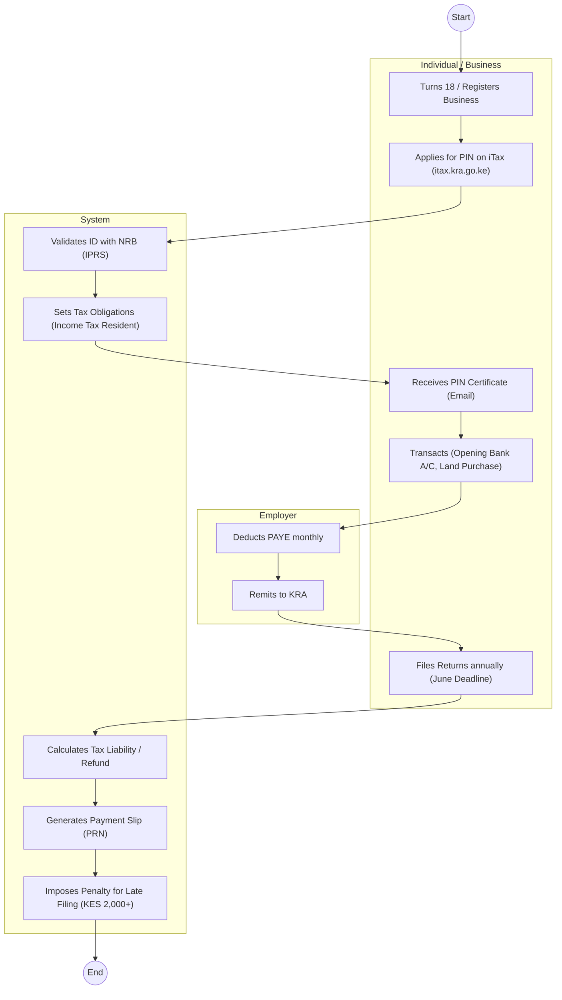
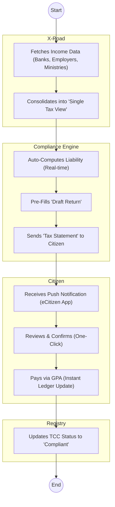

# KENYA REVENUE AUTHORITY (KRA) – Tax Return Filing

## Cover Page
- **Ministry/Department/Agency (MDA):** KENYA REVENUE AUTHORITY (KRA)
- **Process Name:** Tax Compliance (PIN Registration & Filing)
- **Document Version:** 1.3
- **Date:** 2026-02-19
- **Classification:** Official

---

## Executive Summary
The Kenya Revenue Authority (KRA) administers tax laws. The **Personal Identification Number (PIN)** is the mandatory identifier for all economic activities. Compliance involves monthly/annual filing of returns (PAYE, VAT, Rental Income) via the **iTax** platform.

---

## 1. AS-IS Process Flowchart (BPMN 2.0)
*Current State visualization (iTax System / Password Resets / Penalties).*

---

## Process Overview
### Process Name
Taxpayer Registration & Compliance (Individual Income Tax)

### Service Category
- G2C (Government to Citizen) / G2B (Government to Business)

### Scope
- **In Scope:** PIN Generation; Filing of Annual Returns (IT1); Payment of Taxes; TCC (Tax Compliance Certificate).
- **Out of Scope:** Customs clearance (handled by ICMS).

### Triggers
- Turning 18 (Adult).
- Employment.
- Business Registration.

### End States
- **Successful:** Valid TCC; Zero liability.

### Policy Context
- Tax Procedures Act, 2015; Income Tax Act (Cap 470).

---

## Stakeholders
| Stakeholder | Role | Responsibilities |
|---|---|---|
| Taxpayer | Compliance | Registers for PIN, files returns, pays taxes. |
| KRA Officer | Enforcer | Audits returns, issues assessments, collects debt. |
| Employer | Agent | Withholds PAYE and remits to KRA. |
| Bank / M-Pesa | Collector | Facilitates payment via PRN (Payment Registration Number). |

---

## Detailed Process (AS-IS)
| Step | Role | Action | Tool | Notes |
|---|---|---|---|---|
| 1 | Taxpayer | **Registration:** Individual accesses iTax, selects "New Registration". Enters ID number, Date of Birth. | iTax Portal | System frequently down. ID validation fails if NRB data is mismatched. |
| 2 | iTax System | **Obligation:** Auto-registers for "Income Tax Resident". Often adds VAT obligation by mistake, leading to penalties later. | Backend Logic | *Pain Point:* Users unaware of monthly filing requirements for VAT. |
| 3 | Taxpayer | **Filing:** Logs in to file Annual Returns (Jan - June). Downloads Excel sheet, fills macros, zips, uploads. | Excel Macros | Complex, buggy Excel sheets. Fails on Mac/Linux. |
| 4 | Employer | **Pre-Filling:** Employer uploads P9 data. Employee finds data missing on iTax. | Employer Portal | Discrepancies common. |
| 5 | Taxpayer | **Payment:** Generates PRN (E-Slip) to pay tax due. Pays via M-Pesa Paybill 572572. | Payment Gateway | Reconciliation takes 24-48 hours. |
| 6 | System | **Penalty:** Automatically imposes KES 2,000 penalty if return is late (even by 1 minute). | Auto-Script | "Debt" shows up years later, blocking TCC. |
| 7 | Taxpayer | **TCC Application:** Applies for Tax Compliance Certificate. System rejects due to "Ksh 5.00 arrears" from 2015. | Compliance Module | Frustrating "Ledger Cleanup" required manually at KRA station. |

---

## Pain Points & Opportunities
### Pain Points
- **Forgotten PINs:** Users lose email access, cannot reset password without visiting KRA office.
- **Complex Filing:** The Excel macro sheets are too technical for the average citizen.
- **Ghost Obligations:** System auto-adds VAT/PAYE obligations to students/unemployed, accruing massive penalties.
- **Ledger Mess:** Historic data migration errors show false arrears.
- **Refund Delays:** Tax refunds take years to process.

### Opportunities
- **Auto-Population:** Pre-fill return 100% from Employer/Bank data. User just clicks "Confirm".
- **Simplified App:** M-Service App for nil filing and simple returns (no Excel).
- **Real-Time Ledger:** Instant update of payments to allow TCC issuance immediately.
- **Amnesty Automation:** Auto-waiver of penalties for dormant/student PINs.

---

## 2. TO-BE Process Flowchart (BPMN 2.0)
*Future State visualization (Repeatable WoG Platform).*

## Future State Process (TO-BE)
### Narrative
The process is **Invisible** and **Automated**.
1.  **Data Aggregation:** The KRA system pulls income data directly from sources (Employers, Banks, IFMIS) via **X-Road**.
2.  **No More Filing:** Citizens do not "file" returns. They receive a **Tax Statement** (like a utility bill) pre-calculated by the AI engine.
3.  **One-Click Compliance:** The taxpayer simply reviews the statement on the **eCitizen App** and clicks "Accept" or "Dispute".
4.  **Instant TCC:** Upon payment via **GPA**, the ledger updates instantly. The Tax Compliance Certificate is live and verifiable via API by any agency (e.g., procurement).

### Optimized Steps (Digital)
| Step | Actor | Action | System |
|---|---|---|---|
| 1 | WoG Platform | Aggregates income data from sources via X-Road APIs. | KeSEL / Data Hub |
| 2 | KRA AI | Computes tax liability and pre-fills the return. | Compliance Engine |
| 3 | Citizen | Receives "Tax Statement" notification on App. | eCitizen App |
| 4 | Citizen | Confirms statement and pays balance via GPA. | Payment Gateway |
| 5 | KRA System | Instantly updates TCC status to "Compliant". | Ledger |

---

## 3. Standard Data Inputs
*Required fields for the WoG Digital Service.*

### A. Annual Tax Statement (System Generated)
| Field Name | Type | Source | Validation |
|---|---|---|---|
| Taxpayer PIN | String | System Fetch (NRB) | Must be Active |
| Assessment Year | Year | System | Current - 1 |
| Employment Income | Currency | System Fetch (Employers) | Aggregated |
| Withholding Tax | Currency | System Fetch (Banks) | Aggregated |
| Tax Liability | Currency | System Calculated | Income Tax Bands |
| Tax Paid (PAYE) | Currency | System Fetch (Employer) | Read-only |
| Balance Due | Currency | System Calculated | Must be >= 0 |

### B. User Action (One-Click)
| Field Name | Type | Source | Validation |
|---|---|---|---|
| Action | Enum | User Input | Accept / Dispute |
| Payment Method | Enum | User Input | M-Pesa / Card (GPA) |
| Dispute Reason | String | User Input | Required if Dispute |
| Supporting Doc | File | User Upload | Required if Dispute |

---

## References
- Tax Procedures Act.
