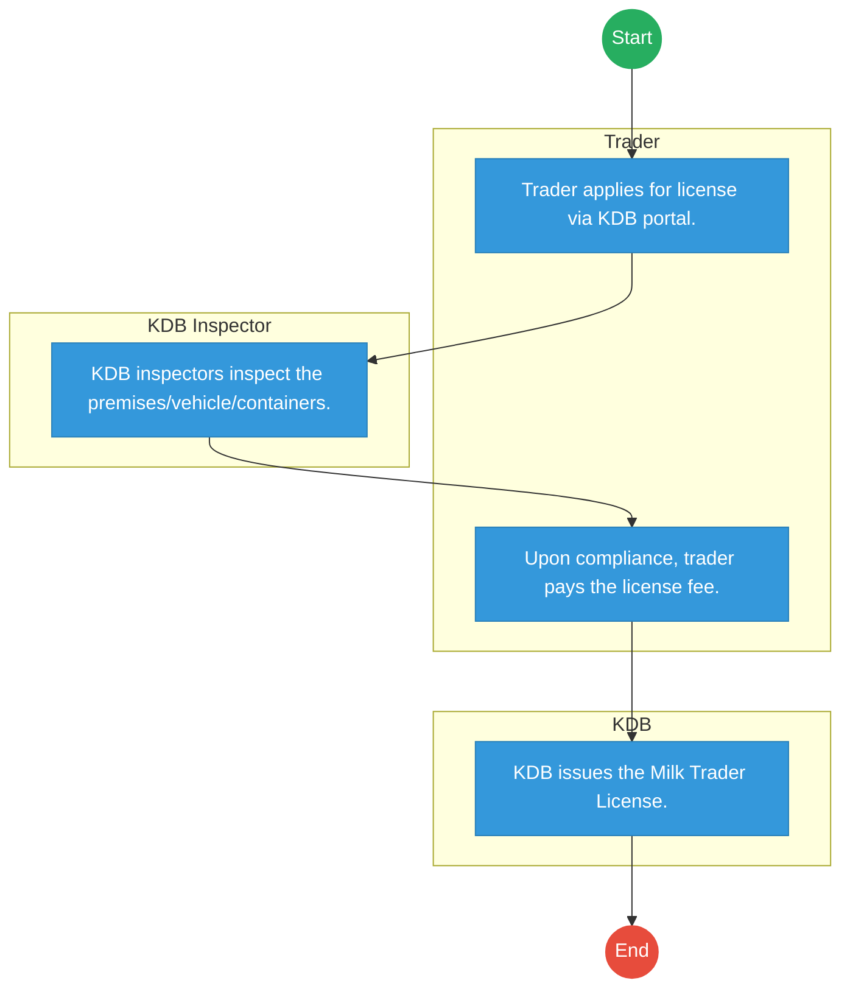
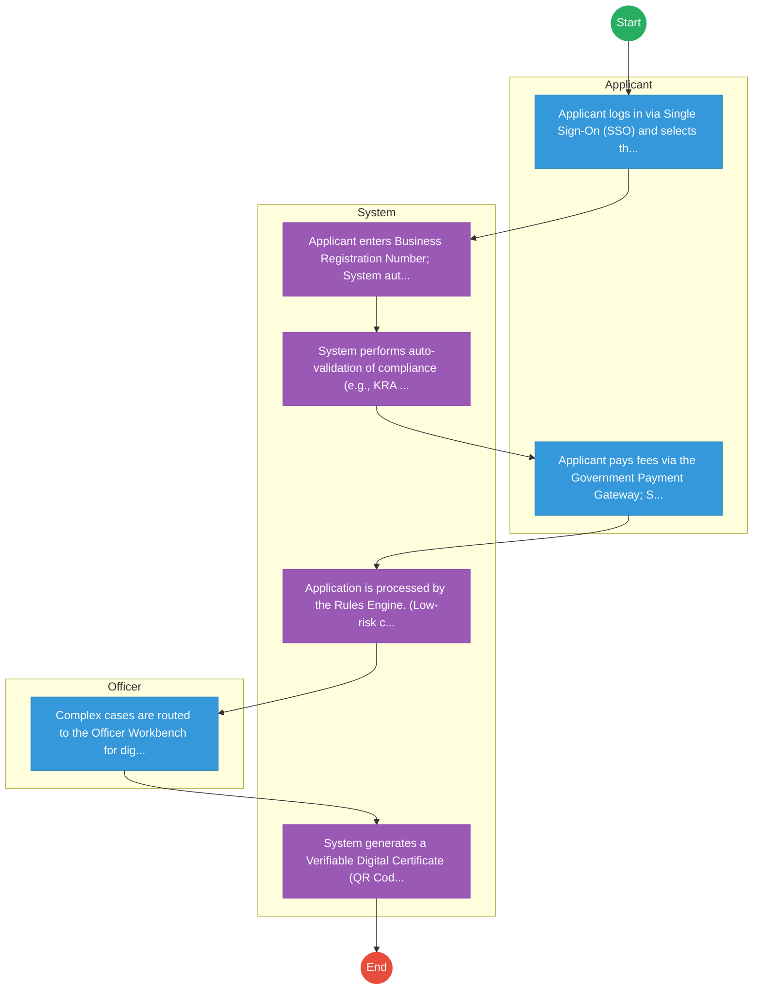

# Kenya Dairy Board – Service Delivery

## Cover Page
- **Ministry/Department/Agency (MDA):** Kenya Dairy Board
- **Process Name:** Service Delivery
- **Document Version:** 1.0
- **Date:** 2026-02-14
- **Classification:** Official

---

## Executive Summary
The Kenya Dairy Board (KDB) is a parastatal operating under the Ministry of Agriculture, Livestock, Fisheries, and Cooperatives (State Department of Livestock). Its primary mandate is to regulate and promote the dairy sector in Kenya, ensuring the quality and safety of milk and milk products for consumers, and fostering sustainable growth and development within the industry.

---

## 1. AS-IS Process Flowchart (BPMN 2.0)
*Current State visualization.*

---

## Process Overview
### Process Name
Service Delivery

### Service Category
- G2B (Government to Business)

### Scope
- **In Scope:** End-to-end processing within Kenya Dairy Board.

### Triggers
- Submission of application/request by Trader.

### End States
- **Successful:** License / Permit / Certificate, Compliance Inspection Report, Official Receipt, Gazette Notice

### Policy Context
- The Kenya Dairy Board Act; The Constitution of Kenya 2010; Data Protection Act 2019.

---

## Stakeholders
| Stakeholder | Role | Responsibilities |
|---|---|---|
| KDB Inspector | Process Actor | Performs actions as defined in steps. |
| KDB | Process Actor | Performs actions as defined in steps. |
| Trader | Process Actor | Performs actions as defined in steps. |

---

## Detailed Process (AS-IS)
| Step | Role | Action | Tool | Notes |
|---|---|---|---|---|
| 1 | Trader | Trader applies for license via KDB portal. | Digital | |
| 2 | KDB Inspector | KDB inspectors inspect the premises/vehicle/containers. | Manual | |
| 3 | Trader | Upon compliance, trader pays the license fee. | Manual | |
| 4 | KDB | KDB issues the Milk Trader License. | Manual | |

---

## Pain Points & Opportunities
### Pain Points
- Manual document verification takes time.
- High cost and time for physical inspections.
- Risk of counterfeit licenses/certificates.
- Lack of real-time monitoring of licensees.

### Opportunities
- Integration with IPRS/BRS via Service Bus.
- Adoption of Government Payment Gateway.
- Implementation of Automated Rules Engine.
- Issuance of Digital Verifiable Credentials.

---

## 2. TO-BE Process Flowchart (BPMN 2.0)
*Future State visualization (Optimized).*

## Future State Process (TO-BE)
### Narrative
The To-Be process leverages the Government Service Bus to integrate with BRS (Business Registry) and the Payment Gateway. Manual data entry and document uploads are replaced by real-time API validations, enabling a paperless, cashless, and presence-less service experience.

### Optimized Steps (Digital)
| Step | Actor | Action | System |
|---|---|---|---|
| 1 | Applicant | Applicant logs in via Single Sign-On (SSO) and selects the service. | Citizen Portal / SSO |
| 2 | System | Applicant enters Business Registration Number; System auto-populates details from BRS (Business Registry) via the Service Bus. | Service Bus / Registry API |
| 3 | System | System performs auto-validation of compliance (e.g., KRA Tax Status) via Inter-Agency APIs. | Service Bus / Compliance Engine |
| 4 | Applicant | Applicant pays fees via the Government Payment Gateway; System auto-receipts. | Payment Gateway |
| 5 | System | Application is processed by the Rules Engine. (Low-risk cases are Auto-Approved). | Workflow Engine |
| 6 | Officer | Complex cases are routed to the Officer Workbench for digital review and approval. | Officer Workbench |
| 7 | System | System generates a Verifiable Digital Certificate (QR Code) and notifies the applicant. | Output Generator |

---

## References
Derived from official mandates.

---

### Validation Survey
Please provide your feedback here: [https://ee.kobotoolbox.org/x/4Ls7SlCG](https://ee.kobotoolbox.org/x/4Ls7SlCG)
