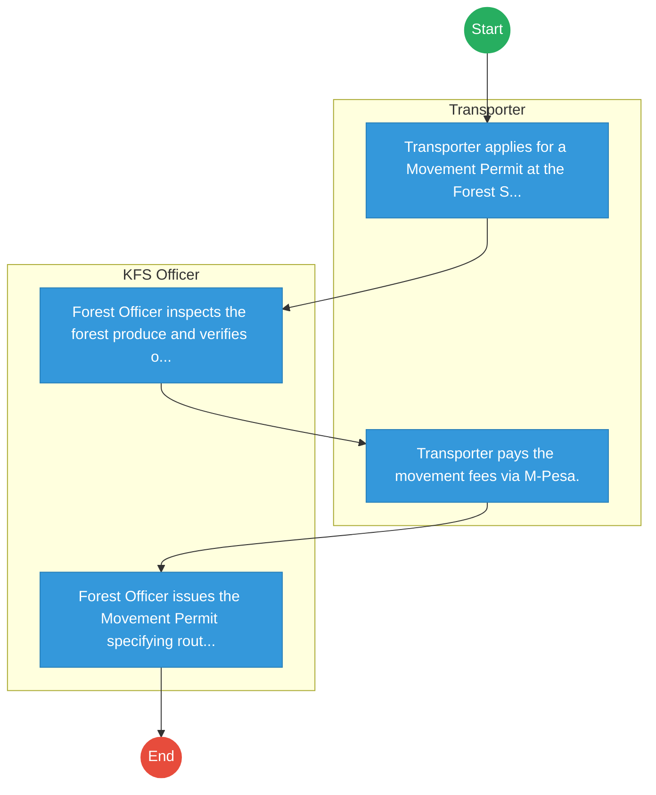
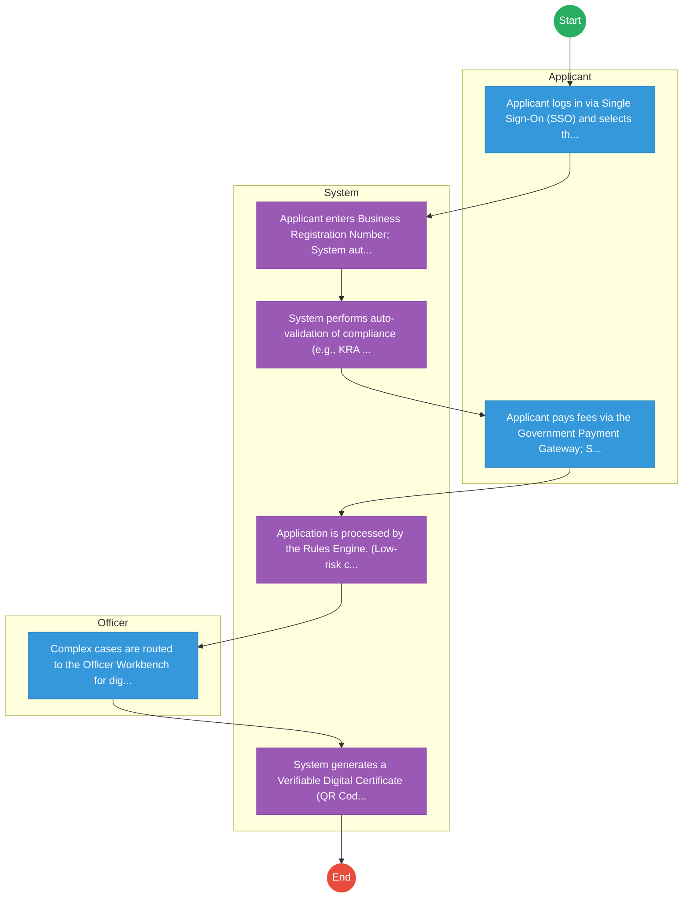

# Kenya Forest Service – Licensing and Permitting

## Cover Page
- **Ministry/Department/Agency (MDA):** Kenya Forest Service
- **Process Name:** Licensing and Permitting
- **Document Version:** 1.0
- **Date:** 2026-02-14
- **Classification:** Official

---

## Executive Summary
The Kenya Forest Service (KFS) is a state corporation established under the Forests Act of 2005 and formalized by the Forest Conservation and Management Act of 2016. Its mandate is to provide for the development and sustainable management, including conservation and rational utilization, of all forest resources for the socio-economic development of Kenya and for environmental benefits such as water catchment protection and carbon sequestration.

---

## 1. AS-IS Process Flowchart (BPMN 2.0)
*Current State visualization.*

---

## Process Overview
### Process Name
Licensing and Permitting

### Service Category
- G2C/G2B

### Scope
- **In Scope:** End-to-end processing within Kenya Forest Service.

### Triggers
- Submission of application/request by Transporter.

### End States
- **Successful:** License / Permit / Certificate, Compliance Inspection Report, Official Receipt, Gazette Notice

### Policy Context
- The Kenya Forest Service Act; The Constitution of Kenya 2010; Data Protection Act 2019.

---

## Stakeholders
| Stakeholder | Role | Responsibilities |
|---|---|---|
| KFS Officer | Process Actor | Performs actions as defined in steps. |
| Transporter | Process Actor | Performs actions as defined in steps. |

---

## Detailed Process (AS-IS)
| Step | Role | Action | Tool | Notes |
|---|---|---|---|---|
| 1 | Transporter | Transporter applies for a Movement Permit at the Forest Station. | Manual | |
| 2 | KFS Officer | Forest Officer inspects the forest produce and verifies origin. | Manual | |
| 3 | Transporter | Transporter pays the movement fees via M-Pesa. | Manual | |
| 4 | KFS Officer | Forest Officer issues the Movement Permit specifying route and validity. | Manual | |

---

## Pain Points & Opportunities
### Pain Points
- Manual document verification takes time.
- High cost and time for physical inspections.
- Risk of counterfeit licenses/certificates.
- Lack of real-time monitoring of licensees.

### Opportunities
- Integration with IPRS/BRS via Service Bus.
- Adoption of Government Payment Gateway.
- Implementation of Automated Rules Engine.
- Issuance of Digital Verifiable Credentials.

---

## 2. TO-BE Process Flowchart (BPMN 2.0)
*Future State visualization (Optimized).*

## Future State Process (TO-BE)
### Narrative
The To-Be process leverages the Government Service Bus to integrate with BRS (Business Registry) and the Payment Gateway. Manual data entry and document uploads are replaced by real-time API validations, enabling a paperless, cashless, and presence-less service experience.

### Optimized Steps (Digital)
| Step | Actor | Action | System |
|---|---|---|---|
| 1 | Applicant | Applicant logs in via Single Sign-On (SSO) and selects the service. | Citizen Portal / SSO |
| 2 | System | Applicant enters Business Registration Number; System auto-populates details from BRS (Business Registry) via the Service Bus. | Service Bus / Registry API |
| 3 | System | System performs auto-validation of compliance (e.g., KRA Tax Status) via Inter-Agency APIs. | Service Bus / Compliance Engine |
| 4 | Applicant | Applicant pays fees via the Government Payment Gateway; System auto-receipts. | Payment Gateway |
| 5 | System | Application is processed by the Rules Engine. (Low-risk cases are Auto-Approved). | Workflow Engine |
| 6 | Officer | Complex cases are routed to the Officer Workbench for digital review and approval. | Officer Workbench |
| 7 | System | System generates a Verifiable Digital Certificate (QR Code) and notifies the applicant. | Output Generator |

---

## References
Derived from official mandates.

---

### Validation Survey
Please provide your feedback here: [https://ee.kobotoolbox.org/x/4Ls7SlCG](https://ee.kobotoolbox.org/x/4Ls7SlCG)
